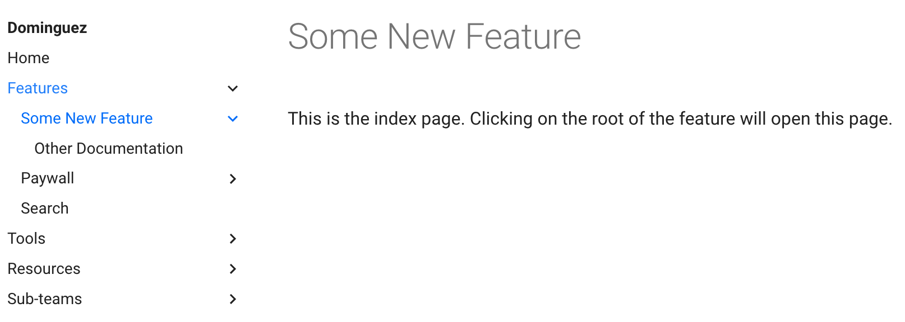

# Contributing

## Overview

- [Avoid Duplicate Docs!](#avoid-duplicate-docs)
- [Workflow](#workflow)
    - [Pull Requests](#pull-requests)
- [Structure of the docs](#structure-of-the-docs)
- [Technical Docs Writing Philosophy](#technical-docs-writing-philosophy)
- [Feature docs](#feature-docs)
- [Styling suggestions and guidelines](#styling-suggestions-and-guidelines)
    - [Backticks](#backticks)
    - [Listing Steps](#listing-steps)
    - [Bolding](#bolding)
    - [Admonitions](#admonitions)
    - [Images and Gifs](#images-and-gifs)
    - [Header Guidelines](#header-guidelines)
    - [Icons](#icons)

## Avoid Duplicate Docs

- Before contributing, [please search our new doc site](https://github.bamtech.co/pages/Android/dmgz-docs/) for an existing document to avoid duplicates
- Additionally, search our _old_ docs to see if we can delete an old doc or port over an already existing doc
- Our old docs are in two locations:
    - [The `/docs` folder in the Dmgz codebase](https://github.bamtech.co/Android/Dmgz/tree/development/docs)
    - There might be a `README.md` file in a module in the Dmgz codebase

## Workflow

- open terminal and navigate to where you cloned the project
- Run this command: `mkdocs serve`
    - If this command doesn't work, try with using your local python installation explicitly as
        in `python3 -m mkdocs serve`.
- The command line will tell you the locally hosted URL of the website. Something like this:
    - `Serving on http://127.0.0.1:8000/`
- Open `http://127.0.0.1:8000/` in your web browser
- Open project files in your preferred text editor. You can edit any files, save them, and the locally hosted site in your browser will automatically update
    - **Note:** If something breaks, you will need to re-fire the command `mkdocs serve` in a terminal window to re-host the site

### Pull Requests

- When contributing, create a branch off of the `main` branch
- Merge your pull request into the `main` branch after it has received one approval
- After your pull request is merged into the `main` branch, the new doc site updated and deployed in five minutes or less
- When reviewing pull requests refer to the [Technical Docs Writing Philosophy](#technical-docs-writing-philosophy) section

## Structure of the docs

- The left side of the site is the core navigation. This can be edited / updated inside of the `mkdocs.yml` file under the **nav:** section
    - Ensure that you set the index of the navigation section properly. For more information on setting the index properly, see how to [Section index pages](https://squidfunk.github.io/mkdocs-material/setup/setting-up-navigation/#section-index-pages).
        - The name of the file _must_ be `index.md` within that directory. See `features/paywall/index.md` and its accompanying section in `mkdocs.yml`.
            - If there is to be more than one page of documentation for a given, section, the top level of the navigation _must_ be empty.
            - For example. If you are creating a new section, you would have the following setup:

        ```yml
        nav:
            - Home: index.md
            - Features:
              - Index: features/index.md
              - Some New Feature:
                - Some New Feature Index: features/new-feature/index.md
                - Other Documentation: features/new-feature/some-other-feature-doc.md
              - Paywall:
        ```

    - This will result in the following:
        - 
- The right side of the site is the auto generated **Table of contents** for the page you are on. For this to auto generate correctly, follow the **Header Guidelines** below
    - `mkdocs.yml` - settings for the website. Be careful with the indentation / spacing when editing this file
    - `docs/assets` - global assets - do not place assets in here. In an effort to keep assets near the docs they are used in, place assets in a respective `images` or `gifs` folder where the actual `.md` doc lives
        - **Example:**
            - The root document for the **Search** feature is at `docs/features/search/index.md`
            - The name in the navigation section of `mkdocs.yml` should be: `Search Index`.
            - All gifs referenced in that **Search** doc are in `docs/features/search/gifs`

## Technical Docs Writing Philosophy

- In an effort to keep the documentation written on the site consistent, here are some themes to keep in mind when writing docs
- A lot of our philosophy is mirrored in [this tech writing post](https://blog.pragmaticengineer.com/becoming-a-better-writer-in-tech/) that was stumbled upon on [androidweekly.net](https://androidweekly.net/). You are encouraged to read the article, but below is a TLDR:
    - **Break it into readable chunks** - a large wall of text is very off-putting. Use bullet points, small paragraphs, admonitions, images, gifs, etc.
    - **Less is more** - Remove as much unnecessary and distracting elements as possible. This means shorter docs for people to read and shorter docs for us to maintain. Use shorter sentences. If something can be expressed in a shorter sentence, prefer that. In writing / editing this is often referring to as _trimming the fat_
    - **Value the reader's time more than your own** - empathy for the reader is the key value in writing pristine docs
- To see a 3rd party example of some of these ideas in play, take a look at [Leak Canary's docs](https://square.github.io/leakcanary/fundamentals-how-leakcanary-works/). They also use the same **material** theme so it looks similar to our site

## Feature docs

- If you are writing a doc for a feature, start by copy pasting the [feature doc template](https://github.bamtech.co/Android/dmgz-docs/blob/main/feature_doc_template.md)
- This way, each feature doc will have consistent sections that everyone may find useful

## Styling suggestions and guidelines

### Backticks

- Use backticks for code or file names
    - `Example.kt`
    - `.json`
- When using a code block, use three backticks above and below the code block
- Add the programming language after the third back tick above the code block
- Rendered example:

    ```kotlin
    private val example = "Example code block"
    ```

### Listing Steps

- If you are listing out a set of steps in a single line, separate them with an →
    - **Example:** Charles toolbar → Tools → Import/Export Settings...

### Bolding  

- Use bolding with two `*` to draw extra attention to something
- A common use case for this is bolding items someone needs to click on
    - **Example:** Charles toolbar → **Tools** → **Import/Export Settings...**

### Admonitions  

- Consider adding an **admonition** in certain cases (such as a warning, note, info, etc.)
- [Looking at these examples is the easiest way to get a feel for admonitions](https://squidfunk.github.io/mkdocs-material/reference/admonitions/#supported-types)
- This helps call out something specific, and breaks up a huge wall of text in our docs
    - **Example:**
        - Here is the example syntax for a **warning admonition**:

        ```markdown
        !!! warning
            Sometimes **Throttling** is enabled by default after installing. Double check the **[Throttling](#throttling)** section below
        ```

### Images and Gifs

- There are two main ways to add images / gifs
- **Example 1**
    - Use Example 1 if you need to set the width manually or if you need to set a caption. Prefer this option

    ```markdown
    <figure markdown>
        { width="700" }
        <figcaption>Example 1</figcaption>
    </figure>
    ```

- **Example 2**

    ``

### Header Guidelines

- It is important to follow the header guidlines so the **Table of contents** will generate correctly
- Each page uses just one `#` for the top header, and each sub section will add an additional hash mark
- [Click here for a visualization](https://www.markdownguide.org/basic-syntax/#headings)
- Place a space after the `#` in a header, and also add a blank line above and below each header. [Click here for a better visualization](https://www.markdownguide.org/basic-syntax/#heading-best-practices)

### Icons

- Sometimes it may be a nice touch to add a relevant icon
- You can search for the [available bundled icons here](https://squidfunk.github.io/mkdocs-material/reference/icons-emojis/#search)
- Prefer icons without color
- Place the copied icon in markdown and it will render
    - **Example:** `:octicons-pencil-24:`
    - **Note:** Double check to see if the icon you chose renders on our site. Not why why yet, but some do not render properly

### Diagrams

- We do not yet have a consistent standard for creating diagrams on the doc site
- [The site does support Mermaid.js](https://squidfunk.github.io/mkdocs-material/reference/diagrams/?h=merma)
- For larger diagrams we could use Lucid Chart, especially since we already pay for it
