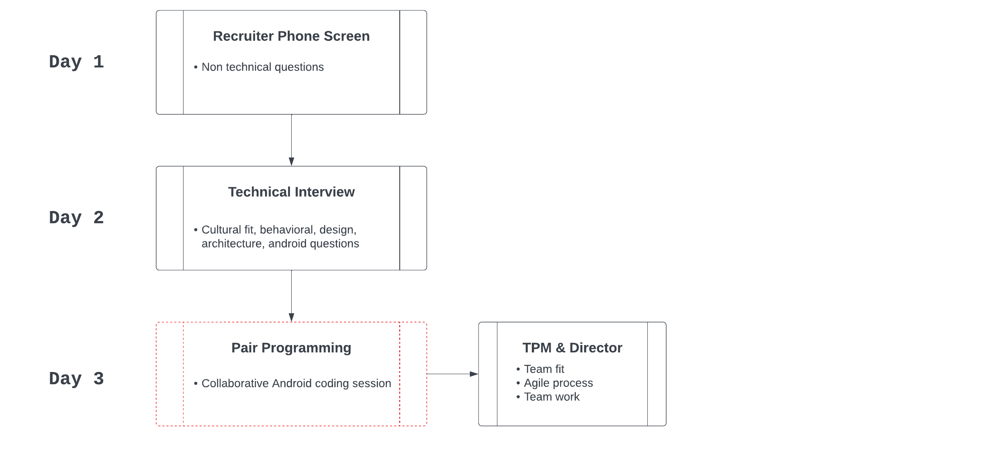

# EU Hiring Process

This is the current process in the EU for hiring. Over time this will be updated and adjusted based on feedback, how interviews go, etc.

## Recruiter Phone Screen

* **Interviewer** - Recruiter
* **Length** - ? minutes
* **Format**
    * Position and requirements explained
    * Provides high level details about the interview process and how best to prepare for it
* **Post Recruiter Phone Screen steps**
    * Recruiter sends candidate resumes to Hiring Managers to inspect
    * Hiring Managers create a shortlist of candidates
    * Recruiter schedules interviews

## TODO Add other steps here
