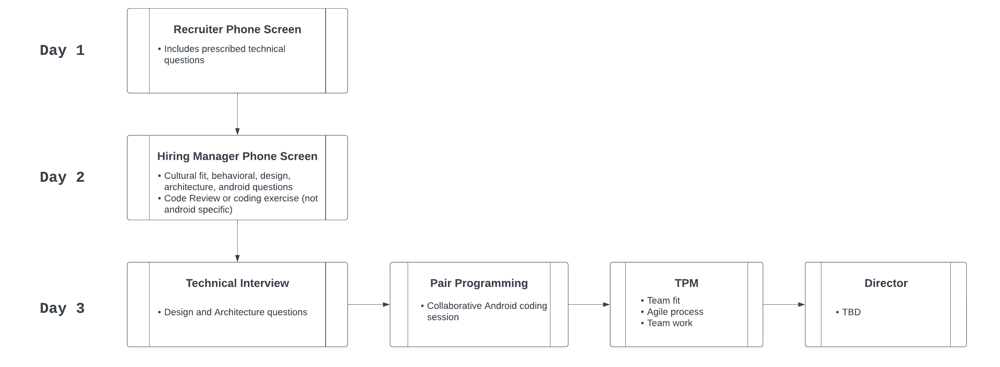

# US Hiring Process

This is the current process in the US for hiring. Over time this will be updated and adjusted based on feedback, how interviews go, etc.

## Recruiter Phone Screen

* **Interviewer** - Recruiter
* **Length** - 30 minutes
* **Format**
    * Prescribed questions provided by Android team
    * Position and requirements explained
    * Provides high level details about the interview process and how best to prepare for it
* **Post Recruiter Phone Screen steps**
    * Recruiter sends candidate resumes to Hiring Managers to inspect
    * Hiring Managers create a shortlist of candidates
    * Recruiter schedules interviews

## Manager Phone Screen

* **Interviewer** - Hiring Manager
* **Length** - 1 hour
* **Format**
    * [Evalute Resume](https://docs.google.com/document/d/1NuaHpMJdjvplzsEo2Ie21Bv2n8hKnmH-DPatGHGUqRM/edit#)
    * Sell the position to the candidate
    * Cultural fit
    * Technical challenge
        * P1 - [Coding excercise](https://docs.google.com/document/d/1N6MQpuk-NsKZRvzmdvOTURqt0-o2kC4Fl839bZXkvPU/edit)
        * P2+ - [Code review](https://docs.google.com/document/d/1xQRurg61cMeZ3MeCjtmTWcQUuugFXchnmxn0VTotPLQ/edit)

## Technical Interview

* **Interviewers** - Two P2+ engineers
* **Length** - 1 hour
* **Format**
    * Greet the candidate and inform them of the format of the interview
    * Everyone does a quick introduction
    * Conversational question / answer format with resume questions, technical questions, architecture questions, design questions, etc.
    * Last ~10 minutes - candidate asks questions

## Pair Programming

* **Interviewer** - Two P2+ engineers
* **Length** - 1 hour and 30 minutes
* **Format**
    * Greet the candidate and inform them of the format of the interview
    * Everyone does a quick introduction
    * Collaborative coding session, getting feedback and suggestions from interviewers
    * All available resources allowed (Google, Stack Overflow, Android docs, etc.)
    * Interviewers can start with resume questions, etc.
    * [Coding Session](https://docs.google.com/document/d/1ofKsycIfShY48O9fhD0W67qXkA_CNMWdR48i-bkNsGo/edit)

## TPM Interview

* **Interviewer** - Android TPM
* **Length** - 30 minutes
* **Format**
    * Covers agile processes and team fit

## Director Interview

* **Interviewer** - Aaron Rietschlin or Balaji Rathinasekaran
* **Length** - 30 minutes
* **Format**
    * TODO
