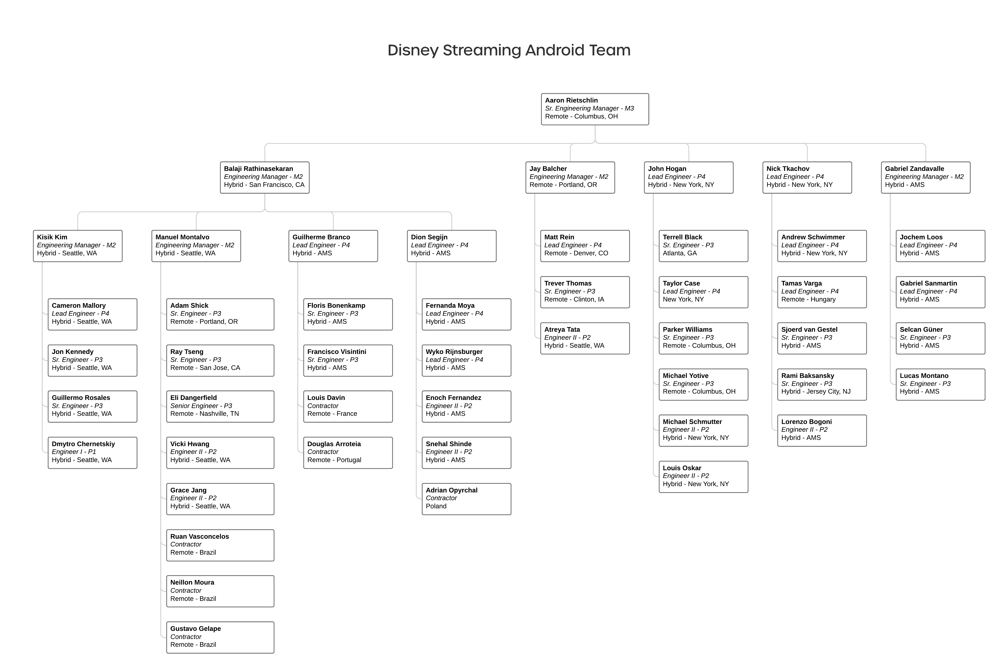

# Disney Streaming Android Organization

Below, you can find the current org chart of the Disney Streaming Android team as well as the current team structure.

=== "Org Chart"
    

=== "Workstreams"
    <iframe src="https://docs.google.com/spreadsheets/d/e/2PACX-1vQzLmIkhzGj8nGqqjbHD_POdYxI3GfkCsSavz1uIQg-ksOUklXdyZagXgJAlPqwq44WC-auNSl3npN0/pubhtml?gid=0&amp;single=true&amp;widget=true&amp;headers=false" width="1000" height="1000" /></iframe>

    * View the [doc here](https://docs.google.com/spreadsheets/d/1m0TLQEqx0eZ3Od9nGmuIQXGGyr0yRPTLseDHm2PqjkM/edit?usp=sharing).
    * View the [wiki page here](https://wiki.disneystreaming.com/display/DMGZ/Android+Team+Structure).
