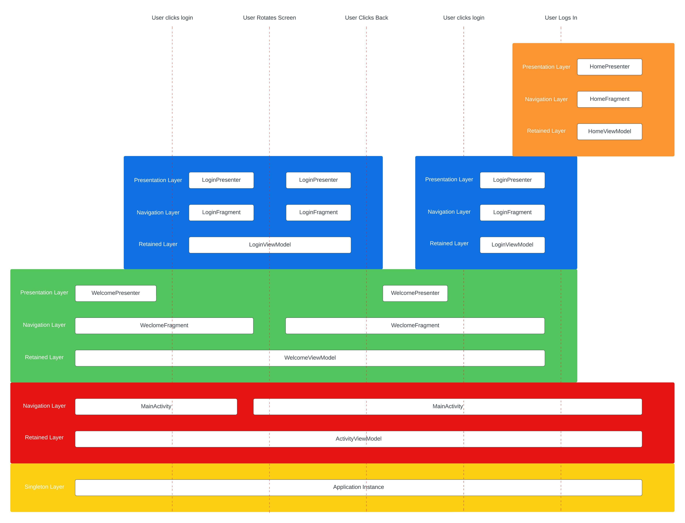

# UI Architecture Layers

The overall architectural approach of Dominguez Android could be defined as a Layered Reactive Unidirectional Paradigm. Higher layers observe state of lower layers and send events to those lower layers which results in state updates that that higher layer is observing.

The lifetime of objects is the most important aspect in this layering approach, how long an object stays around defines in what layer it lives and vice-versa. In some ways a brick wall where lower-layer instance have to outlive the higher-layer instances and lower-level instances can not build upon anything that is at a higher level without defying the rules of gravity.

In the UI there are generally three layers. The [Retained Layer](#retained-layer) is the lowest layer, on top of that is the [Navigation Layer](#navigation-layer) and on top of that the [Presentation Layer](#presentation-layer). Below is a visual representation of what this looks like, where the white blocks represent what instances exist in what layer and at what point in time during a login flow.

The [Retained Layer](#retained-layer) of a screen stays around for as long as the user can go back to that same screen and it does not get destroyed on configuration changes.

The [Navigation Layer](#navigation-layer) of a screen also stays around as along as the user can go back to that screen but it does get recreated on configuration changes.

The [Presentation Layer](#presentation-layer) only exists when the user is actively viewing the screen and it also gets recreated on configuration changes.

Implementing the above might seem complex, and it is. Lucky for us this is exactly the standard functionality that the [androidx.fragment](https://developer.android.com/jetpack/androidx/releases/fragment) and [androidx.lifecycle](https://developer.android.com/jetpack/androidx/releases/lifecycle) libraries provide. Where the `Fragment`'s `ViewModel` lives in the `Retained Layer`, the `Fragment` in the `Navigation Layer` and the `Fragment`'s `View` in the `Presentation Layer`. In fact, the naming of these layers is really just a formalization of the Fragment behavior.

## Retained Layer

The retained layer provides the base of the functionality of a feature. The central class in this layer is a `ViewModel` implementation.

- The retained layer models a retained state that is observed by the [presentation layer](#presentation-layer).
    - The most common way to model that state is through a state stream [state stream](state-streams.md) that describes the state of the screen (or part of the screen). A lifecycle observer observes that state stream and invokes the [presentation layer](#presentation-layer) to update the UI.
- The retained layer is responsible for handling events that originate from the [presentation layer](#presentation-layer).
    - These events can result in updates to the state stream.
    - The ViewModel exposes methods that are invoked from the presentation layer to handle events originating from the user or system.
- The Retained layer must be fully testable with JVM unit tests without the need for mocks.
- The `Presentation Layer` must be able to recover completely from a configuration change based on the data that's exposed and cached by the ViewModel layer.
- The retained layer stores state that is relevant to recover from process death
- Using `@HiltViewModel` does not work well with our architecture. See the [dagger docs](../resources/dagger.md#hiltviewmodel) for more details. Instead we have proposed our own version of this annotation [here](../resources/dagger.md#fragmentviewmodel-and-activityviewmodel)
- The retained layer should store data that's needed to recover from process death in a `SavedStateHandle`.
    - To validate that this is working correctly, make sure that you test backgrounding and foregrounding the application while `Don't keep activities` debug option is enabled.

## Navigation Layer

The Fragment class itself and anything that the Fragment instance references is considered to be part of the navigation layer.

Although routers are tools that are used for navigation, they are not considered to be part of the navigation layer. Instead they make use the [ActivityNavigation and FragmentViewNavigation](https://github.bamtech.co/Android/Dmgz/blob/development/core-ui-framework/docs/NAVIGATION.md) which allow them to live in the retained layer, making it easier to trigger navigation based on events.

## Presentation Layer

The `Presentation Layer` is all about turning state into something visible, it Presents the State, hence the name. All classes that either extend from `android.view.View`, directly or indirectly interact with classes that extend from `android.view.View` are considered the Presentation Layer. When we start adopting Jetpack Compose this would also include any `@Composable` functions that use any of the Composables in the `androidx.compose.ui` package.

A common pattern in the presentation layer is to have a `Presenter` class that exposes a `bindState` method.

A [Groupie](https://github.com/lisawray/groupie) `Item` implementation is also considered to be part of the presentation layer to present items in a `RecyclerView`.

### Presenter

- In the presentation layer the app makes use of Presenter classes, who's main functionality is to bind state to UI.
- A class is considered a presenter if it binds state/data to a view.
- Presenters expose methods like `bindState` that ensures updates and/or initializes Views to display the state.
- Presenters can inject a `ViewModel` from the [retained layer](#retained-layer) and calls methods on it to trigger state-manipulating and/or asynchronous work..
- Presenters are not expected to contain any asynchronous code with the exception of animations.
    - With dynamic window sizes it could be that a presenter (and the view) get recreated multiple times per second as the user resizes the application window. Asynchronous work in a presenter would therefore be cancelled and restarted many times.
    - An exception to this could be animations which could also be qualified as asynchronous work, but depending on the expectation on configuration changes you might still want to model the state of the animation (percentage complete for example) in the [retained layer instead](#retained-layer). That way a new view after configuration change can continue the animation where it left off.
- The lifetime of a Presenter is directly linked to the lifetime of the view it is implementing presentation logic for.
    - This means that when that view gets created the presenter is created and when the view gets destroyed the presenter gets destroyed. The idea is that the View or other classes in the presentation layer are the only classes that reference the presenter so it will be automatically be garbage collected. If you set another reference to a Presenter in a layer that lives longer than the View it is also your responsibility to unset that. But always try to avoid that since de-referencing is easy to forget.
- Much like the `android.view` classes, all code in Presenters only runs on the main thread.
- Presenters are not be lifecycle-aware but rather passive components that do something when a method on it is called. The processing of Lifecycle events is done in the [LifecycleObserver](#lifecycleobserver)
    - This could either be the lifecycle observer invoking a method on the presenter, or invoking a method on the ViewModel that results in a state update which results in a new invocation of the bind method.

### LifecycleObserver

- LifecycleObservers are used to wire up a Presenter by instantiating it through injections and binding state while the lifecycle state is at least started.
- LifecycleObservers are responsible for observing a state stream in the ViewModel while the Lifecycle is at least in the Started state.
- Since Android supports Java 8 default methods the [DefaultLifecycleObserver](https://developer.android.com/reference/androidx/lifecycle/DefaultLifecycleObserver) is often the interface that is implemented instead of the plain `LifecycleObserver`.
