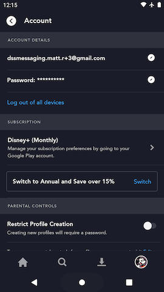
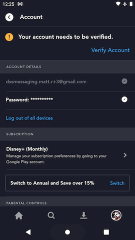
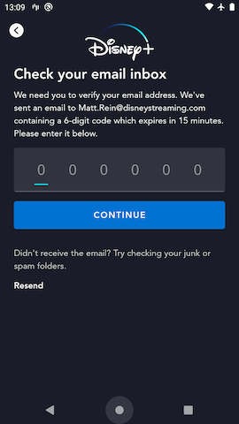
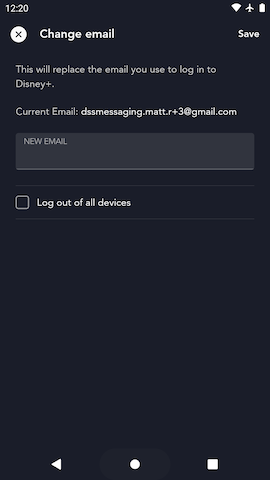
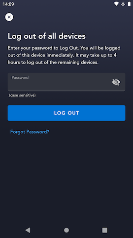
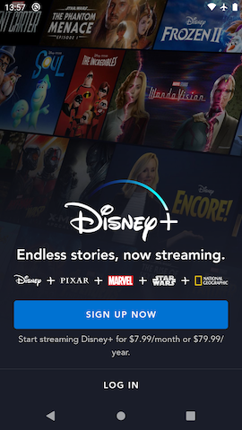

# Account Settings

## Overview

The Account Settings screen in the app is where authenticated users can check current account information and manage some settings related to their account. This page provides an entry point to several child pages and flows which are described below.



* * *

## `identityOnlyMe` graphql query

The Account Settings page pulls the data it needs to render from [`SessionStateRepository`](https://github.bamtech.co/Android/Dmgz/blob/development/features/sessionApi/src/main/java/com/bamtechmedia/dominguez/session/SessionStateRepository.kt) which is actually backed by a local cache on the device. Because requirements dictate that this page uses the most up to date data available, the app must first update that local cache.

To achieve this, whenever the Account Settings page is shown the app sends an [`identityOnlyMe`](https://github.bamtech.co/Android/Dmgz/blob/development/features/session/src/main/graphql/IdentityOnlyMe.graphql) graphql query in order to update the [`SessionState.Identity`](https://github.bamtech.co/Android/Dmgz/blob/development/features/sessionApi/src/main/java/com/bamtechmedia/dominguez/session/SessionState.kt#L726) data in the cache before fetching from `SessionStateRepository` and rendering the page.

??? info "`identityOnlyMe` response"
	This response payload is very large and subject to change as we update the graphql data schema as necessary for various features. To see a current example, take a look at the [identityOnlyMe response stub](https://github.bamtech.co/Android/Dmgz/blob/development/coreAndroidTest/src/main/assets/r2d2Responses/assemble/v1/public/graphql/identityOnlyMe_assemble_subscriber.json) used in instrumented tests. _Note: this example stub response has a placeholder "chunk" that gets replaced with actual `subscriber` payload data specific to each test scenario. See [`R2D2StubIdentityOnlyMeQuery`](https://github.bamtech.co/Android/Dmgz/blob/development/coreAndroidTest/src/main/java/com/bamtechmedia/dominguez/account/R2D2StubIdentityOnlyMeQuery.kt) and its usage in instrumented tests for more info._

## Verify Account Flow

Sometimes (especially after a new account signup) a user will need to verify that they own the email address associated with their account. Users will see a banner at the top of the Account Settings that prompts them to verify their account. Note, this banner only appears on mobile and tablet - this feature is not built for the TV platforms.

Users are in the "Verify Account" state when the session state's `account.attributes.userVerified` value is `false`.

**Note: User's in the "Verify Account" state are unable to change their account email address until they verify their account.** The [Change Email](#change-email) row will be grayed out and un-clickable when in this state.

??? example "Verify Account banner on Account Settings"
	

### Verify Account Flow Steps

1. User is authenticated, navigates to Account Settings and sees the Verify Account banner
2. Clicks on the Verify Account banner and lands on the [OtpVerifyFragment](../auth/screens/otp/#otpverifyfragment)
3. Enters OTP code they received via email and lands back on the Account Settings page
4. App shows a brief success flash message and the Account Settings page updates to remove the Verify Account banner and make the Change Email row clickable

??? tip "Verify Account flow chart"
	```mermaid
		graph TB
		A[User authenticated] -->|Navigate to Account Settings| B[Account Settings];
		B -->|App paints Account Settings page| C{`account.attributes.userVerified = false`?};
		C -->|Yes| D[Verify Account banner SHOWN];
		C -->|No| E[Verify Account banner NOT SHOWN];
		D -->|User clicks Verify Account banner| F[OTP];
		F -->|Correct OTP code submitted| B[Account Settings];
	```

??? example "Verify Account flow screens"
	| Account Settings with Verify Account Banner | [OTP](../auth/screens/otp/#otpverifyfragment) | Account Settings |
	|-|-|-|
	|  |  |  |

### Instrumented Test

- [VerifyAccountFlowTest](https://github.bamtech.co/Android/Dmgz/blob/development/mobile/src/androidTestGoogle/java/com/bamtechmedia/dominguez/account/verify/VerifyAccountFlowTest.kt)
	- _Only on mobile_

* * *

## Change Email

We offer users the ability to change their account email address via the Account Settings page. For more details about this functionality see the [Change Email Screen](screens/change_email.md)

### Change Email Flow Steps

1. User is authenticated and navigates to Account Settings
2. Clicks on the Change Email row and lands on the [OtpChangeEmailFragment](../auth/screens/otp/#otpchangeemailfragment)
3. Enters OTP code they received via email and lands on the [Change Email Screen](screens/change_email.md)
4. Enters the new email address they'd like to associate with their account
5. App returns to Account Settings page which updates to show the new email address and a brief success flash message is shown.

??? tip "Change Email flow chart"
	```mermaid
		graph TB
		A[User authenticated] -->|Navigate to Account Settings| B[Account Settings];
		B -->|App paints Account Settings page| C{`account.attributes.userVerified = false`?};
		C -->|Yes| D[Verify Account mode, Change Email UNAVAILABLE];
		C -->|No| E[Change Email AVAILABLE];
		E -->|User clicks Change Email row| F[OTP];
		F -->|Correct OTP code submitted| G[Change Email];
		G -->|User submits valid new email address| H{Log Out All Devices checked?};
		H -->|No| I[Success flash message];
		H -->|Yes| J[Logged out];
		I -->|Back to Account Settings| B[Account Settings];
	```

??? example "Change Email flow screens"
	| Account Settings | [OTP](../auth/screens/otp/#otpchangeemailfragment) | [Change Email](screens/change_email.md) | Account Settings |
	|-|-|-|-|
	|  |  |  |  |

* * *

## Change Password

We offer users the ability to change their account password via the Account Settings page. The actual password reset fragment used in this case is the [`AccountPasswordResetFragment`](https://github.bamtech.co/Android/Dmgz/blob/development/features/passwordReset/src/main/java/com/bamtechmedia/dominguez/password/reset/AccountPasswordResetFragment.kt) subclass of [`PasswordResetFragment`](https://github.bamtech.co/Android/Dmgz/blob/development/features/passwordReset/src/main/java/com/bamtechmedia/dominguez/password/reset/PasswordResetFragment.kt). For more details see the [AccountPasswordResetFragment subsection](../auth/screens/password_reset/#accountpasswordresetfragment) of the OTP Screen documentation.

### Change Password Flow Steps

1. User is authenticated and navigates to Account Settings
2. Clicks on the Change Password row and lands on the [`AccountOtpPasscodeFragment`](../auth/screens/otp/#accountotppasscodefragment)
3. Enters OTP code they received via email and lands on the [`AccountPasswordResetFragment`](../auth/screens/password_reset/#accountpasswordresetfragment)
4. Enters a new password to use for the account
5. App returns to Account Settings page and a brief success flash message is shown

??? tip "Change Password flow chart"
	```mermaid
		graph TB
		A[User authenticated] -->|Navigate to Account Settings| B[Account Settings];
		B -->|User clicks Change Password row| C[OTP];
		C -->|Correct OTP code submitted| D[Password Reset];
		D -->|Valid new password submitted| E{Log Out All Devices checked?};
		E -->|Yes| F[Logged out];
		E -->|No| G[Success flash message];
		G -->|Back to Account Settings| B[Account Settings];
	```

??? example "Change Password flow screens"
	| Account Settings | [OTP](../auth/screens/otp/#accountotppasscodefragment) | [Password Reset](../auth/screens/password_reset/#accountpasswordresetfragment) | Account Settings |
	|-|-|-|-|
	|  |  |  |  |

### Instrumented Test

- [ChangePasswordFlowTest](https://github.bamtech.co/Android/Dmgz/blob/development/mobile/src/androidTestGoogle/java/com/bamtechmedia/dominguez/account/password/ChangePasswordFlowTest.kt)
	- _Only on mobile_

* * *

## Log Out All Devices

We offer users the ability to log their account out on all devices where they are currently logged in via the Account Settings page.

### Log Out All Devices Flow Steps

1. User is authenticated and navigates to Account Settings
2. Clicks on the "Log out of all devices" row and lands on the [Log Out All Devices Screen](screens/load.md)
3. Enters their account password
4. Becomes logged out and lands back on the Welcome Screen

??? tip "Log Out All Devices flow chart"
	```mermaid
		graph TB
		A[User authenticated] -->|Navigate to Account Settings| B[Account Settings];
		B -->|User clicks Log Out All Devices row| C[Log Out All Devices];
		C -->|Correct password submitted| D[Logged out];
		D --> E[Welcome Screen];
	```

??? example "Log Out All Devices flow screens"
	| Account Settings | [Log Out All Devices](screens/load.md) | Welcome |
	|-|-|-|
	|  |  |  |

* * *

## Subscriptions

The Account Settings page displays a **Subscriptions** section that shows the user information about their account's currently active subscriptions. Each active subscription tied to the account is represented by a row that:

- Shows a title of the subscription and appends "Monthly" or "Annual" if we can determine the duration;
- Shows some sub-copy about the current subscription; and
- If possible, allows the user to click the row in order to manage that subscription by launching a URL in a browser tab.

### Subscription data

The [`SubscriptionCopyProvider`](https://github.bamtech.co/Android/Dmgz/blob/development/features/account/src/main/java/com/bamtechmedia/dominguez/account/item/SubscriptionCopyProvider.kt) uses data from [`SessionState.Subscriber`](https://github.bamtech.co/Android/Dmgz/blob/development/features/sessionApi/src/main/java/com/bamtechmedia/dominguez/session/SessionState.kt#L797) to return the proper title, subcopy, and onClick URL for a subscription row.

### Horizontal Stacking

There are a number of edge case scenarios where an account can have multiple current subscriptions which are "active" at the same time. This is referred to as "stacking". There are specific rules on how the app should render multiple subscriptions based on their specific stacking state. The documentation for these rules is can be found on the [FED Solution Architecture wiki](https://github.bamtech.co/pages/fed-solutions/documentation/commerce/horizontal-stacking.html).

It is worth noting that the app will only render multiple subscription rows (regardless of the particular stacking case) on mobile and tablet. On TV, the app will render a generic "multiple subscriptions" row if there are multiple active subscriptions to show for an account.

### Instrumented Tests

- AccountSettingsSubsTest
	- [mobile](https://github.bamtech.co/Android/Dmgz/blob/development/mobile/src/androidTestGoogle/java/com/bamtechmedia/dominguez/account/AccountSettingsSubsTest.kt)
	- [tv](https://github.bamtech.co/Android/Dmgz/blob/development/tv/src/androidTestGoogle/java/com/bamtechmedia/dominguez/account/AccountSettingsSubsTest.kt)
- [AccountSettingsStackedSubsTest](https://github.bamtech.co/Android/Dmgz/blob/development/mobile/src/androidTestGoogle/java/com/bamtechmedia/dominguez/account/AccountSettingsStackedSubsTest.kt)
	- _Only on mobile_

* * *
