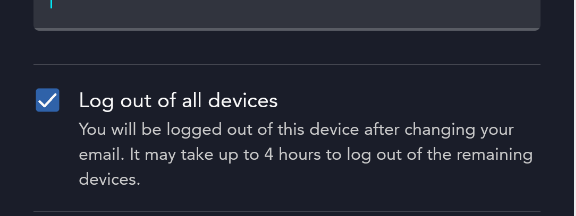
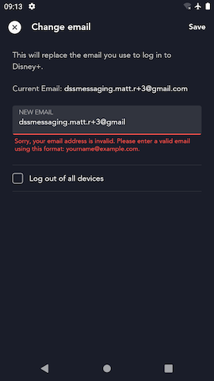
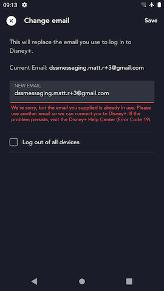

# Change Email Screen

## Overview

The Change Email screen ([`ChangeEmailFragment`](https://github.bamtech.co/Android/Dmgz/blob/development/features/account/src/main/java/com/bamtechmedia/dominguez/account/email/ChangeEmailFragment.kt)) allows the user to change their account email address. After successfully completing a change email operation, the user will have to use that **new** email address when logging into this app from that point forward.


## Important page elements

### Log Out All Devices checkbox

The Change Email screen includes a checkbox that provides an optional security feature. If the Log Out All Devices checkbox is checked when the user submits a new email address, then after successfully updating the account's email the app will log this account out on any device or browser where they are curently authenticated (including the current device).

This feature allows users who believe their account credentials have been compromised to revoke access from any potential bad actors logged in with their account credentials on any device.

??? example "Change Email - Log Out All Devices checkbox"
	

## `updateEmailWithActionGrant` graphql mutation

When the user submits the desired new email address to use for their account, the app sends a [`updateEmailWithActionGrant`](https://github.bamtech.co/Android/Dmgz/blob/development/features/session/src/main/graphql/UpdateEmailWithActionGrant.graphql) graphql mutation to the orchestration API. The following parameters are sent to this mutation:

- the new email address;
- the `actionGrant` token received from successful OTP validation (see [`authenticateWithOtp`](../../../auth/screens/otp/#authenticatewithotp-graphql-mutation)); and
- a boolean value indicating whether the user also wants to [log out of all devices](#log-out-all-devices-checkbox);

### Successful email change

If the user submits a valid new email address (valid meaning a proper email address format and also not already in use by another account in the backend) and their `actionGrant` is not expired, the `updateEmailWithActionGrant` mutation returns a response that indicates the operation was successful.

When this happens if the [log out all devices checkbox](#log-out-all-devices-checkbox) was unchecked, the user will see a brief flash message indicating success and be returned to the Account Settings screen where their new email address will be shown.

However if the user did check the log out all devices checkbox prior to submitting the new email address, the user will see an overlay indicating that they are logging out and they should use the new email address the next time they log in.

??? info "successful `updateEmailWithActionGrant` response"
	```json hl_lines="5"
	{
		"data": {
			"updateEmailWithActionGrant": {
				"__typename": "UpdateEmailResult",
				"accepted": true
			}
		},
		"extensions": {
			"operation": {
				"operationType": "mutation",
				"operations": [{
					"operation": "updateEmailWithActionGrant",
					"errorCode": null
				}]
			},
			"sdk": {
				"token": null,
				"session": null,
				"grant": null,
				"accountDelegationRefreshToken": null,
				"featureFlags": null
			}
		}
	}
	```

### Error handling

#### Client-side email validation

When the user submits an email address on this page the app first does a few client-side validation checks on the input in order to catch some common issues early and prevent making an unnecessary request to the server.

If the submitted email address input does not pass email address format validation the app handles this the same way as it would if it received an [INVALID_EMAIL error](#invalid_email-error) response for `updateEmailWithActionGrant`.

If the submitted email address matches the user's current account email address the app handles this the same way as it would if it received an [IDENTITY_ALREADY_EXISTS error](#identity_already_exists-error) response for `updateEmailWithActionGrant`.

#### INVALID_EMAIL error

If the submitted email address is not valid and somehow got past the app's [client-side email validation](#client-side-email-validation), the `updateEmailWithActionGrant` mutation returns an error response indicating this. In this case the app displays a form-field error under the email input field to let the user know they entered an invalid email address.

??? info "`updateEmailWithActionGrant" response - invalid email error"
	```json hl_lines="6"
	{
		"data": null,
		"errors": [{
			"message": "",
			"extensions": {
				"code": "idp.error.params.invalid-email"
			},
			"path": ["updateEmailWithActionGrant"],
			"locations": [{
				"line": 1,
				"column": 81
			}]
		}],
		"extensions": {
			"operation": {
				"operationType": "mutation",
				"operations": [{
					"operation": "updateEmailWithActionGrant",
					"errorCode": "idp.error.params.invalid-email"
				}]
			},
			"sdk": {
				"token": null,
				"session": null,
				"grant": null,
				"accountDelegationRefreshToken": null,
				"featureFlags": null
			}
		}
	}
	```

??? example "Invalid email address form field error"
	

#### IDENTITY_ALREADY_EXISTS error

If the submitted email address is already associated with another account in the backend, the `updateEmailWithActionGrant` mutation returns an error response indicating this. In this case the app displays a form-field error under the email input field to let the user know they need to select another email address for their account.

??? info "`updateEmailWithActionGrant" response - identity already exists error"
	```json hl_lines="6"
	{
		"data": null,
		"errors": [{
			"message": "upstream: 'identity'\nReceived error response from upstream error with status '409' and description 'Email address dssmessaging.matt.r+4@gmail.com already exists in OneId'",
			"extensions": {
				"code": "idp.error.identity.already-exists"
			},
			"path": ["updateEmailWithActionGrant"],
			"locations": [{
				"line": 1,
				"column": 81
			}]
		}],
		"extensions": {
			"operation": {
				"operationType": "mutation",
				"operations": [{
					"operation": "updateEmailWithActionGrant",
					"errorCode": "idp.error.identity.already-exists"
				}]
			},
			"sdk": {
				"token": null,
				"session": null,
				"grant": null,
				"accountDelegationRefreshToken": null,
				"featureFlags": null
			}
		}
	}
	```

??? example "Invalid email address form field error"
	

#### All other errors

Any other error returned in the `updateEmailWithActionGrant` response is handled the same way. The app uses `ErrorLocalization` to lookup the user-facing error message copy to show the user, and a full-bleed error dialog displays that copy. Upon dismissal, the user will land back on the Account Settings page to re-try the operation if they desire.

## Testing Change Email in QA environment

Because you have to go through the [OTP Screen](../../../auth/screens/otp/) in order to get to the Change Email screen, you will need an account email address that starts with `dssmessaging` in order to test Change Email in the QA environment. See [Testing OTP in QA environment](../../../auth/screens/otp/#testing-otp-in-qa-environment) for more details.

## Instrumented Tests

- ChangeEmailTest
	- [mobile](https://github.bamtech.co/Android/Dmgz/blob/development/mobile/src/androidTestGoogle/java/com/bamtechmedia/dominguez/account/email/ChangeEmailTest.kt)
	- [tv](https://github.bamtech.co/Android/Dmgz/blob/development/tv/src/androidTestGoogle/java/com/bamtechmedia/dominguez/account/email/ChangeEmailTest.kt)
