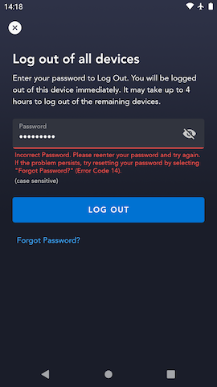

# Log Out All Devices (LOAD) Screen

## Overview

The Log Out All Devices screen (often abbreviated as "LOAD") allows an authenticated user to enter their account password in order to have their account logged out on all devices where it is currently authenticated  (including the current device). In code, this is the [`LogOutAllConfirmFragment`](https://github.bamtech.co/Android/Dmgz/blob/development/features/logoutAll/src/main/java/com/bamtechmedia/dominguez/logoutall/LogOutAllConfirmFragment.kt).

There are a handful of security-related reasons a user may want to do this:

- They logged in on a hotel TV or at a friend's house and forgot to log out before they left
- They disciplining a child by taking away Disney+ time on their tablet
- They believe a bad actor is currently logged in to their account and want to quickly revoke access before resetting their account password


## Important page elements

### Forgot Password CTA

The user can click the "Forgot Password?" CTA to launch into the [Change Password Flow](../../#change-password). They will see the [`AccountOtpPasscodeFragment`](../../../auth/screens/otp/#accountotppasscodefragment) where they enter the OTP code emailed to them. Then they will see the [`AccountPasswordResetFragment`](../../../auth/screens/password_reset/#accountpasswordresetfragment) where they can update their account password. After successfully updating their password they will land back on the Log Out All Devices screen where they can enter the new password to complete the log out all devices operation.

??? tip "Log Out All Devices -> Forgot Password flow chart"
	```mermaid
		graph TB
		A[User authenticated] -->|Navigate to Account Settings| B[Account Settings];
		B -->|Log Out All Devices row clicked| C[Log Out All Devices];
		C -->|'Forgot Password?' CTA clicked| D[OTP];
		D -->|Correct OTP code submitted| E[Password Reset];
		E -->|Valid new password submitted| C[Log Out All Devices];
		C -->|Correct password submitted| F[Logged out];
		F --> G[Welcome Screen];
	```

## `logoutAllDevices` graphql mutation

When the user submits their password on this screen, the app sends a [`logoutAllDevices`](https://github.bamtech.co/Android/Dmgz/blob/development/features/session/src/main/graphql/LogoutAllDevicesMutation.graphql) graphql mutation to the orchestration API passing along the current account's email address and the submitted password as arguments.

### `logoutAllDevices` success

If the user submitted the correct password for the current account, the `logoutAllDevices` graphql mutation returns a response indicating that the operation was successful.

What the success response really means is that the backend has found all currently "active" authenticated tokens that it has a record of for the current account and invalidates those tokens. The next time a user opens the app on another device where they were already logged in with this account, the app will make some authenticated request and the backend will send back an error code that prompts the app to immediately log out.

??? info "successful `logoutAllDevices` response"
	```json hl_lines="5"
	{
		"data": {
			"logoutAllDevices": {
				"__typename": "LogoutAllDevicesResult",
				"accepted": true
			}
		},
		"extensions": {
			"operation": {
				"operationType": "mutation",
				"operations": [{
					"operation": "logoutAllDevices",
					"errorCode": null
				}]
			},
			"sdk": {
				"token": null,
				"session": null,
				"grant": null,
				"accountDelegationRefreshToken": null,
				"featureFlags": null
			}
		}
	}
	```

### Error handling

#### INVALID_CREDENTIALS

If the password the user submitted was incorrect for the currently authenticated account, the `logoutAllDevices` mutation returns an error response that indicates this. In this case, the app displays a form-field error under the password input field to let the user know they entered the wrong password.

??? info "`logoutAllDevices` response - incorrect password error"
	```json hl_lines="6"
	{
		"data": null,
		"errors": [{
			"message": "upstream: 'identity'\nReceived error response from upstream error with status '401' and description 'Bad credentials sent for disney/matt.rein@disneystreaming.com'",
			"extensions": {
				"code": "idp.error.identity.bad-credentials"
			},
			"path": ["logoutAllDevices"],
			"locations": [{
				"line": 1,
				"column": 61
			}]
		}],
		"extensions": {
			"operation": {
				"operationType": "mutation",
				"operations": [{
					"operation": "logoutAllDevices",
					"errorCode": "idp.error.identity.bad-credentials"
				}]
			},
			"sdk": {
				"token": null,
				"session": null,
				"grant": null,
				"accountDelegationRefreshToken": null,
				"featureFlags": null
			}
		}
	}
	```

??? example "Incorrect password form field error"
	

#### PASSWORD_RESET_REQUIRED

If the user's account is security flagged in the backend to force the user to reset their account password, the `logoutAllDevices` mutation returns an error response that indicates this. In this case, the app routes the user into the OTP -> Password Reset flow just as if the user had clicked the [Forgot Password CTA](#forgot-password-cta).

??? info "`logoutAllDevices` response - password reset required error"
	```json hl_lines="6"
	{
		"data": null,
			"errors": [{
			"message": "upstream: 'identity'\nReceived error response from upstream error with status '401' and description 'Password reset required.'",
			"extensions": {
				"code": "idp.error.identity.password-reset-required"
			},
			"path": ["logoutAllDevices"],
			"locations": [{
				"line": 1,
				"column": 61
			}]
		}],
		"extensions": {
			"operation": {
				"operationType": "mutation",
				"operations": [{
					"operation": "logoutAllDevices",
					"errorCode": "idp.error.identity.password-reset-required"
				}]
			},
			"sdk": {
				"token": null,
				"session": null,
				"grant": null,
				"accountDelegationRefreshToken": null,
				"featureFlags": null
			}
		}
	}
	```

#### All other errors

Any other error returned in the `logoutAllDevices` mutation response is handled the same way. The app uses `ErrorLocalization` to lookup the user-facing error message copy to show the user, and a full-bleed error dialog displays that copy. Upon dismissal, the user will land back on the Account Settings page to re-try the operation if they desire.

## Instrumented Tests

- LogOutAllDevicesTest
	- [mobile](https://github.bamtech.co/Android/Dmgz/blob/development/mobile/src/androidTestGoogle/java/com/bamtechmedia/dominguez/logoutall/LogOutAllDevicesTest.kt)
	- [tv](https://github.bamtech.co/Android/Dmgz/blob/development/tv/src/androidTestGoogle/java/com/bamtechmedia/dominguez/logoutall/LogOutAllDevicesTest.kt)
