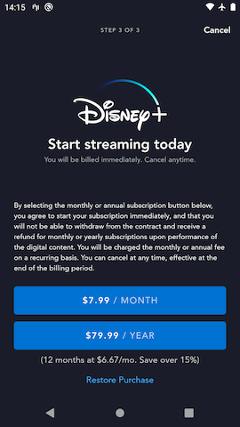
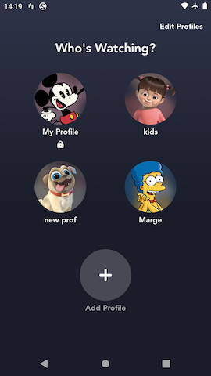
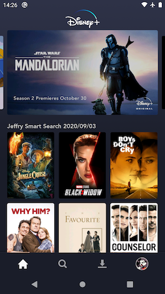

# Authentication & Signup

**Authentication** is all about how a user logs into the application. **Signup** is an important subset of authentication where new users can create a new account for the application.

* * *

## Login flows

### Happy Path

The simplest flow (we'll call it the "happy path") is where an unauthenticated user:

1. Launches the app and lands on the _Welcome_ screen
2. Clicks the Login CTA to land on the [Login Email](screens/login_email.md) screen
3. Submits their email address and lands on the [Login Password](screens/login_password.md) screen
4. Submits their password

At this point, the user is **authenticated**. This means the access token stored in the app's cache is associated with their account and can be used to make API requests that require an authenticated token. They should be able to access the main part of the app as long as they have an active entitlement.

??? tip "Login happy path flow chart"
	```mermaid
		graph TB
		A[Welcome] -->|Login CTA click| B[Login Email];
		B -->|User submits email| C{`check` response includes `Login`?};
		C -->|Yes| D[Login Password];
		D -->|Correct password submitted| E[Authenticated];
	```

??? example "Login happy path screens"
	| Welcome | [Login Email](screens/login_email.md) | [Login Password](screens/login_password.md) |
	|-|-|-|
	|  |  |  |

??? info "A user will remain logged in until"

    - Performing a Log Out on that device.
    - Performing  "Log Out Of All Devices" while logged into this account on any device including the current one.
    - Their access token expires after not using the app for a long period of time. In the PROD environment this takes several months of not using the app to occur.
    - Some other process in the backend which could invalidate any existing access tokens associated with the account as a security measure.

* * *

### Edge Cases

#### Login Forgot Password

In this case, the unauthenticated user:

1. Launches the app and lands on the _Welcome_ screen
2. Clicks the Login CTA to land on the [Login Email](screens/login_email.md) screen
3. Submits their email address and lands on the [Login Password](screens/login_password.md) screen
4. Clicks the "Forgot Password?" CTA and lands on the [OTP](screens/otp.md) screen
5. Enters OTP code they received via email and lands on the [Password Reset](screens/password_reset.md) screen
6. Enters a new password for the account

Upon successfully updating their password, the user is **authenticated**.

??? tip "Login Forgot Password flow chart"
	```mermaid
		graph TB
		A[Welcome] -->|Login CTA click| B[Login Email];
		B -->|User submits email| C{`check` response includes `Login`?};
		C -->|Yes| D[Login Password];
		D -->|Forgot Password CTA click| E[OTP];
		E -->|Correct OTP code submitted| F[Password Reset];
		F -->|Valid new password submitted| G[Authenticated];
	```

??? example "Login Forgot Password screens"
	| Welcome | [Login Email](screens/login_email.md) | [Login Password](screens/login_password.md) | [OTP](screens/otp.md) | [Password Reset](screens/password_reset.md) |
	|-|-|-|-|-|
	|  |  |  |  |  |

* * *

#### OTP Login

In this case, the unauthenticated user:

1. Launches the app and lands on the _Welcome_ screen
2. Clicks the Login CTA to land on the [Login Email](screens/login_email.md) screen
3. Submits their email address and lands on the [OTP](screens/otp.md) screen
4. Enters OTP code they received via email

Upon successfully entering the correct OTP code, the user is **authenticated**.

??? tip "OTP Login flow chart"
	```mermaid
		graph TB
		A[Welcome] -->|Login CTA click| B[Login Email];
		B -->|User submits email| C{`check` response contains just `OTP`?};
		C -->|Yes| D[OTP];
		D -->|User submits correct OTP code| E{`authenticateWithOtp` response has `securityAction: ChangePassword`?};
		E -->|No| F[Authenticated];
	```

??? example "OTP Login screens"
	| Welcome | [Login Email](screens/login_email.md) | [OTP](screens/otp.md) |
	|-|-|-|
	|  |  | |

* * *

#### OTP Login -> Forced Password Reset

In this case, the unauthenticated user:

1. Launches the app and lands on the _Welcome_ screen
2. Clicks the Login CTA to land on the [Login Email](screens/login_email.md) screen
3. Submits their email address and lands on the [OTP](screens/otp.md) screen
4. Enters OTP code they received via email and receives a response with `securityAction: ChangePassword`
5. Lands on the [Password Reset](screens/password_reset.md) screen
6. Enters a new password for the account

Upon successfully updating their password, the user is **authenticated**.

??? tip "OTP Login -> Forced Password Reset flow chart"
	```mermaid
		graph TB
		A[Welcome] -->|Login CTA click| B[Login Email];
		B -->|User submits email| C{`check` response contains just `OTP`?};
		C -->|Yes| D[OTP];
		D -->|User submits correct OTP code| E{`authenticateWithOtp` response has `securityAction: ChangePassword`?};
		E -->|Yes| F[Password Reset];
		F -->|Valid new password submitted| G[Authenticated];
	```

??? example "OTP Login -> Forced Password Reset screens"
	| Welcome | [Login Email](screens/login_email.md) | [OTP](screens/otp.md) | [Password Reset](screens/password_reset.md) |
	|-|-|-|-|
	|  |  |  |  |

* * *

## Signup Flows

### Signup Happy Path

This is the typical flow that a user signing up for a new account for the app will see.

1. Launches app and lands on the _Welcome_ screen
2. Clicks the "Sign Up Now" CTA to land on the [Signup Email](screens/signup_email.md) screen
3. If the user is in a country that requires showing a Disclosure Review step, they will see the [Disclosure Review](screens/disclosure_review.md) screen, otherwise this step is skipped
4. Lands on the [Signup Password](screens/signup_password.md) screen
5. Creates and submits a new password

At this point a new account was created and the user is **authenticated**. Since all new accounts start out unsubscribed, the user will be routed to the Paywall screen next.

??? tip "Signup happy path flow chart"
	``` mermaid
	graph TB
	  A[Welcome] -->|Signup CTA click| B[Signup Email];
	  B -->|User submits email| C{`check` response includes `Register`?};
	  C -->|Yes| D{activeReviewDisclosures count?};
	  D -->|0| F[Signup Password];
	  D -->|>0| E[Disclosure Review];
	  E -->|User agrees| F[Signup Password];
	  F -->|Valid password submitted| G[Authenticated];
	```

??? example "Signup happy path screens"
	| Welcome | [Signup Email](screens/signup_email.md) | [Disclosure Review (optional)](screens/disclosure_review.md) | [Signup Password](screens/signup_password.md) |
	|-|-|-|-|
	|  |  |  |  |

* * *

### Edge Cases

#### Signup Email -> Login Happy Path

It's possible that a user may have forgotten that they already have an account associated with the email address they are trying to Signup with. When this happens we seamlessly send the user from the [Signup Email](screens/signup_email.md) page to the [Login Password](screens/login_password.md) page so that they can just login to that account normally.

1. Launches the app and lands on the _Welcome_ screen
2. Clicks the "Sign Up Now" CTA to land on the [Signup Email](screens/signup_email.md) screen
3. Submits their email address and lands on the [Login Password](screens/login_password.md) screen
4. Submits their password

Upon successfully updating their password, the user is **authenticated**.

??? tip "Signup Email -> Login Happy Path flow chart"
	``` mermaid
	graph TB
	  A[Welcome] -->|Signup CTA click| B[Signup Email];
	  B -->|User submits email| C{`check` response includes `Login`?};
	  C -->|Yes| D[Login Password];
	  D -->|Correct password submitted| E[Authenticated];
	```

??? example "Signup Email -> Login Happy Path screens"
	| Welcome | [Signup Email](screens/signup_email.md) | [Login Password](screens/login_password.md) |
	|-|-|-|
	|  |  |  |

* * *

#### Signup Email -> OTP Login

This flow is similar to the [Signup Email -> Login Happy Path](#signup-email-login-happy-path) flow above. In this case a user who already has an account attempts to signup with that account's email address. However unlike the above flow, the account is flagged to force the user into the OTP authentication (and possibly the forced password reset flow).

1. Launches the app and lands on the _Welcome_ screen
2. Clicks the "Sign Up Now" CTA to land on the [Signup Email](screens/signup_email.md) screen
3. Submits their email address and lands on the [OTP](screens/otp.md) screen
4. Enters OTP code they received via email

Upon successfully entering the correct OTP code, the user is **authenticated**.

??? tip "Signup Email -> OTP Login flow chart"
	``` mermaid
	graph TB
	  A[Welcome] -->|Signup CTA click| B[Signup Email];
	  B -->|User submits email| C{`check` response contains `OTP`, nextAction: `Login`?};
	  C -->|Yes| D[OTP];
	  D -->|User submits correct OTP code| E{`authenticateWithOtp` response has `securityAction: ChangePassword`?};
	  E -->|No| F[Authenticated];
	  E -->|Yes| G[Password Reset];
	  G -->|Valid new password submitted| F[Authenticated];
	```

??? example "Signup Email -> OTP Login screens"
	| Welcome | [Signup Email](screens/signup_email.md) | [OTP](screens/otp.md) |
	|-|-|-|
	|  |  | |

* * *

#### RegisterAccount

The RegisterAccount flow is a special case where a user already has an account for one app (e.g. **Disney+**) and they attempt to sign up for a new account for one of our other apps (e.g. **Star+**) using the same email address. For example, a user already has a **Disney+** account with email address `mickey.mouse@twdc.com` and they try to sign up for a **Star+** account with that same email address.

The idea here is that both of these "accounts" (one for Star+ and one for Disney+) are connected to the same "identity" in the backend. The accounts will effectively share the same credentials. This means that later if the user changes their account's password on **Disney+**, they will need to use that new password to log in to **Star+** next time.

Here are the steps in the typical RegisterAccount signup flow:

1. User launches the app and lands on the _Welcome_ screen
2. Clicks the "Sign Up Now" CTA to land on the [Signup Email](screens/signup_email.md) screen
3. If the user is in a country that requires showing a Disclosure Review step, they will see the [Disclosure Review](screens/disclosure_review.md) screen, otherwise this step is skipped
4. Lands on the [RegisterAccount Password](screens/register_account_password.md) screen
5. Submits their identity's password to create a new account for this app

At this point a new account was created and attached to the user's existing "identity" and the user is **authenticated**.

??? tip "RegisterAccount flow chart"
	``` mermaid
	graph TB
	  A[Welcome] -->|Signup CTA click| B[Signup Email];
	  B -->|User submits email| C{`check` response includes `RegisterAccount`?};
	  C -->|Yes| D{activeReviewDisclosures count?};
	  D -->|0| F[RegisterAccount Password];
	  D -->|>0| E[Disclosure Review];
	  E -->|User agrees| F[RegisterAccount Password];
	  F -->|Correct password submitted| G[Authenticated];
	```

??? example "RegisterAccount screens"
	| Welcome | [Signup Email](screens/signup_email.md) | [Disclosure Review (optional)](screens/disclosure_review.md) | [RegisterAccount Password](screens/register_account_password.md) |
	|-|-|-|-|
	|  |  |  |  |

* * *

#### OTP RegisterAccount

The OTP RegisterAccount flow is sort of a combination of the [RegisterAccount](#registeraccount) flow and the [OTP Login -> Forced Password Reset](#otp-login-forced-password-reset) flow. In this case, a user already has an account for one app (e.g. **Disney+**) and they attempt to sign up for a new account with one of our other apps (e.g. **Star+**), just like the RegisterAccount flow. The difference here is that the existing account (for the first app) is in a **Security Flagged** state and requires a password reset. This flow handles both the new account creation as well as the password reset in one sequence of screens.

Here are the steps for the OTP RegisterAccount signup flow:

1. User launches the app and lands on the _Welcome_ screen
2. Clicks the "Sign up Now" CTA to land on the [Signup Email](screens/signup_email.md) screen
3. Submits their email address
4. If the user is in a country that requires showing a Disclosure Review step, they will see the [Disclosure Review](screens/disclosure_review.md) screen, otherwise this step is skipped
5. Lands on the [OTP](screens/otp.md) screen
6. Enters OTP code they received via email and receives a response with `securityAction: ChangePassword`
7. Lands on the [Password Reset](screens/password_reset.md) screen
8. Enters a new password for the account

Upon successfully updating their password, the app calls the `registerWithActionGrant` graphql query to also create an account for the user for the current application, and the user is **authenticated**.

??? tip "OTP RegisterAccount flow chart"
	```mermaid
		graph TB
		A[Welcome] -->|Signup CTA click| B[Signup Email];
		B -->|User submits email| C{`check` response contains `OTP`, nextAction: `RegisterAccount`?};
		C -->|Yes| D{activeReviewDisclosures count?};
		D -->|0| F[OTP];
		D -->|>0| E[Disclosure Review];
		E -->|User agrees| F[OTP];
		F -->|User submits correct OTP code| G{`authenticateWithOtp` response has `securityAction: ChangePassword`?};
		G -->|Yes| H[Password Reset];
		H -->|Valid new password submitted| I[Authenticated];
	```

??? example "OTP RegisterAccount screens"
	| Welcome | [Signup Email](screens/signup_email.md) | [Disclosure Review (optional)](screens/disclosure_review.md) |  [OTP](screens/otp.md) | [Password Reset](screens/password_reset.md) |
	|-|-|-|-|-|
	|  |  |  |  |  |

* * *

## After Authentication

The next page the user will land on after getting authenticated is determined by a number of factors. They may land on:

### Marketing Opt In

There are edge case scenarios where we need to force a user to agree to our legal disclosures and indicate whether they want to opt in or out of receiving marketing communications before actually using the app. When `identity.flows.marketingPreferences.isOnboarded = false` and `identity.flows.marketingPreferences.isOnboarded = true`, the user will be shown the [Marketing Opt In](screens/marketing_opt_in.md) page. This page forces the user to "agree" to the current set of legal disclosures and choose to opt in or out of marketing preferences before they can enter the rest of the app and start streaming anything.

??? example "Marketing Opt In screen"
	| Marketing Opt In |
	|-|
	|  |

* * *

### Paywall

- This is where the user can make an In App Purchase (IAP) for a monthly or annual subscription for the app
- The user will land here after authenticating if their account does not have an active subscription / entitlement for the app.

??? example "Paywall screens"
	| Paywall |
	|-|
	|  |

* * *

### Who's Watching

- Also known as the **Profile Picker**
- A user who has more than one profile associated with their account will land here
	- On mobile and tablet, they only land here once until they choose a profile to use, regardless of how many profiles they have.
	- On TV, users with multiple profiles will always land on the **Profile Picker** when launching the app while authenticated.

??? example "Who's Watching screen"
	| Who's Watching |
	|-|
	|  |

* * *

### Home

This is the main page where users can start exploring content to watch.

??? example "Home screen"
	| Home |
	|-|
	|  |
