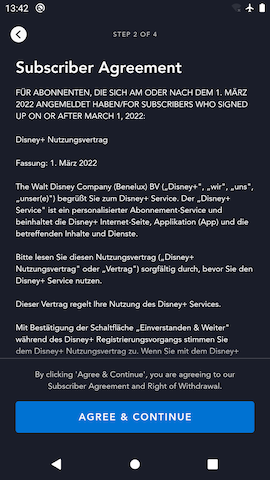

# Disclosure Review Screen

## Overview

The laws in certain countries (e.g. Germany) require apps to provide an easy way for users to read the entirety of certain legal documents and explicitly "agree" to them during account signup.  The Disclosure Review screen fulfills this requirement by providing:

- a scrollable window showing an entire legal document text; and
- a CTA that the user must press to agree to the terms displayed and progress to the next step of the onboarding flow

## Data

The Disclosure Review screen requires a list of [`LegalDisclosure`s](https://github.bamtech.co/Android/Dmgz/blob/development/features/legalApi/src/main/java/com/bamtechmedia/dominguez/legal/api/LegalDomainModels.kt#L61) whose `requiresActiveReview` flag is set to `true` to be provided as an argument.  This list comes from the [Graph `anonymousDocuments` query](https://github.bamtech.co/Android/Dmgz/blob/development/features/legal/src/main/graphql/AnonymousDocumentsQuery.graphql). The response contains the full legal text to display as well as a list of metadata to support any hyper-linkable chunks of the copy that the client app should linkify.

??? info "Disclosure Review can show multiple instances if there are multiple active review disclosures"

	So far, in all of the countries where the app is live there are either 0 or 1 `LegalDisclosure`s with `requiresActiveReview = true`.  This means that all users will either NOT see any Disclosure Review pages (when there are 0), or see only one Disclosure Review page (when there is 1).  That said, this page is built to dynamically handle if there happen to be more than 1 `LegalDisclosure`s that require active review.  This is why the page receives a **list** of `LegalDisclosure`s as well as an integer value representing the index in that list of the `LegalDisclosure` to use for the currently showing instance of the Disclosure Review screen.

### Error handling

When the documents query fails to load for any reason, we are unable to render the Disclosure Review page.  Since we have never received specific error handling requirements, the app displays a full-bleed error dialog showing the generic "Error code 83" user-facing error message if there are any issues loading the data required from this endpoint.

## Instrumented Tests

- PaywallFlowTest
	- [mobile](https://github.bamtech.co/Android/Dmgz/blob/development/mobile/src/androidTest/java/com/bamtechmedia/dominguez/paywall/PaywallFlowTest.kt)
	- [tv](https://github.bamtech.co/Android/Dmgz/blob/development/tv/src/androidTest/java/com/bamtechmedia/dominguez/paywall/PaywallFlowTest.kt)
- SignupFlowTest
	- [mobile](https://github.bamtech.co/Android/Dmgz/blob/development/mobile/src/androidTest/java/com/bamtechmedia/dominguez/signup/SignupFlowTest.kt)
	- [tv](https://github.bamtech.co/Android/Dmgz/blob/development/tv/src/androidTest/java/com/bamtechmedia/dominguez/signup/SignupFlowTest.kt)
