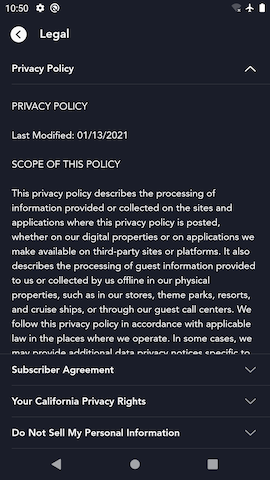

# Legal Center Screen

## Overview

The Legal Center screen lets users read all of the legal documents that they agree to when signing up for an account. The page is fully dynamic because legal documents differ between different countries and territories that our apps are available in. All data in this screen comes from the [Graph API `meDocuments` query](#graph-medocuments-query).

## Important page elements

### Selectable Legal Doc Titles

Most (if not all) of the countries that our apps are available in have multiple legal documents that appear in the Legal Center. Design requirements call for the full copy of **only one document to be displayed at a time**. The Legal Center therefore displays a listing of the titles of all of the legal documents for the current region. The user can click (mobile) or select (tv) one of the titles to expand and display the full legal document copy for that title.

### Scrollable Legal Doc Contents

The Legal Center displays a scrollable view that displays the full copy of the currently "selected" legal document title.

Some slight design differences exist here between mobile and TV. On mobile, clicking a title row will expand a [Scrollable Legal Doc Contents](#scrollable-legal-doc-contents) view directly below that title inline. However on TV, the titles all appear in a separate scrollable list on the left side of the screen, while the copy of the currently selected legal document is displayed in a single scrollable view on the right hand side.

### Links in Legal Doc Contents

The data payload for an individual legal document includes a list of link data that the app uses to dynamically linkify the appropriate words in the copy. These links can point to:

- A URL, which when clicked will launch in a browser tab; or
- A documentCode which refers to another legal document, which when clicked will expand that other document in the Legal Center

On mobile, we actually apply the blue underlined hyperlink style and make the linkified copy clickable. However on TV devices since there is no web browser present, our requirements are to display the backing URL from the links data inline in the copy in parentheses next to the words that should be linkified.

## Graph Documents query

The Legal Center screen is populated dynamically by the data returned from the Graph Documents query. Based on the user's logged in state, we either query `anonymousDocuments` or `meDocuments`. This response data provides the list of documents to display for the current region, including their content.

??? info "`meDocuments` example response"
	This response payload is very large. To see a current example, take a look at the [stub response](https://github.bamtech.co/Android/Dmgz/blob/development/coreAndroidTest/src/main/assets/r2d2Responses/v1/public/graphql/logged_in_legal_marketing_docs_us_en.json) we use in instrumented tests.

??? info "`anonymousDocuments` example response"
	This response payload is very large. To see a current example, take a look at the [stub response](https://github.bamtech.co/Android/Dmgz/blob/development/coreAndroidTest/src/main/assets/r2d2Responses/v1/public/graphql/anonymous_legal_marketing_docs_us_en.json) we use in instrumented tests.

### Error handling

When the documents fail to load for any reason, we are unable to render the Legal Center page. Since we have never received specific error handling requirements for site config, the app displays a full-bleed error dialog showing the generic "Error code 83" user-facing error message if there are any issues loading the data required from this endpoint.
 documentation should be updated to reflect this at the time that work is completed on Android.

## Restricted Onboarding Language

Having all the different legal documents for different countries translated to all languages that the app supported is cost prohibitive. To solve this the app enforces **Restricted Onboarding Language** (ROL) rules.

The idea of ROL is that we limit the number of languages that legal documents will be translated to for any given country or territory to just a handful of languages that make sense for that region. For example, in Canada, legal documents are only available in English and French, whereas in the US, English and Spanish.

In order to not provide a jarring experience for users going through onboarding flows, whatever ROL language for a certain region is determined to be the best one for the current user is used not just on the Legal Center page, but rather **all of the onboarding (unauthenticated) pages of the app**. This way a user doesn't see the Welcome screen in one language, but the Legal Center in another.

## Entry points

Users can access the Legal Center screen two different ways (described below).

### Unauthenticated entry point

Before a user is authenticated, they can access the Legal Center screen via the [Signup Email screen](signup_email.md). On mobile, the user can click one of the hyperlinks in the [Legal Disclosures](../signup_email/#legal-disclosures) copy displayed above the "Agree and Continue" primary CTA. On TV, because we don't linkify the Legal Disclosures copy on Signup Email, a secondary CTA is shown below the primary that allows users to access the Legal Center.

### Authenticated entry point

After a user is authenticated, they can access the Legal Center via the "Legal" row in the Settings menu of the app.

## Instrumented Tests

- LegalCenterOnboardingTest
	- [mobile](https://github.bamtech.co/Android/Dmgz/blob/development/mobile/src/androidTestGoogle/java/com/bamtechmedia/dominguez/legal/LegalCenterOnboardingTest.kt)
	- [tv](https://github.bamtech.co/Android/Dmgz/blob/development/tv/src/androidTestGoogle/java/com/bamtechmedia/dominguez/legal/LegalCenterOnboardingTest.kt)
- LegalCenterAuthenticatedTest
	- [mobile](https://github.bamtech.co/Android/Dmgz/blob/development/mobile/src/androidTestGoogle/java/com/bamtechmedia/dominguez/legal/LegalCenterAuthenticatedTest.kt)
	- [tv](https://github.bamtech.co/Android/Dmgz/blob/development/tv/src/androidTestGoogle/java/com/bamtechmedia/dominguez/legal/LegalCenterAuthenticatedTest.kt)
