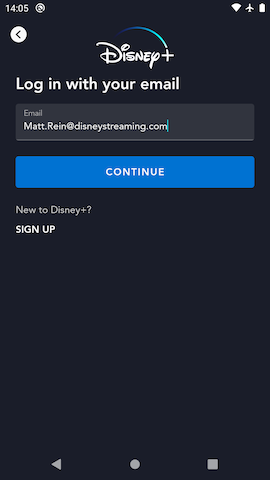
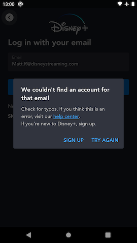
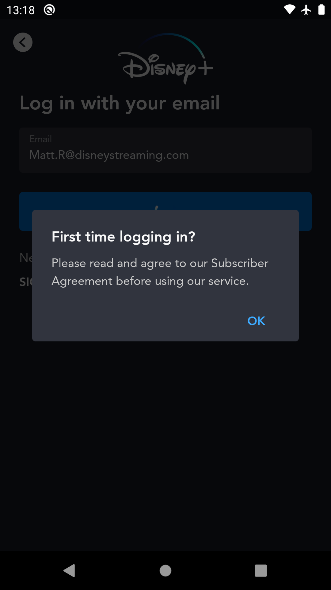

# Login Email Screen

## Overview

The Login Email page is the first step for a user who already has an account to login and become authenticated.  At this step the user enters the email address associated with their account.  The next page a user will see depends on the response from the `check` API that the email address is submitted to.  
The most common use case (happy path) is that the user will see the [Login Password](login_password.md) page so that they can simply enter their password to log in.



## `check` query

When the user submits their email address, the application passes the entered email address to the orchestration API's `check` query.  The response for this query contains an `operations` array, and the values in this array indicates what the backend "knows" about an account with this email address and therefore what screen the user should see next in their onboarding journey.

### `"Login"` response

??? info "`check` response - operation: `"Login"`"

	```json hl_lines="5"
	{
		"data": {
			"check": {
				"__typename": "Operations",
				"operations": ["Login", "OTP"],
				"nextOperation": null
			}
		},
		"extensions": {
			"operation": {
				"operationType": "query",
				"operations": [
					{
						"operation": "check",
						"errorCode": null
					}
				]
			},
			"sdk": {
				"token": null,
				"session": null,
				"grant": null,
				"accountDelegationRefreshToken": null,
				"featureFlags": null
			}
		}
	}
	```

This is the [happy path](../../#happy-path) response.

When the response's `operations` array contains a `"Login"`, this indicates that the user should be able to just enter the password associated with the provided email address in order to log in.  The app will route the user to the [Login Password](login_password.md) in this case.

??? note "A note about the happy path response"

	As you will see in the example response above, `"Login"` operation is almost always delivered as a pair with `"OTP"` in the `operations` array.  This is because in theory the user is also able to just login with an OTP code in order become authenticated.  
	The app does not really offer a way for the user to do this mode of authentication for users at this time so you can disregard this part of the `check` response.  The app code just looks for any occurence of `"Login"` in the `operations` array to determine this case, ignoring whatever else might be in the array.

### `"Register"` response

??? info "`check` response - operation: `"Register"`"

	```json hl_lines="5"
	{
		"data": {
			"check": {
				"__typename": "Operations",
				"operations": ["Register"],
				"nextOperation": null
			}
		},
		"extensions": {
			"operation": {
				"operationType": "query",
				"operations": [
					{
						"operation": "check",
						"errorCode": null
					}
				]
			},
			"sdk": {
				"token": null,
				"session": null,
				"grant": null,
				"accountDelegationRefreshToken": null,
				"featureFlags": null
			}
		}
	}
	```

When the `operations` array contains `"Register"`, this means that the email address provided does not match any account in our system, and so we prompt the user to double check the email address they entered for typos or to sign up for a new account with that email address.

??? example "Sign up or Try again"
	

- If the user clicks the "Sign Up" CTA, we route the user to the [Signup Email](signup_email.md) page, and pre-populate the email address they had submitted.

- If the user clicks the "Try Again" CTA, the dialog dismisses and they remain on this page, now with a form-field error showing that indicates there was an issue with the email address they had submitted.

	??? example "Invalid email address form field error"
		

### `"RegisterAccount"` response

??? info "`check` response - operation: `"RegisterAccount"`"

	```json hl_lines="5"
	{
		"data": {
			"check": {
				"__typename": "Operations",
				"operations": ["RegisterAccount"],
				"nextOperation": null
			}
		},
		"extensions": {
			"operation": {
				"operationType": "query",
				"operations": [
					{
						"operation": "check",
						"errorCode": null
					}
				]
			},
			"sdk": {
				"token": null,
				"session": null,
				"grant": null,
				"accountDelegationRefreshToken": null,
				"featureFlags": null
			}
		}
	}
	```

When the `operations` array contains `"RegisterAccount"`, this means that there is an account in the backend for the provided email, but it is not an account for the particular app that the user is attempting to log in on.  
For example a user may have a Star+ account but not a Disney+ account yet.  If they were to try and log in with that email address on Disney+ they receive this response for the `check` query.

When this happens, the user is presented a dialog prompting them to enter the RegisterAccount flow.  Clicking the OK CTA sends them to the [Signup Email](signup_email.md) page to start that flow.

??? example "RegisterAccount dialog"
	

### `"OTP"` + `nextOperation: "Login"` response

??? info "`check` response - operation:`"OTP"` nextOperation: `"Login"`"

	```json hl_lines="5 6"
	{
		"data": {
			"check": {
				"__typename": "Operations",
				"operations": ["OTP"],
				"nextOperation": "Login"
			}
		},
		"extensions": {
			"operation": {
				"operationType": "query",
				"operations": [
					{
						"operation": "check",
						"errorCode": null
					}
				]
			},
			"sdk": {
				"token": null,
				"session": null,
				"grant": null,
				"accountDelegationRefreshToken": null,
				"featureFlags": null
			}
		}
	}
	```

This is the [OTP Login](../../#otp-login) response.

When the `operations` array contains `"OTP"` but not `"Login"` and the response's `nextOperation` field is `"Login"`, this indicates that the account associated with the provided email address has been flagged to force the user into an OTP flow in order to log in.  This happens if some backend process flags the account for security reasons.  
A common cause for this might be that there has been a suspicious number of login attempts for this account from different parts of the world, for example.

When this response is received, the user will be shown the [OTP](otp.md) screen, where they will have to enter a 6 digit pin code that is sent to the provided email address in order to authenticate.

### `"OTP"` + `nextOperation: "RegisterAccount"` response

??? info "`check` response - operation: `"OTP"` nextOperation: `"RegisterAccount"`"

	```json hl_lines="5 6"
	{
		"data": {
			"check": {
				"__typename": "Operations",
				"operations": ["OTP"],
				"nextOperation": "RegisterAccount"
			}
		},
		"extensions": {
			"operation": {
				"operationType": "query",
				"operations": [
					{
						"operation": "check",
						"errorCode": null
					}
				]
			},
			"sdk": {
				"token": null,
				"session": null,
				"grant": null,
				"accountDelegationRefreshToken": null,
				"featureFlags": null
			}
		}
	}
	```

When `operations` contains `"OTP"` on its own (no other operations in the array), and the `nextOperation` field is `"RegisterAccount"`, this indicates 2 things:

- The account associated with the provided email is in flagged state where we need to force the user to do a successful OTP operation in order to prove they own the provided email address - similar to [OTP + nextOperation: Login response](#otp-nextoperation-login-response).
- The account associated with the provided email exists, but is for a different app than the one the user is trying to log in with - similar to [RegisterAccount response](#registeraccount-response).

What happens in this case is we send the user to the same starting point for the RegisterAccount flow - [Signup Email](signup_email.md).  See more details on the Signup Email documentation for how this case is handled downstream.

## Error handling

### Client-side email validation

When the user submits the email address, the app first does some client-side validation to ensure what has been entered is a valid email address before submitting the input to the remote `check` operation.  If that validation result is that the input is not a valid email address, we show a form-field error prompting the user to double-check their input.

??? example "Invalid email address form field error"
	

### Server-side email validation

If the client-side email validation doesn't detect any issues, there's still a chance that the backend could determine that the provided input is not a valid email address.  From a user perspective, this is treated the same way as described in [client-side email validation](#client-side-email-validation) above.

### All other errors

Any other error that is returned in the `check` response is handled the same way.  The app uses `ErrorLocalization` to lookup the user-facing error message copy to show the user, and a full-bleed error dialog will be displayed to the user with that error copy.

## Instrumented Tests

- LoginFlowTest
	- [mobile](https://github.bamtech.co/Android/Dmgz/blob/development/mobile/src/androidTest/java/com/bamtechmedia/dominguez/login/LoginFlowTest.kt)
	- [tv](https://github.bamtech.co/Android/Dmgz/blob/development/tv/src/androidTest/java/com/bamtechmedia/dominguez/login/LoginFlowTest.kt)
- [LoginForgotPasswordTest](https://github.bamtech.co/Android/Dmgz/blob/development/mobile/src/androidTestGoogle/java/com/bamtechmedia/dominguez/otp/LoginForgotPasswordTest.kt)
