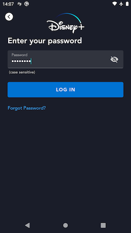
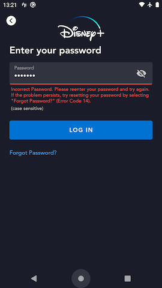
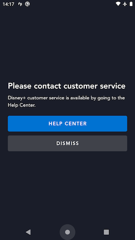

# Login Password Screen

## Overview

The Login Password page allows the user to enter their password in order to authenticate.  The password the user enters is sent along with the email address that they entered (on the [Login Email](login_email.md) page prior to this one) are sent as a pair of arguments to the `login` graphQl mutation.



## Forgot Password

The user can click the "Forgot Password?" CTA to launch into the [Login Forgot Password](../../#login-forgot-password) flow which allows them to both **authenticate** and reset their password in one flow.

## `login` graphql mutation

When the user submits their password, the app passes that password along with the email address they entered on the Login Email page to the orchestration API's `login` mutation.

### Successful login

If the entered password is correct for the account, a large payload is returned which contains a host of information about the account that the app needs to know for various features (e.g. all of the account's profile info, subscription info, welch onboarding status, parental controls, etc).
The response also includes the new **token** which the SDK will pass along with future requests so the various services know who is requesting the data (authorization).

??? info "successful `login` response"
	This response payload is very large and subject to change as we update the graphql payload definitions as necessary for various features.  To see a current example, take a look at the [login response](https://github.bamtech.co/Android/Dmgz/blob/development/coreAndroidTest/src/main/assets/r2d2Responses/v1/public/graphql/login.json) stub file we use in instrumented tests.

### Error handling

#### INVALID_CREDENTIALS

??? info "`login` response - incorrect password error"

	```json hl_lines="6"
	{
		"data": null,
		"errors": [{
			"message": "upstream: 'identity'\nReceived error response from upstream error with status '401' and description 'Bad credentials sent for disney/matt.rein@disneystreaming.com'",
			"extensions": {
				"code": "idp.error.identity.bad-credentials"
			},
			"path": ["login"],
			"locations": [{
				"line": 1,
				"column": 125
			}]
		}],
		"extensions": {
			"operation": {
				"operationType": "mutation",
				"operations": [{
					"operation": "login",
					"errorCode": "idp.error.identity.bad-credentials"
				}]
			},
			"sdk": {
				"token": null,
				"session": null,
				"grant": null,
				"accountDelegationRefreshToken": null,
				"featureFlags": null
			}
		}
	}
	```

If the password the user submitted was incorrect for the account into which they are trying to log in, the `login` mutation returns an error response that indicates this.  In this case the app displays a form-field error under the password input field to let the user know they entered the wrong password.

??? example "Incorect password form field error"
	

#### ACCOUNT_BLOCKED

??? info "`login` response - account blocked error"

	```json hl_lines="6"
	{
		"data": null,
		"errors": [{
			"message": "",
			"extensions": {
				"code": "account.blocked"
			},
			"path": ["login"],
			"locations": [{
				"line": 1,
				"column": 125
			}]
		}],
		"extensions": {
			"operation": {
				"operationType": "mutation",
				"operations": [{
					"operation": "login",
					"errorCode": "account.blocked"
				}]
			},
			"sdk": {
				"token": null,
				"session": null,
				"grant": null,
				"accountDelegationRefreshToken": null,
				"featureFlags": null
			}
		}
	}
	```

There is a rare edge case where the account has been "blocked" in the backend.  When the `login` mutation response's error code indicates that this is the case, we display a full bleed error page that provides the user a way to access the help center in a web browser.

??? example "Account Blocked error page"
	

#### All other errors

Any other error that is returned in the `login` response is handled the same way.  The app uses `ErrorLocalization` to lookup the user-facing error message copy to show the user, and a full-bleed error dialog will be displayed to the user with that error copy.

## Instrumented Tests

- LoginFlowTest
	- [mobile](https://github.bamtech.co/Android/Dmgz/blob/development/mobile/src/androidTest/java/com/bamtechmedia/dominguez/login/LoginFlowTest.kt)
	- [tv](https://github.bamtech.co/Android/Dmgz/blob/development/tv/src/androidTest/java/com/bamtechmedia/dominguez/login/LoginFlowTest.kt)
- [LoginForgotPasswordTest](https://github.bamtech.co/Android/Dmgz/blob/development/mobile/src/androidTestGoogle/java/com/bamtechmedia/dominguez/otp/LoginForgotPasswordTest.kt)
