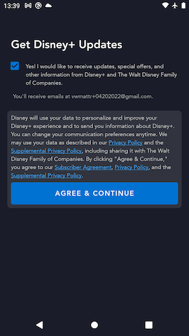
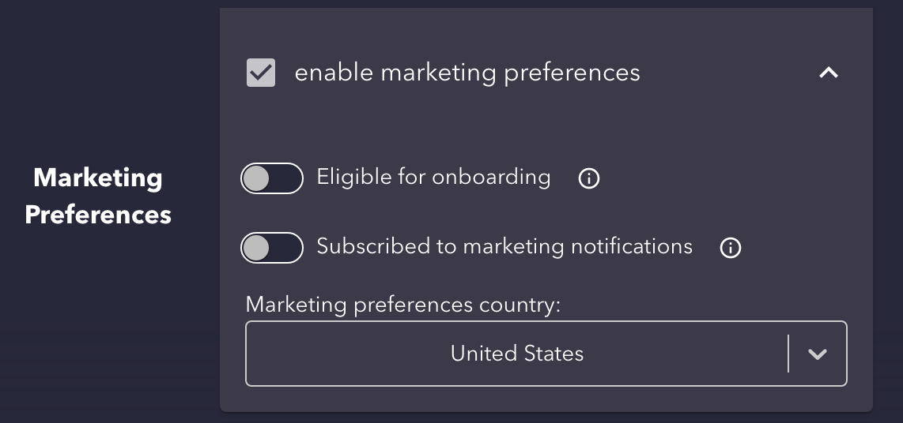

# Marketing Opt In Screen

## Overview

There are edge case scenarios where we need to force a user to agree to our legal disclosures and indicate whether they want to opt in or out of receiving marketing communications before actually using the app. After authenticating, when grahql responses have `identity.flows.marketingPreferences.isOnboarded = false` and `identity.flows.marketingPreferences.isOnboarded = true`, the user will be shown the Marketing Opt In page. This page forces the user to "agree" to the current set of legal disclosures and opt in or out of marketing preferences before they can enter the rest of the app and start streaming anything.



## Important page elements

You may notice that this page appears very similar to [Signup Email](signup_email.md). It effectively has the same layout and page elements with the following exceptions:

- This page does not display an email input field since the user is already authenticated at this point.
- This page does not display [legal consent checkboxes](../signup_email/#legal-consent-checkboxes) like we do on Signup Email (wasn't in the requirements).

### Marketing opt in checkboxes

This part of the page is identical to the [marketing opt in checkboxes on Signup Email](../signup_email/#marketing-opt-in-checkboxes).

### Legal Disclosures

This part of the page is identical to the [legal disclosures section on Signup Email](../signup_email/#legal-disclosures).

## Data

See [Graph `anonymousDocuments` query on Signup Email](../signup_email/#graph-anonymousdocuments-query).

### Error handling

When the data fails load for any reason, we are unable to render the Marketing Opt In page. Since we have never received specific error handling requirements for site config, the app displays a full-bleed error dialog showing the generic "Error code 83" user-facing error message if there are any issues loading the data required from this endpoint.

## `marketing` request

See [`marketing` request on Signup Email](../signup_email/#marketing-request).

## How to test this out

At the time of writing these docs, there are no instrumented tests covering this page in the app.

### Using existing account with cURL command

In order to test this flow manually you can follow these steps in the QA environment.

1. Sign up for a new account (doesn't matter if you subscribe on the paywall or not)
2. Log out or simply clear local app data
3. Visit the [QA Account Override tool](https://overrider-qa.us-east-1.bamgrid.net/overrides/account) and enter the email of the account you created in step 1
4. Copy the **Identity ID** for this account from the Account Override tool
5. Replace the `${identityid}` placeholder block in the cURL request (see below) with the **Identity ID** of the new account that you copied in step 4
6. Run that cURL command from step 5 in a terminal
7. Log in with the account created in step 1
8. Observe the Marketing Opt In screen

??? info "cURL to set identity flags to show Marketing Opt In for an account"
	```
	curl -X PATCH "https://idp-service-userservices-bamtech-qa.us-east-1.bamgrid.net/private/identities/${identity id}/attributes" -H "accept: application/json; charset=utf-8" -H "Content-Type: application/json; charset=utf-8" -d "{ \"marketingPreferences\": { \"eligibleForOnboarding\": true,\"isOnboarded\": false}}"
	```

### Creating a new account with Account Maker

Alternatively, you can use the [Account Maker](https://account-maker-qa.us-east-1.bamgrid.net/accounts/one) tool to create a new account that will be in this flagged state.


