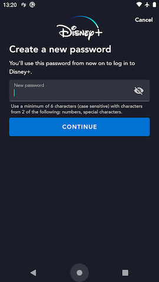
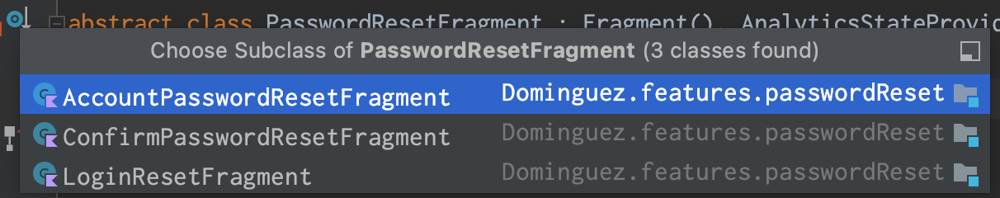
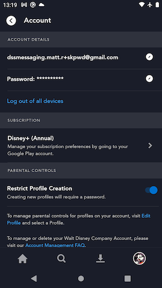
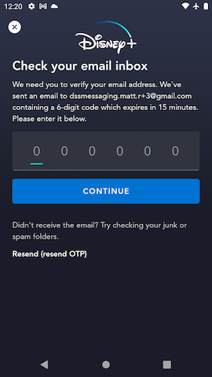
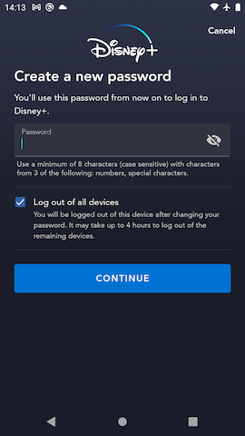
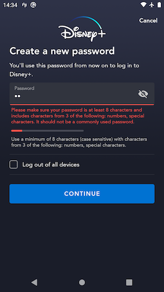

# Password Reset Screen

## Overview

The Password Reset page allows the user to update their password. For the password reset operation to work, an `actionGrant` from a successful OTP validation must be sent in order to authorize the operation. Therefore in all password reset use-cases, we can only show the Password Reset page after the user successfully completes the OTP validation on the [OTP screen](otp.md)



## `PasswordResetFragment` and concrete sub-classes

The PasswordReset page is used in a few different use cases in the app but the page typically looks the same in all cases. There are slight differences in API calls and / or behaviors needed for the different use cases. As a result, in the code we have a base abstract [`PasswordResetFragment`](https://github.bamtech.co/Android/Dmgz/blob/development/features/passwordReset/src/main/java/com/bamtechmedia/dominguez/password/reset/PasswordResetFragment.kt) with a few different concrete implementations.



### `LoginResetFragment`

The [`LoginResetFragment`](https://github.bamtech.co/Android/Dmgz/blob/development/features/passwordReset/src/main/java/com/bamtechmedia/dominguez/password/reset/LoginResetFragment.kt) subclass of `PasswordResetFragment` is used in all onboarding flows. That is, this is the particular Fragment used when the user is resetting password in a flow where they are not yet logged in. This includes the [OTP Login - Forced Password Reset Flow](../../#otp-login-forced-password-reset), the [Login Forgot Password Flow](../../#login-forgot-password), and the [OTP RegisterAccount flow](../../#otp-registeraccount).

If the [`authenticateWithOtp`](../otp/#authenticatewithotp-graphql-mutation) response (made on the OTP page prior to landing here) contains `securityAction: ChangePassword`, this page will send an [`loginWithActionGrant`](#loginwithactiongrant-graphql-mutation) request after successful [`updatePasswordWithActionGrant`](#updatepasswordwithactiongrant-graphql-mutation) response. This is what will actually **authenticate** the user in that specific case. This setup blocks a security hole where a user could become **authenticated** after just doing the OTP validation and then closing the app, even though the backend says we need to force the user to reset their password.

??? info "Note about LoginResetFragment in the OTP RegisterAccount flow"
	In the [OTP RegisterAccount flow](../../#otp-registeraccount) use case, the app will **NOT** send a `loginWithActionGrant` graphql request after successfully resetting the account password. This is because we still need to "register" an account for the current app after resetting the identity's password.

	Instead, the app will make a [`registerWithActionGrant`](#registerwithactiongrant-graphql-mutation) request in order to register the new account for the current app as well as authenticate the user.

### `AccountPasswordResetFragment`

The [`AccountPasswordResetFragment`](https://github.bamtech.co/Android/Dmgz/blob/development/features/passwordReset/src/main/java/com/bamtechmedia/dominguez/password/reset/AccountPasswordResetFragment.kt) subclass of `PasswordResetFragment` is used in the use-case where an authenticated user navigates to the Account Settings page and clicks the Change Password option. The user will first see the [`AccountOtpPasscodeFragment`](../otp/#accountotppasscodefragment) and then land here after successfully validating the OTP code they receive.

One notable difference about this subclass of the `PasswordResetFragment` is that it includes a checkbox that, when checked will send `logoutAllDevices: true` argument to `updatePasswordWithActionGrant`. If the operation is successful the user sees the [`LoggingOutAllFragment`](https://github.bamtech.co/Android/Dmgz/blob/development/features/logoutAll/src/main/java/com/bamtechmedia/dominguez/logoutall/interstitial/LoggingOutAllFragment.kt) before becoming logged out. This flag also logs the user out on all devices where this account is currently authenticated. This is useful for users who think a bad actor may have gained access to their account credentials.

??? example "AccountSettings password reset screens"
	| Account Settings | [OTP](../otp/#accountotppasscodefragment) | [Password Reset](#accountpasswordresetfragment) | Account Settings |
	|-|-|-|-|
	|  |  |  |  |

### `ConfirmPasswordResetFragment`

The [`ConfirmPasswordResetFragment`](https://github.bamtech.co/Android/Dmgz/blob/development/features/passwordReset/src/main/java/com/bamtechmedia/dominguez/password/reset/ConfirmPasswordResetFragment.kt) subclass of `PasswordResetFragment` is used when an authenticated user needs to reset their password at the time of doing a password-protected operation in the app. For example, when a user attempts to modify the maturity rating setting for a profile, they must enter their password on the [`PasswordConfirmFragment`](https://github.bamtech.co/Android/Dmgz/blob/development/features/passwordConfirm/src/main/java/com/bamtechmedia/dominguez/password/confirm/PasswordConfirmFragment.kt) first to be authorized to do so.

There are 2 variants of these use-cases:

- Forgot password
- Forced password reset

#### Password Confirm - Forgot Password

On the Password Confirm page, the user may click the Forgot Password CTA which will send them through the [`OtpConfirmPasswordFragment`](../otp/#otpconfirmpasswordfragment) and then the `ConfirmPasswordResetFragment`. After updating their password in this case, the user lands back on the Password Confirm page to enter their new password to complete their desired operation.

#### Password Confirm - Forced Password Reset

An already authenticated user may have a flag on their account indicating they need to reset their password. If that user attempts a password-protected operation in the app, they will be shown the `OtpConfirmPasswordFragment`, and then the `ConfirmPasswordResetFragment`. After updating their password instead of seeing the Password Confirm page, they will already be authorized to complete their desired operation and will land on the appropriate page of the app to complete that action, or see a flash message indicating the operation was successful.

## `updatePasswordWithActionGrant` graphql mutation

When the user submits their desired new password, the app sends that password along with the `actionGrant` received from successful OTP validation (see [`authenticateWithOtp`](../otp/#authenticatewithotp-graphql-mutation)) to the orchestration API's [`updatePasswordWithActionGrant`](https://github.bamtech.co/Android/Dmgz/blob/development/features/session/src/main/graphql/UpdatePasswordWithActionGrant.graphql) mutation. The app also sends a boolean argument indicating whether the user intends to log out their account on all devices (as mentioned above in [`AccountPasswordResetFragment`](#accountpasswordresetfragment)).

### Successful password reset

If the user submits a valid new password and their `actionGrant` is not expired, the `updatePasswordWithActionGrant` response contains a large payload similar to the [`login`](../login_password/#successful-login) response.

??? info "successful `updatePasswordWithActionGrant` response"
	This response payload is very large and subject to change as we update the graphql payload definitions as necessary for various features. To see a current example, take a look at the [updatePasswordWithActionGrant response](https://github.bamtech.co/Android/Dmgz/blob/development/coreAndroidTest/src/main/assets/r2d2Responses/v1/public/graphql/updatePasswordWithActionGrant_success.json) stub file we use in instrumented tests.

### Error handling

#### Invalid password error

??? info "`updatePasswordWithActionGrant` response - invalid password error"
	``` json hl_lines="6"
	{
		"data": null,
		"errors": [{
			"message": "upstream: 'identity'\nReceived error response from upstream error with status '400' and description 'Password must be between 8 and 256 characters,Password must include at least one letter, at least one number and at least one special character'",
			"extensions": {
				"code": "idp.error.password.enhanced.invalid-value"
			},
			"path": ["updatePasswordWithActionGrant"],
			"locations": [{
				"line": 1,
				"column": 87
			}]
		}],
		"extensions": {
			"operation": {
				"operationType": "mutation",
				"operations": [{
					"operation": "updatePasswordWithActionGrant",
					"errorCode": "idp.error.password.enhanced.invalid-value"
				}]
			},
			"sdk": {
				"token": null,
				"session": null,
				"grant": null,
				"accountDelegationRefreshToken": null,
				"featureFlags": null
			}
		}
	}
	```

If the new password that the user submitted does not meet a set of minimum requirements for account passwords (length and number of different character types), the `updatePasswordWithActionGrant` response contains an error code that indicates this. In this case the app displays a form-field error under the new password input field to let the user know the current minimum requirements for passwords in their specific region.

??? example "Incorect password form field error"
	

#### All other errors

Any other error that is returned in the `updatePasswordWithActionGrant` response is handled the same way. The app uses `ErrorLocalization` to lookup the user-facing error message copy to show the user, and a full-bleed error dialog will be displayed to the user with that error copy.

## `loginWithActionGrant` graphql mutation

In the unauthenticated use-cases that use [`LoginResetFragment`](#loginresetfragment), if the `authenticateWithOtp` response contained `securityAction: ChangePassword`, we must call `loginWithActionGrant` after a success response from `updatePasswordWithActionGrant`. We send the same `actionGrant` token that was sent to `updatePasswordWithActionGrant`. This effectively accomplishes the same thing as the [`login` mutation](../login_password/#login-graphql-mutation).

## `registerWithActionGrant` graphql mutation

In the [OTP RegisterAccount flow](../../#otp-registeraccount) after successful password reset occurs, the app sends a [`registerWithActionGrant`](https://github.bamtech.co/Android/Dmgz/blob/development/features/session/src/main/graphql/RegisterWithActionGrant.graphql) graphql request.

### Successful `registerWithActionGrant`

A successful `registerWithActionGrant` graphql call effectively does 2 things:

- Creates a new account for the current app in the backend and attaches it to the user's existing identity; and
- Authenticates the user

??? info "successful `registerWithActionGrant` response"
	This response payload is pretty large and subject to change as we update the graphql payload definitions to support new features. To see a current example, take a look at the [registerWithActionGrant response](https://github.bamtech.co/Android/Dmgz/blob/development/coreAndroidTest/src/main/assets/r2d2Responses/v1/public/graphql/registerWithActionGrant_success.json) stub file used in instrumentation tests.

### Error handling

Any other error that is returned in the `registerWithActionGrant` response is handled the same way. The app uses `ErrorLocalization` to lookup the user-facing error message copy to show the user, and a full-bleed error dialog will be displayed to the user with that error copy.

## Instrumented Tests

- [LoginForgotPasswordTest](https://github.bamtech.co/Android/Dmgz/blob/development/mobile/src/androidTestGoogle/java/com/bamtechmedia/dominguez/otp/LoginForgotPasswordTest.kt)
- [ChangePasswordFlowTest](https://github.bamtech.co/Android/Dmgz/blob/development/mobile/src/androidTestGoogle/java/com/bamtechmedia/dominguez/account/password/ChangePasswordFlowTest.kt)
- SignupFlowTest
	- [mobile](https://github.bamtech.co/Android/Dmgz/blob/development/mobile/src/androidTest/java/com/bamtechmedia/dominguez/signup/SignupFlowTest.kt)
	- [tv](https://github.bamtech.co/Android/Dmgz/blob/development/tv/src/androidTest/java/com/bamtechmedia/dominguez/signup/SignupFlowTest.kt)
