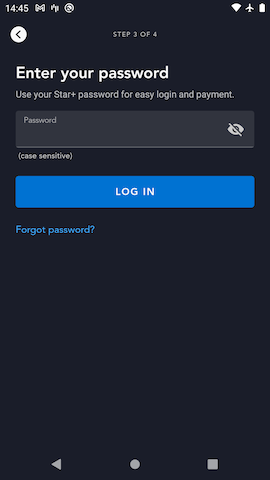
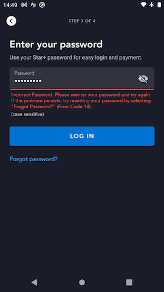

# RegisterAccount Password Screen

## Overview

The RegisterAccount Password page allows the user to enter their current identity's password in order to create a new account for the app. Users who see this page **already have an account for another TWDC app** and are trying to sign up on the current app (for example, they already have a **Star+** account and they are signing up for a **Disney+** account). For more context see the [RegisterAccount signup flow](../../#registeraccount) overview.

This page could sort of be described as a combination of the [Login Password](login_password.md) page UI with the API calls and error handling logic of the [Signup Password](signup_password.md) page. One noteable UI difference from the Login Password page is that this page displays extra sub-copy above the password input field which explains to users that they should be entering the current password for their already-existing account on the other application. You can see this extra copy in the screenshot below.



## Forgot Password

The user can click the "Forgot Password?" CTA to launch the [OtpResetPasswordFragment](../otp/#otpresetpasswordfragment) which will allow them to reset the password for their existing identity in the backend.

## `register` graphql mutation

Similar to the [`register` call on Signup Password](../signup_password/#register-graphql-mutation), this page also calls `register` when the user submits their password. The difference here though is that the backend will be checking that the submitted password matches the password for the user's existing identity and will throw an error indicating the wrong password was submitted when appropriate.

### Successful registration

If the entered password is correct for the user's identity, the backend creates a new account for the current app and attaches it to that existing identity. The `register` mutation returns a large payload that contains a host of information about the account, similar to [Successful login](../login_password/#successful-login).

??? info "successful `register` response"
	This response payload is pretty large and subject to change as we update the graphql payload definitions as necessary for various features. To see a current example take a look at the [register response](https://github.bamtech.co/Android/Dmgz/blob/development/coreAndroidTest/src/main/assets/r2d2Responses/v1/public/graphql/register_account_response.json) stub file used in instrumented tests.

### Error handling

#### INVALID_CREDENTIALS error

??? info "`register` response - incorrect password error"

	```json hl_lines="6"
	{
		"data": null,
		"errors": [{
			"message": "upstream: 'identity'\nReceived error response from upstream error with status '401' and description 'Bad credentials sent for disney/vwmattr+04132022@gmail.com'",
			"extensions": {
				"code": "idp.error.identity.bad-credentials"
			},
			"path": ["register"],
			"locations": [{
				"line": 1,
				"column": 76
			}]
		}],
		"extensions": {
			"operation": {
				"operationType": "mutation",
				"operations": [{
					"operation": "register",
					"errorCode": "idp.error.identity.bad-credentials"
				}]
			},
			"sdk": {
				"token": null,
				"session": null,
				"grant": null,
				"accountDelegationRefreshToken": null,
				"featureFlags": null
			}
		}
	}
	```

Similar to the [INVALID_CREDENTIALS error on the Login Password](../login_password/#invalid_credentials) page, if the password the user submitted was incorrect for the user's identity, the `register` mutation returns an error response indicating this. In this case, the app displays a form-field error under the password input field to let the user know they entered the wrong password.

??? example "Incorect password form field error"
	

#### All other errors

Any other error that is returned in the `register` response is handled the same way. The app uses `ErrorLocalization` to lookup the user-facing error message copy to show the user, and a full-bleed error dialog will be displayed to the user with that error copy.
