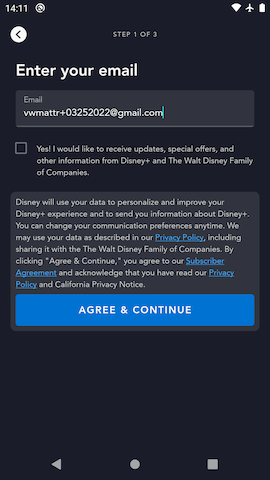
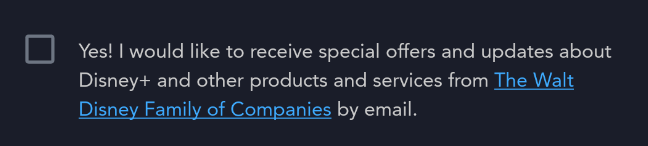
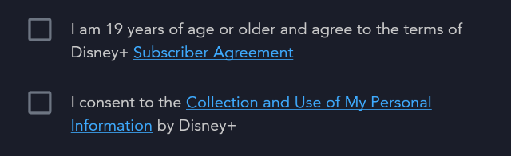
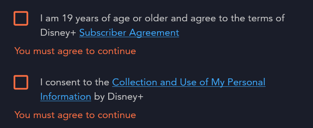
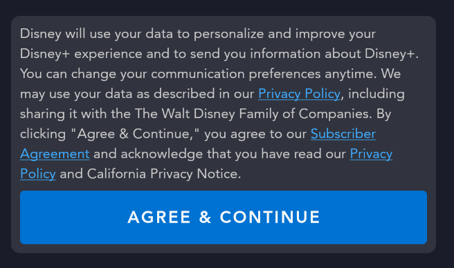
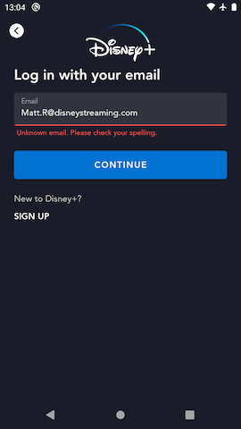

# Signup Email Screen

## Overview

The Signup Email page is the first step for a user to sign up for a new account and become authenticated.

On this page the user:

- Enters the email address they want to associate to their new account
- Can opt in or out of receiving marketing emails from Disney
- (In some countries) Checks specific legal check boxes indicating they consent to some required legal agreements
- Implicitly agrees to the set of legal terms of service specific to the country or territory where they live by clicking the "Agree and Continue" CTA



## Important page elements

### Marketing opt in checkboxes

We display a set of 1 or more checkboxes below the email input field. These checkboxes provide users the ability to opt in or out of receiving marketing emails from Disney at the email address they are entering on this page. The checkboxes are rendered dynamically based on data from the [Graph `anonymousDocuments` query response](#graph-documents-query).

??? example "Marketing opt in checkbox"
	

??? info "Note: not all checkboxes are 'marketing' checkboxes"
	In certain countries or territories, there will also be [legal consent checkboxes](#legal-consent-checkboxes) shown in this section of the page as well. Read that section for more information.

### Legal consent checkboxes

In certain countries or territories (e.g. in South Korea), local laws require that we also show 1 or more legal consent checkboxes below the email input field in addition to the [marketing opt in checkboxes](#marketing-opt-in-checkboxes). The user **is required** to check these checkboxes in to imply their consent to certain legal notices or agreements. These checkboxes are rendered dynamically based on data from the [Graph documents query response](#graph-anonymousdocuments-query).

??? example "Legal consent checkboxes for South Korea"
	

#### Client-side legal consent checkbox validation

When the user submits the form the app performs client side validation to ensure that any displayed legal consent checkboxes are "checked". If the user submits and there are any legal consent checkboxes which are not checked, we display an error message indicating that the user **must** check these boxes to imply their consent in order to sign up for an account.

??? example "Legal consent checkboxes error state"
	

### Legal Disclosures

Below any marketing and legal consent checkboxes we display legal disclosure copy above the "Agree & Continue". This copy provides an overview of the various legal documents that the user is implying agreement to when they sign up for an account.

Parts of the legal disclosure copy may be "linkified". Clicking on one of these links will open the [Legal Center screen](legal_center.md). This copy, including any linkification is rendered dynamically based on data from the [Graph `anonymousDocuments` query response](#graph-anonymousdocuments-query).

??? example "Legal disclosure section for US"
	

??? info "Note: links in the copy are only shown on mobile and tablet"
	 "Linkification" of the copy only occurs on mobile and tablet versions of the app. On TV the Signup Email page provides a secondary CTA that allows the user to access the [Legal Center screen](legal_center.md).

## Graph `anonymousDocuments` query

As noted above, many components of this page are rendered dynamically based on legal and marketing data that are specific to the country or territory the user is signing up from. This app currently requests this data from the Graph `anonymousDocuments` query.

??? info "`anonymousDocuments` example response"
	This response payload is very large. To see a current example, take a look at the [stub response](https://github.bamtech.co/Android/Dmgz/blob/development/coreAndroidTest/src/main/assets/r2d2Responses/v1/public/graphql/anonymous_legal_marketing_docs_us_en.json) we use in instrumented tests.

### Error handling

When the documents fail to load for any reason, we are unable to render the Signup Email page. Since we have never received specific error handling requirements for site config, the app displays a full-bleed error dialog showing the generic "Error code 83" user-facing error message if there are any issues loading the data required from this endpoint.

## `marketing` request

When the user submits the form the app sends:

- the email address;
- marketing opt in checkbox values and checked state; and
- the list of legal diclosure codes to which the user is implicitly agreeing;

to the `marketing` endpoint.

Doing so creates a record in Disney backend systems that is called a "NRT account" or "marketing account". This record enables Disney to send emails to users who don't complete the full account signup flow, for example.

## `check` query

Immediately after sending the [`marketing` request](#marketing-request), the application sends the entered email address to the orchestration API's `check` query. The response for this query contains an `operations` array which indicate what the backend "knows" about any accounts already associated with this email address and therefore what screen the user should see next in their onboarding journey.

### `"Login"` response

This is the response that corresponds to the [Signup Email -> Login Happy Path](../../#signup-email-login-happy-path) Signup edge case flow.

When `operations` in the response contains `"Login"`, this indicates that there is already an account for this app with that email address and the user should be able to just enter that account's password to log in. The app will route the user to the [Login Password](login_password.md) in this case.

??? info "`check` response - operation: `"Login"`"
	``` json hl_lines="5"
	{
		"data": {
			"check": {
				"__typename": "Operations",
				"operations": ["Login", "OTP"],
				"nextOperation": null
			}
		},
		"extensions": {
			"operation": {
				"operationType": "query",
				"operations": [
					{
						"operation": "check",
						"errorCode": null
					}
				]
			},
			"sdk": {
				"token": null,
				"session": null,
				"grant": null,
				"accountDelegationRefreshToken": null,
				"featureFlags": null
			}
		}
	}
	```

??? note "A note about the `"Login"` response"

	As you will see in the example response above, `"Login"` operation is almost always delivered as a pair with `"OTP"` in the `operations` array. This is because in theory the user is also able to just login with an OTP code in order become authenticated. The app code just looks for any occurence of `"Login"` in the `operations` array to determine this case, ignoring whatever else might be in the array.

### `"Register"` response

This is the [signup happy path](../../#signup-happy-path) response.

When the `operations` array contains `"Register"`, this means that the email address provided does not match any account in our system, and so the app routes the user to the next step in the signup flow. This next step will be either the [Disclosure Review](disclosure_review.md) page if the site config response indicates that there are certain legal disclosures that the user must explicitly agree to, or the [Signup Password](signup_password.md) page otherwise.

??? info "`check` response - operation: `"Register"`"
	``` json hl_lines="5"
	{
		"data": {
			"check": {
				"__typename": "Operations",
				"operations": ["Register"],
				"nextOperation": null
			}
		},
		"extensions": {
			"operation": {
				"operationType": "query",
				"operations": [
					{
						"operation": "check",
						"errorCode": null
					}
				]
			},
			"sdk": {
				"token": null,
				"session": null,
				"grant": null,
				"accountDelegationRefreshToken": null,
				"featureFlags": null
			}
		}
	}
	```

### `"RegisterAccount"` response

This is the response that corresponds to the [RegisterAccount](../../#registeraccount) Signup edge case flow.

When the `operations` array contains `"RegisterAccount"`, this means that there is already an account in the backend for the provided email, but it is not an account for the particular app that the user is attempting to sign up for. For example a user may have a **Star+** account but not a **Disney+** account yet. If they were to try and sign up with that email address on **Disney+** they receive this response from the `check` query.

When this happens the user is routed to the [RegisterAccount Password](register_account_password.md) page, where they must enter the password already associated with their existing account's identity in order to complete the process of creating a new account for the current app.

??? info "`check` response - operation: `"RegisterAccount"`"
	``` json hl_lines="5"
	{
		"data": {
			"check": {
				"__typename": "Operations",
				"operations": ["RegisterAccount"],
				"nextOperation": null
			}
		},
		"extensions": {
			"operation": {
				"operationType": "query",
				"operations": [
					{
						"operation": "check",
						"errorCode": null
					}
				]
			},
			"sdk": {
				"token": null,
				"session": null,
				"grant": null,
				"accountDelegationRefreshToken": null,
				"featureFlags": null
			}
		}
	}
	```

### `"OTP"` + `nextOperation: "Login"` response

This is the response that corresponds to the [Signup Email -> OTP Login](../../#signup-email-otp-login) Signup edge case flow.

When the `operations` array contains `"OTP"` but not `"Login"` and the response's `nextOperation` field is `"Login"`, this indicates that there is already an account associated with the provided email address and that account has been flagged to force the user into an OTP flow in order to log in. This happens if some backend process flags the account for security reasons. A common cause for this might be that there has been a suspicious number of login attempts for this account from different parts of the world, for example.

When this response is received, the user will be shown the [OTP](otp.md) screen, where they will have to enter a 6 digit pin code that is sent to the provided email address in order to authenticate.

??? info "`check` response - operation:`"OTP"` nextOperation: `"Login"`"
	``` json hl_lines="5 6"
	{
		"data": {
			"check": {
				"__typename": "Operations",
				"operations": ["OTP"],
				"nextOperation": "Login"
			}
		},
		"extensions": {
			"operation": {
				"operationType": "query",
				"operations": [
					{
						"operation": "check",
						"errorCode": null
					}
				]
			},
			"sdk": {
				"token": null,
				"session": null,
				"grant": null,
				"accountDelegationRefreshToken": null,
				"featureFlags": null
			}
		}
	}
	```

### `"OTP"` + `nextOperation: "RegisterAccount"` response

This is the response that corresponds to the [OTP RegisterAccount](../../#otp-registeraccount) Signup edge case flow.

When `operations` contains `"OTP"` on its own (no other operations in the array), and the `nextOperation` field is `"RegisterAccount"`, this indicates 2 things:

- The account associated with the provided email exists, but is for a different app than the one the user is trying to log in with - similar to the [RegisterAccount response](#registeraccount-response).
- The account associated with the provided email is in a Security Flagged state where we need to force the user to do a successful OTP + password reset operation before they can authenticate.

When this occurs the user will be routed to the [OtpRegisterAccount](../otp/#otpregisteraccountfragment) page where they must enter an OTP code sent to their email address before resetting their account password and finishing the process of creating a new account for this specific app.

??? info "`check` response - operation: `"OTP"` nextOperation: `"RegisterAccount"`"
	``` json hl_lines="5 6"
	{
		"data": {
			"check": {
				"__typename": "Operations",
				"operations": ["OTP"],
				"nextOperation": "RegisterAccount"
			}
		},
		"extensions": {
			"operation": {
				"operationType": "query",
				"operations": [
					{
						"operation": "check",
						"errorCode": null
					}
				]
			},
			"sdk": {
				"token": null,
				"session": null,
				"grant": null,
				"accountDelegationRefreshToken": null,
				"featureFlags": null
			}
		}
	}
	```

### Error handling

#### Client-side email validation

When the user submits the email address, the app first does some client-side validation to ensure what has been entered is a valid email address before submitting the input to the remote `check` operation. If that validation result is that the input is not a valid email address, we show a form-field error prompting the user to double-check their input.

??? example "Invalid email address form field error"
	

#### Server-side email validation

If the client-side email validation doesn't detect any issues, there's still a chance that the backend could determine that the provided input is not a valid email address. From a user perspective, this is treated the same way as described in [client-side email validation](#client-side-email-validation) above.

## Instrumented Tests

- LegalCenterOnboardingTest
	- [mobile](https://github.bamtech.co/Android/Dmgz/blob/development/mobile/src/androidTestGoogle/java/com/bamtechmedia/dominguez/legal/LegalCenterOnboardingTest.kt)
	- [tv](https://github.bamtech.co/Android/Dmgz/blob/development/tv/src/androidTestGoogle/java/com/bamtechmedia/dominguez/legal/LegalCenterOnboardingTest.kt)
- PaywallFlowTest
	- [mobile](https://github.bamtech.co/Android/Dmgz/blob/development/mobile/src/androidTest/java/com/bamtechmedia/dominguez/paywall/PaywallFlowTest.kt)
	- [tv](https://github.bamtech.co/Android/Dmgz/blob/development/tv/src/androidTest/java/com/bamtechmedia/dominguez/paywall/PaywallFlowTest.kt)
- SignupFlowTest
	- [mobile](https://github.bamtech.co/Android/Dmgz/blob/development/mobile/src/androidTest/java/com/bamtechmedia/dominguez/signup/SignupFlowTest.kt)
	- [tv](https://github.bamtech.co/Android/Dmgz/blob/development/tv/src/androidTest/java/com/bamtechmedia/dominguez/signup/SignupFlowTest.kt)
- WelchNewUserSignupTest
	- [mobile](https://github.bamtech.co/Android/Dmgz/blob/development/mobile/src/androidTest/java/com/bamtechmedia/dominguez/onboarding/WelchNewUserSignupTest.kt)
	- [tv](https://github.bamtech.co/Android/Dmgz/blob/development/tv/src/androidTest/java/com/bamtechmedia/dominguez/onboarding/WelchNewUserSignupTest.kt)
