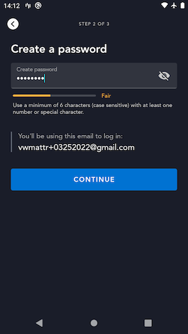
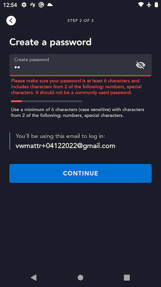

# Signup Password Screen

## Overview

The Signup Password screen allows the user to create a password and complete the process of creating an account.  Upon successfully creating the account, the user will also be **authenticated** in the app.



## `register` graphql mutation

When the user submits the password to use for their new account, the app passes the following set of arguments to the [`register` mutation](https://github.bamtech.co/Android/Dmgz/blob/development/features/session/src/main/graphql/RegisterMutation.graphql):

- **email address** provided on the [Signup Email](signup_email.md) screen
- **password** that the user input on this page
- list of **legal disclosure codes** corresponding to the legal disclosures the user is implicitly agreeing to
- set of **initial language preferences** for the account provided from [`LanguagePreferencesSetupImpl#initialLanguagePreferencesOnce`](https://github.bamtech.co/Android/Dmgz/blob/development/features/profiles/src/main/java/com/bamtechmedia/dominguez/profiles/language/LanguagePreferencesSetupImpl.kt#L31)

### Successful registration

If the entered password is valid (meets the minimum password strength rules) the backend creates a new account and the `register` mutation returns a large payload that contains a host of information about the account, very similar to [Successful login](../login_password/#successful-login).

??? info "successful `register` response"
	This response payload is pretty large and subject to change as we update the graphql payload definitions as necessary for various features.  To see a current example take a look at the [register response](https://github.bamtech.co/Android/Dmgz/blob/development/coreAndroidTest/src/main/assets/r2d2Responses/v1/public/graphql/register_account_response.json) stub file used in instrumented tests.

### Error handling

#### Invalid password error

??? info "`register` response - invalid password error"
	``` json hl_lines="6"
	{
		"data": null,
		"errors": [{
			"message": "upstream: 'identity'\nReceived error response from upstream error with status '400' and description 'Password must be between 6 and 256 characters'",
			"extensions": {
				"code": "idp.error.password.enhanced.invalid-value"
			},
			"path": ["register"],
			"locations": [{
				"line": 1,
				"column": 76
			}]
		}],
		"extensions": {
			"operation": {
				"operationType": "mutation",
				"operations": [{
					"operation": "register",
					"errorCode": "idp.error.password.enhanced.invalid-value"
				}]
			},
			"sdk": {
				"token": null,
				"session": null,
				"grant": null,
				"accountDelegationRefreshToken": null,
				"featureFlags": null
			}
		}
	}
	```

If the new password the user submitted does not meet a set of minimum requirements for passwords (length and number of different character types), the `register` response contains an error code that indicates this.  In this case, the app displays a form-field error under the password input field to let the user know the current minimum password requirements for their specific country or territory.

??? example "Invalid password form field error"
	

#### All other errors

Any other error that is returned in the `register` response is handled the same way.  The app uses `ErrorLocalization` to lookup the user-facing error message copy to show the user, and a full-bleed error dialog will be displayed to the user with that error copy.

## Instrumented Tests

- LegalCenterOnboardingTest
	- [mobile](https://github.bamtech.co/Android/Dmgz/blob/development/mobile/src/androidTestGoogle/java/com/bamtechmedia/dominguez/legal/LegalCenterOnboardingTest.kt)
	- [tv](https://github.bamtech.co/Android/Dmgz/blob/development/tv/src/androidTestGoogle/java/com/bamtechmedia/dominguez/legal/LegalCenterOnboardingTest.kt)
- PaywallFlowTest
	- [mobile](https://github.bamtech.co/Android/Dmgz/blob/development/mobile/src/androidTest/java/com/bamtechmedia/dominguez/paywall/PaywallFlowTest.kt)
	- [tv](https://github.bamtech.co/Android/Dmgz/blob/development/tv/src/androidTest/java/com/bamtechmedia/dominguez/paywall/PaywallFlowTest.kt)
- SignupFlowTest
	- [mobile](https://github.bamtech.co/Android/Dmgz/blob/development/mobile/src/androidTest/java/com/bamtechmedia/dominguez/signup/SignupFlowTest.kt)
	- [tv](https://github.bamtech.co/Android/Dmgz/blob/development/tv/src/androidTest/java/com/bamtechmedia/dominguez/signup/SignupFlowTest.kt)
- WelchNewUserSignupTest
	- [mobile](https://github.bamtech.co/Android/Dmgz/blob/development/mobile/src/androidTest/java/com/bamtechmedia/dominguez/onboarding/WelchNewUserSignupTest.kt)
	- [tv](https://github.bamtech.co/Android/Dmgz/blob/development/tv/src/androidTest/java/com/bamtechmedia/dominguez/onboarding/WelchNewUserSignupTest.kt)
