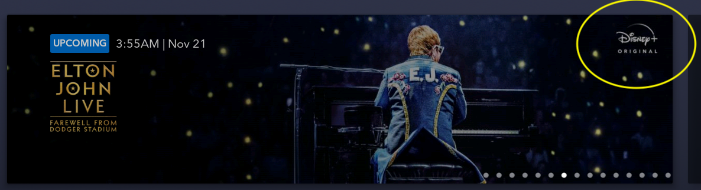
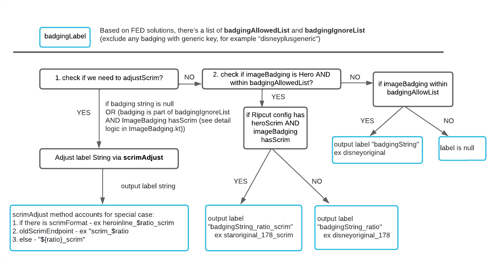

# Badging

**Badging** (Disney+ Original) are what we see on image assets that are handled by Ripcut APIs [more info here](../../resources/ripcut/ripcut.md). For example, they are applied to `tile`, `hero_tile`, and `thumbnail`.

***Example***

This is a Badge

{ width="500" }

| Brand Logo Only                          |            Brand Logo with Scrim             |
| ---------------------------------------- | :------------------------------------------: |
| { width="500" } | {width="500" } |

## How Badges are Loaded on Images

`ImageBadgingResolverImpl` will take `ImageBadging` (Data necessary to display Ripcut option related to the badging/compose feature) and send `ImageType.Badging` to RipcutAPI endpoint to load badging on images.

ImageType.Badging is composed of `badgingExtension` and `badgingLabel`.
For example: `compose/?width=600&label=disneyplusoriginal_178_scrim`

- `badgingExtension` defines the Ripcut endpoint in sequence:
    - "/compose" if imageBadging is Hero container
    - "/badging" if imageBadging has badging info
    - "/scale" if none above is true

- `badgingLabel` determines how the badge/scrim should be loaded on image, see logic below:
  
<figure markdown>

</figure>

## Feature Info

### Availability

|       | Availability |
| ----------- | :-----------: |
| :icons-disney-logo: Disney+ | :white_check_mark: |
| :icons-star-logo: Star+ | :white_check_mark: |
| :fontawesome-solid-mobile: Mobile | :white_check_mark: |
| :fontawesome-solid-tv: TV | :white_check_mark: |
| :material-earth: Regions | :white_check_mark: All regions |

### Relevant classes

- `ImageBadgingResolverImpl.kt`
- `ImageBadging.kt`
- `ImageBadgingResolver.kt`

### Additional Details and Tickets

- [Unit tests tickets completed](https://jira.disneystreaming.com/browse/ANDROID-3316 )
- [FED Solution Architecture](https://github.bamtech.co/pages/fed-solutions/documentation/content/images.html#asset-badging)
- [Helpful PRs for context on scrimAdjust](https://github.bamtech.co/Android/Dmgz/pull/12744)
- [Related Ticket](https://jira.disneystreaming.com/browse/ANDROID-3695)
- [Chart source](https://lucid.app/lucidspark/6df19c3c-c968-400c-bae8-446084c20fbd/edit?view_items=BYI8aAm2l.KC%2CdWI8stRr~gjV%2CgbZ50xqtRW5J%2C2AG86z-LBzxU%2ChJG8yga0Jzmb%2Cl.Y5nlIcFO0Z%2CaaZ5wd5mKezl%2CuYG81pixbkXI%2CmSI8nlYXWU1G%2C_0G8LYcvXVLV%2Cm2I8GnaaFbiw%2Ca4I8yalQZt-E%2CQ4I8bSqVzqTO%2C9ZI8js7JwCj8%2CLLI8I1baQT3u%2C9~I89~_L8CaT%2C95I8-bcvLTpL%2Co6I8sSG7XD2v%2CM_I8Pk6t1R1t%2C-8I86NOzSTow%2Cy.I8urgTYSVK%2Cy.I8DGmP-j8Q%2Cs.I8L6ga0-qB%2Cy9I8_xvvySmt%2CC~Y5LS70qP0f%2C6aZ5-oVGziI8%2CBYI8ej5BRsnr%2C0KG8ULjMVJ5L%2CI5I89iOlL27r%2C.1I8FEDE5cSI%2C.RI8rhN43yp3%2C28I8Ct15wGjN%2CC_I86Ntn1tz9%2Cy.I8vHXVrnLs&invitationId=inv_c80fd59b-5837-4e42-85e7-660a4c338df5)
