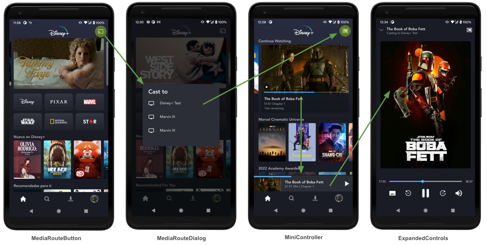
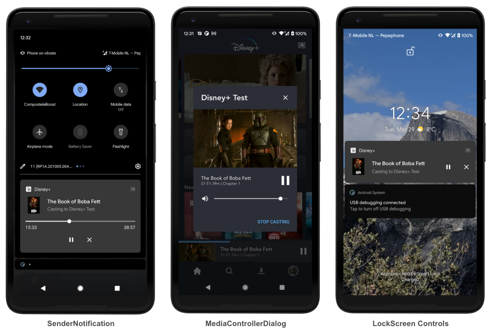

# Chromecast Client module

## Components

## CastContext and Deferred initialization

Chromecast requires an explicit initialization of its SDK for it to function properly. This is done through calling

    CastContext.getSharedInstance(context)

If following the official documentation, this static method should be called upon initialization of an app or activity.

However, this method undergoes a disk I/O heavy operation under the hood, and it even triggers a strict policy violation by Google's own standards. For this reason, and also with the intent of giving more control over what gets initialized and when, and with which parameters, we have decided to defer the initialization of the Cast SDK to suit our own needs.

With this intent we have centralized all access to CastContext within the [CastContexProvider](https://github.bamtech.co/Android/Dmgz/tree/development/features/cast/src/main/java/com/bamtechmedia/dominguez/cast/CastContextProvider.kt), and added a lint rule to prevent the explicit call for the provided static methods, to ensure an accidental eager initialization doesn't happen in the future.

It should be noted that by using the builtin UI components such as MediaRouteButton (accompanied with the static `CastButtonFactory.setUpMediaRouteButton` call) or `UIMediaController` (which our custom `CastController` inherits from) will also internally trigger the initialization of the CastContext. We avoid this uncontrolled eager initialization by using our usual UI architecture by which we can also control when the layouts get inflated or the presenters instantiated (see [MediaRouteButton](https://github.bamtech.co/Android/Dmgz/tree/development/features/castApi/src/main/java/com/bamtechmedia/dominguez/cast/button/MediaRouteButton.kt) and its associated classes).

## Device discovery and Reconnection

As stated in the [official docs](https://developers.google.com/cast/docs/android_sender/integrate#app_flow):

> The Cast framework automatically starts MediaRouter device discovery based on the Activity lifecycle.

This means that whenever the app is launched, the Chromecast SDK will automatically trigger the discovery process to find suitable devices in the network, and thus make the MediaRouteButton visible or enabled.

However, by deferring the initialization of the SDK, Chromecast loses that lifecycle event trigger and thus never initiates the discovery process. This ends up in the app not being able to find devices on the first launch (backgrounding and foregrounding does trigger discovery as, by then, the SDK is already initialized).

In order to fix this, we observe the moment the SDK is initialized and then manually call the discovery process by using MediaRouter's own callback mechanism:

    MediaRouter.getInstance(context)
        .addCallback(mergedSelector, callback, MediaRouter.CALLBACK_FLAG_REQUEST_DISCOVERY)

That causes devices to be found again, however with the discovery trigger prompted by the Chromecast SDK, an associated [Reconnection process](https://developers.google.com/cast/docs/android_sender/integrate#automatic_reconnection) is fired. This process uses Chromecast's own heuristics to determine whether there was an ongoing cast session that was abruptly terminated (by a crash, a loss of internet, eviction from memory, etc) and thus should be automatically reconnected upon starting up the app.

The Reconnection process takes the form of a ReconnectionService, which is added by Cast SDK to the merged manifest:

        <service android:name="com.google.android.gms.cast.framework.ReconnectionService"
        android:exported="false" />

The Reconnection Service is only started by the SDK when a Media Session starts (i.e. when actually playing content) and is automatically stopped when the session ends. The active presence of this Service indicates the Play Services that it should attempt reconnection.

Because we lose the lifecycle event that would prompt Play Services to reconnect, we currently manually start the ReconnectionService ourselves after Discovery has found a Provider:

    private val callback = object : MediaRouter.Callback() {

        override fun onProviderAdded(router: MediaRouter?, provider: MediaRouter.ProviderInfo?) {
          
            ChromecastLog.w { "Cast2 - Starting ReconnectionService now" }
            val intent = Intent(context, ReconnectionService::class.java)
            intent.setPackage(context.packageName)
            context.startService(intent)
        }
    }

This has the side effect of always attempting reconnection on app startup. For this reason, we have manually decided to ignore resuming errors reported from cast SDK with the error code 2005, or APPLICATION_NOT_STARTED. That is, reconnection attempts that have failed because the receiver app isn't running on the Chromecast Device.

## Device seggregation

From the perspective of the new `cast` module we have discriminated 4 different types of devices:

### Regular Android devices with Play framework installed

This is the scenario the `cast` module aims to cover, and the module works normally for these.

### Regular Android devices without Play framework installed

Because this can't be determined in compile time, the module is deployed with these devices, but will never be initialized by means of the `isPlayServicesAvailable` check in [CastContextProviderImpl](https://github.bamtech.co/Android/Dmgz/blob/development/features/cast/src/main/java/com/bamtechmedia/dominguez/cast/CastContextProviderImpl.kt). This check makes sure the CastContext is never emitted and thus no other component does any relevant work that would trigger the initialization of Chromecast (which would result in a crash).

### Amazon devices

Since this is an explicit flavor in our project, we can discriminate in compile time and declare only the `cast` dependency on the Google flavor. This way we don't even deploy the implementation module on Amazon devices. Previous implementation based on Bamnet cast did not distinguish between Amazon devices and any other Android device without Play Services.

### TV Devices

Similarly, and because it doesn't make sens for TV devices to have the chromecast feature, the `cast` module isn't even deployed with TV builds.

## Playback requests

There are fundamentally two types of possible playback requests in the app: Explicit and implicit requests.

### Explicit requests

These are requests that happen when you first connect to a Chromecast device, and then click Play on a piece of content, which means the whole process is split into two steps: Connecting to Chromecast and the Playback request happen at different, explicit actions from the user.

Any plabyack request in the app goes through [TabRouterImpl](https://github.bamtech.co/Android/Dmgz/tree/development/mobile/src/main/java/com/bamtechmedia/dominguez/globalnav/tab/TabRouterImpl.kt), so we can count on this as the single point of entry for these requests. [CastPlayRequester](https://github.bamtech.co/Android/Dmgz/tree/development/features/castApi/src/main/java/com/bamtechmedia/dominguez/cast/requester/CastPlayRequester.kt) models the interface to handle these requests: if [isConnectedOrConnecting] returns true, then the request will be sent to Cast, or to the local player otherwise.

### Implicit requests

The other kind of playback requests that is present in the app are implicit requests, which happen when a content is playing in the local player, and a cast connection is established. In this case, the underlying content should be sent straight away to Chromecast after the connection is established, so this connection is the only explicit action from the user.

For this scenario, we model the [VideoPlayerConnector](https://github.bamtech.co/Android/Dmgz/tree/development/features/castApi/src/main/java/com/bamtechmedia/dominguez/cast/requester/VideoPlayerConnector.kt) and its inner [Player] interface, which should be implemented by the class handling local video playback ([MobilePlaybackActivity](https://github.bamtech.co/Android/Dmgz/tree/development/features/playback/src/main/java/com/bamtechmedia/dominguez/playback/mobile/MobilePlaybackActivity.kt)).

The local playback activity will then observe the `startWhenConnected` and the Cast module handles all possible callbacks for loading, error and success states.

## Activity aliasing

When one starts casting, one of the components that responds to the cast state is the `Sender Notification` that shows up in the notification tray whenever the app is backgrounded.

When clicking on that notification (not the buttons within the notification), the Cast SDK handles that click on its own and resolves the action by creating an intent to an activity name of the developer's choosing. The SDK gives no control over the action itself: they assume that your ExpandedControls screen (which shows up for instance when you click on the minicontroller, to display a fullscreen control set for Chromecast from your phone, see image below) is going to be a separate Activity.

Because in our solution the MiniController and the ExpandedControls are combined into a single view that toggles between the expanded and collapsed states, we need to somehow catch that intent and identify that it comes from the cast Sender Notification. However, the intent produced by the notification has no special extras or flags that would allow for this identification.

So we have resorted to aliasing the `MainActivity` with a different name and process that intent to check if the component name is that of the aliased activity. In the `CastControllerPresenter` we merely observe the sequence of intents to this activity by means of the `IntentObservable, and if the name matches that of the aliased activity, we trigger the display & expansion of the cast controls.

        <activity-alias android:enabled="true"
            android:name=".CastLandingActivity"
            android:targetActivity=".MainActivity">
        </activity-alias>

## D+ Receiver app Reference

When integrating with Chromecast D+ Receiver app these are useful links to check for documentation:

[Receiver Docs](https://wiki.disneystreaming.com/display/CDANDMSFT/Multi-tenants+Chromecast+Data+Contracts)

Additionally, the Receiver can be tested independently through the use of these links:

[QA Sender Test Harness](https://qa-cd-dmgz.bamgrid.com/chromecast/sender/sender.html)

[PROD Sender Test Harness](https://cd-dmgz.bamgrid.com/chromecast/sender/sender.html)

## Migration and differences from V1

See [Migration](./migration.md) docs to learn about the refactoring initiative for Chromecast to switch from v1 to v2.

## The sample app

The sample app leverages the [testTokens](https://github.bamtech.co/Android/Dmgz/tree/development/features/testTokens) feature to obtain an access state and be able to retrieve and play real content from the D+ content Api in the QA Environment.

The behavior and architecture of the sample app mimics as best as reasonably possible the behavior of the real D+ app, within the scope of what's relevant for chromecast purposes; that is, it implements the [cast] feature with all functional UI components and all the wiring in place (as in the declaration of all the necessary DI dependencies, albeit most of them as dummies from the [testDummies](https://github.bamtech.co/Android/Dmgz/tree/development/features/testDummies) module) to be able to cast to the QA chromecast Receiver app, as well as a bogus PlayerActivity that mimic the automatic casting from a real playback scenario and its side effects (namely the closing of the player).

The app consists of two main "screens", the video list and the player screen. Three videos are provided in the basic app, one of which always results in an error, and a debug view is shown displaying the current state of the Chromecast SDK and device, if connected to one.

A right side navigation drawer is included that sends custom messages to the receiver app to enable disable a Console printout overlay over the receiver, and a Dashboard with information about the device and its capabilities, and the content if anything is being cast.
