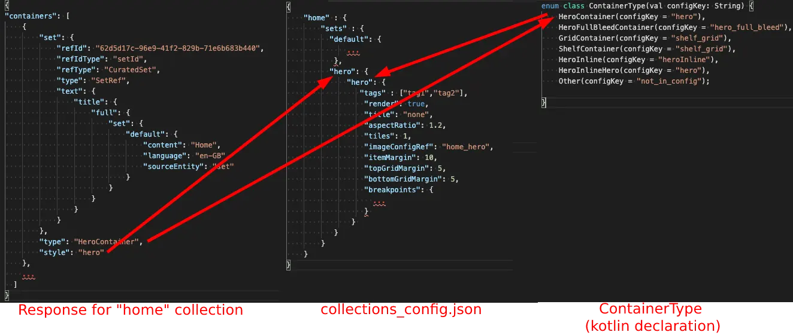

# Set Parameters

Configuration items within the `sets` element apply to the [Container](../../overview/container) level and its tiles, and are parsed by [ContainerConfigResolver](https://github.bamtech.co/Android/Dmgz/blob/development/features/collectionsApi/src/main/java/com/bamtechmedia/dominguez/collections/config/ContainerConfigResolver.kt). Hence these items affect the tiles and the container holding the RecyclerView for them.

To understand how the container items work we need to match the sample json with the response obtained from the backend, in this case for the home collection, to be able to see how they relate to each other:

???+ info "Set parameters"
    ```json
    {
    "containers": [
        {
            "set": {
                "refId": "62d5d17c-96e9-41f2-829b-71e6b683b440",
                "refIdType": "setId",
                "refType": "CuratedSet",
                "type": "SetRef",
                "text": {
                    "title": {
                        "full": {
                            "set": {
                                "default": {
                                    "content": "Home",
                                    "language": "en-GB",
                                    "sourceEntity": "set"
                                }
                            }
                        }
                    }
                }
            },
            "type": "HeroContainer",
            "style": "hero"
        },
        ...
    ]
    }
    ```

in the `collections_config.json` example, `home` represents the name of the collection, with `default` being the special case that covers the configuration for items when no other specific override is given. Within each of these collections a list of `sets` follows indicating the specific configuration for any given container style.

Thus, in the example above, `hero` would be the container style as it comes from the FEDSA response as `style`. And again, `default` is a special case that covers all possible containers within this particular collection, that do not have a specific configuration.

Next, the `shelf_grid` entry matches against the container type in the response, in this case `HeroContainer`. For this, a mapper is set up in [ContainerModels](https://github.bamtech.co/Android/Dmgz/blob/development/coreContentApi/src/main/java/com/bamtechmedia/dominguez/core/content/containers/ContainerModels.kt):

``` kotlin
enum class ContainerType(val configKey: String) {
    HeroFullBleedContainer(configKey = "hero_full_bleed"),
    ShelfContainer(configKey = "shelf_grid"),
    Other(configKey = "not_in_config");
```

???+ info "Model Representation"
    

Now for each of these triples `collection` + `container_style` and `type`, we can configure a number of parameters, which include:

- `tags`: Tags are an arbitrary number of strings that allow you to do later customizations for each element, by calling the function `config.containsSetTag("tag")`. This is an array of String tags, the String tags from the different layers will be merged into one array. More information about the different layers could be found in the [#different-layers-to-override-values](../override_layers) topic.

- `excludeTags`: is an array of [SetTag](https://github.bamtech.co/Android/Dmgz/blob/development/coreContentApi/src/main/java/com/bamtechmedia/dominguez/core/content/sets/SetModels.kt#L127-L204) values that should be excluded from `tags`.  

- `title`: Indicates whether the container title should be displayed or not. Can be either `none` or `above`

- `titleStyle`: String value to change title styling. Possible options are: `CollectionTitle` and `H3`.

- `render`:Whether to render the container at all or not.

- `aspectRatio`: aspect ratio that each tile within the set will be given. This can be later retrieved from the config and enforced on the ShelfItem, for instance in `ShelfItemLayout`

- `tiles`: number of tiles that will be visible within the visible area of the app for any given device. This will be calculated and enforced in runtime.

- `imageConfigRef`, `imageConfigsLogo`, `imageConfigsLogoCTA` and `imageConfigsFocused`: indicates the reference within the [Image config](../../images_config) determining how to present an image within the tile.

- `itemMargin` : Margin between items within the list/grid

- `itemViewType` : key of [ItemViewType](https://github.bamtech.co/Android/Dmgz/blob/development/features/collectionsApi/src/main/java/com/bamtechmedia/dominguez/collections/config/ContainerConfig.kt#L111-L172) to determine how an asset tile within the container should be rendered.

- `topGridMargin`, `bottomGridMargin`, `startGridMargin`, `endGridMargin`: represents the spacing of the container of the list of elements.

- `list`: Boolean value to determine whether the content should render as a simple list.

- `gridViewPlaceholderRows`: number of rows that will be visible as placeholders while converting a ReferenceSet to a ContentSet for a grid view set.

- `customValues`: Json data that will be mapped into a `Map<String, Any>` to allow custom values.

- `scaleOnFocus`: Float value to support different tile scaling on focus.

- `scaleOnHover`: Float value to support different tile scaling on hover (Chromebook).

- `fallbackImageDrawableTextSize`: Float value to determine the text size for fallback images.

- `fallbackImageDrawableTextLineSpacing`: Float value to determine the text line spacing for fallback images.

- `breakpoints`: allows to specify different values per a number of device discriminators, these being:
            - `television`
            - `land`
            - `port`
            - `sw420dp-port`
            - `sw600dp-land`
            - `sw600dp-port`
            - `sw720dp-land`
            - `sw720dp-port`

This way we can specify a different aspect ratio, number of tiles or spacing on different device types. Note that unless we mark a default value you need to specify values for all discriminators.

???+ info
    On runtime, the [ContainerConfigResolverImpl](https://github.bamtech.co/Android/Dmgz/blob/development/features/collections/src/main/java/com/bamtechmedia/dominguez/collections/config/ContainerConfigResolverImpl.kt) will parse this config file and retrieve the appropriate values for the device it's running on, that is, if we are running on a mobile device with a width of more than 600dp, then the `aspectRatio` field within [ContainerConfig](https://github.bamtech.co/Android/Dmgz/blob/development/features/collectionsApi/src/main/java/com/bamtechmedia/dominguez/collections/config/ContainerConfig.kt) will automatically be the right value.
