# Set Tag Values

The [SetTag](https://github.bamtech.co/Android/Dmgz/blob/development/coreContentApi/src/main/java/com/bamtechmedia/dominguez/core/content/sets/SetModels.kt#L127-L204) class is a convenient way to toggle some behavior for a container. In this subject, the possible SetTag values are being summed up and provided with some examples.

## DisableFirstGridRowTopPadding

Tag indicates if first grid shelf row shouldn't show the top padding. The [ShelfGridItem](https://github.bamtech.co/Android/Dmgz/blob/development/features/collections/src/main/java/com/bamtechmedia/dominguez/collections/items/ShelfGridItem.kt) implementation supports having a certain amount of top inset by default, using this tag would disable that.

??? example "Demo tag DisableFirstGridRowTopPadding"
    |No Tag|With Tag|
    |-|-|
    |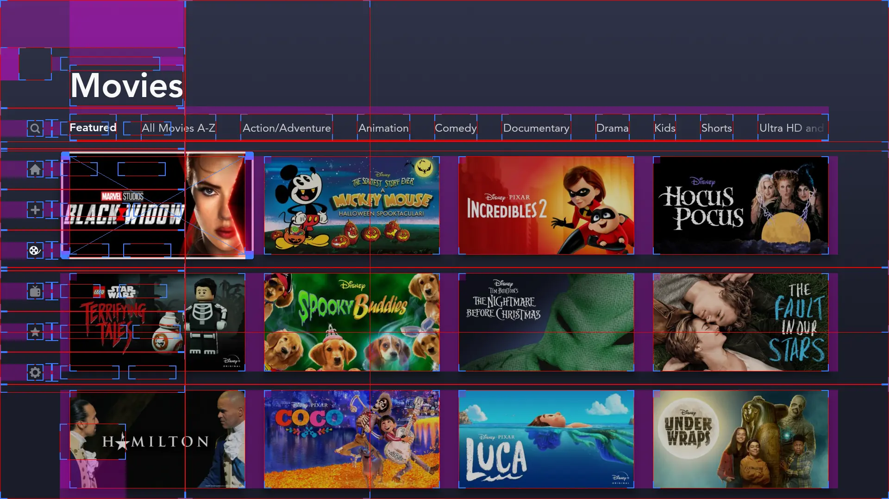|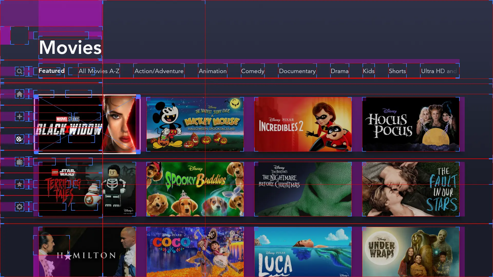|

## DisableAiringNotLive

Tag indicates if an `Airing` asset that is not live should be disabled. This is currently used for Studio Show episodes on upcoming and just ended states under the `Past and Upcoming` tab in the Studio Show series details page.

## DisplayLiveBadge

Tag indicates if broadcast programs live badge should be displayed. This tag is applied by default on all our apps.

## HideUpcomingReAirBadge

Tag indicates if broadcast programs upcoming Re-Air badge (secondary badge) should be hidden. This is currently used on the 0.71 aspect ratio tiles on all apps.

??? example "Demo tag HideUpcomingReAirBadge"
    |No Tag|With Tag|
    |-|-|
    |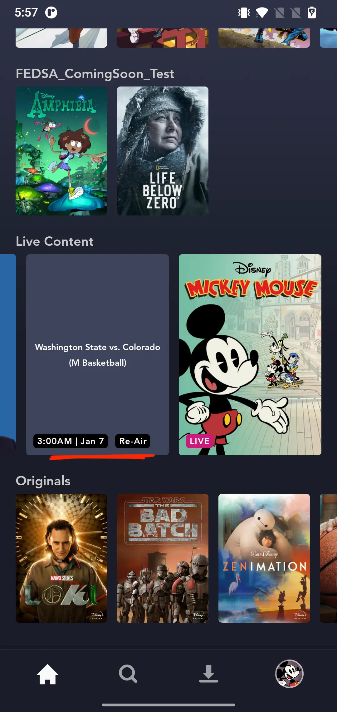|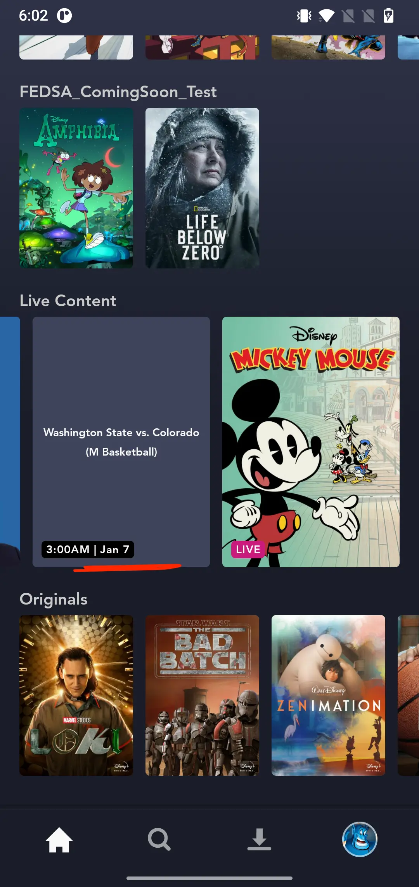|

## Loop

Indicates whether the hero / heroFullBleed container should loop infinitely. With this tag, the user would be able to swipe through the hero carousel in an endless loop. This is currently used by the hero & heroFullBleed implementation in Disney+.

## MatchWidthVaderGrid

Indicates whether the number of tiles should exactly match width of the vader grid.

??? example "Demo tag MatchWidthVaderGrid"
    |No Tag|With Tag|
    |-|-|
    |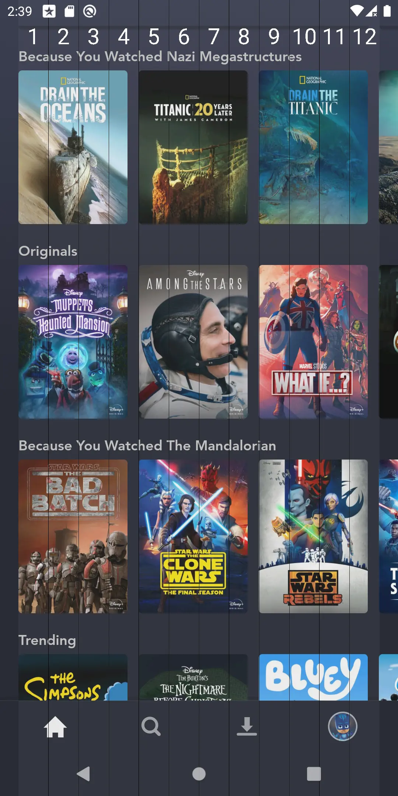|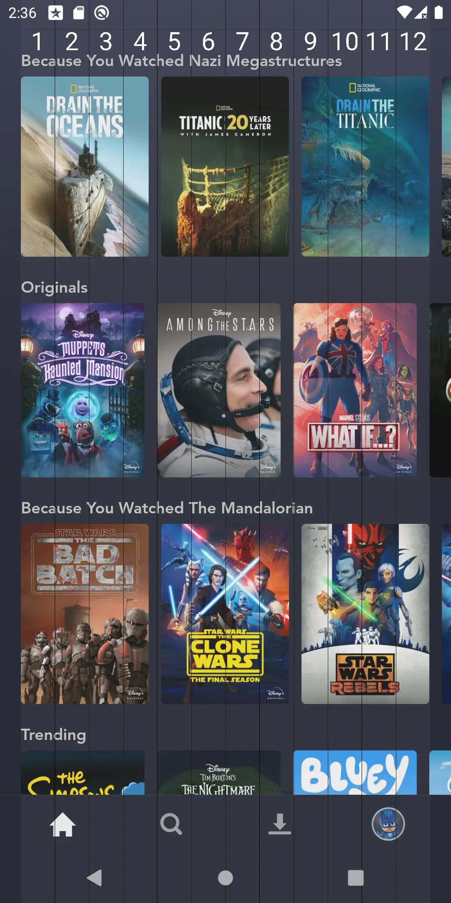|

## TilesMatchAssetCount

Indicates that the number of assets should determine the tiles property of the ContainerConfig. This SetTag is a left-over from the initial Disney+ launch where the `originals` tile wouldn't be available. Applying this tag to a container will adjust the number of visible tiles to match the actual tile count.

??? example "Demo tag TilesMatchAssetCount"
    |No Tag|With Tag|
    |-|-|
    |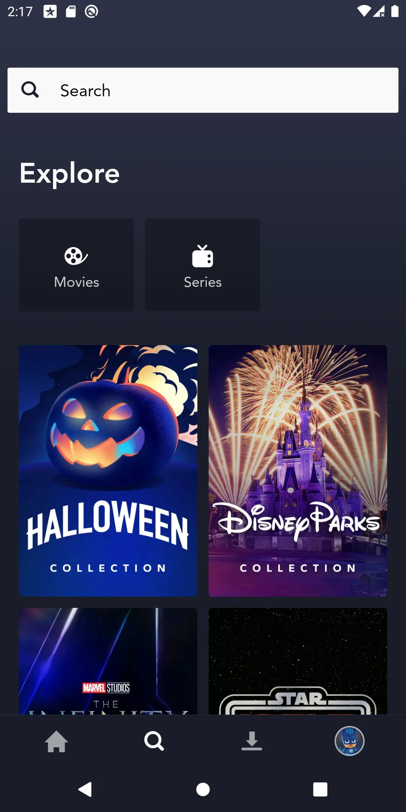|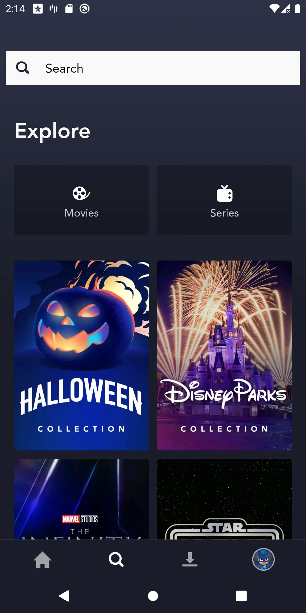|

## ImageHideOriginalsLogo

Indicates if the tile should hide the originals logo for originals content. The originals logo on asset tiles is supposed to be hidden on episodes tiles and on the `originals` collection.

??? example "Demo tag ImageHideOriginalsLogo"
    |No Tag|With Tag|
    |-|-|
    |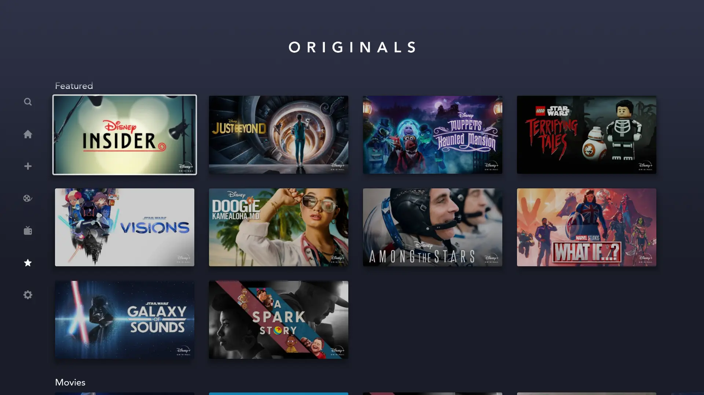||

## ImageTransparentPlaceholder

Indicates whether the default placeholder while loading images should be ignored.

??? example "Demo tag ImageTransparentPlaceholder"
    |No Tag|With Tag|
    |-|-|
    |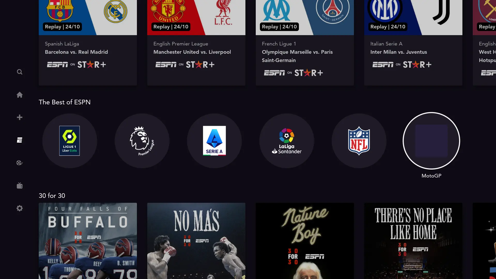|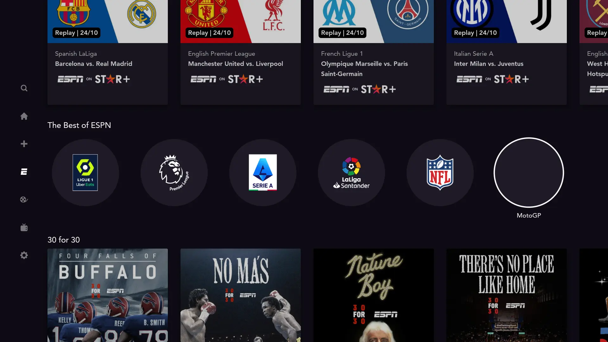|

## ImageSupportTransparency

Indicates if the tile supports transparency. This is useful for images that represents a logo with transparent background, like brand or club/league logos.

??? example "Demo tag ImageSupportTransparency"
    |No Tag|With Tag|
    |-|-|
    |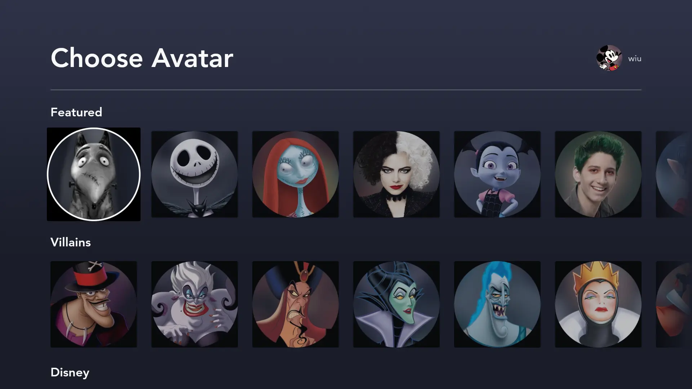|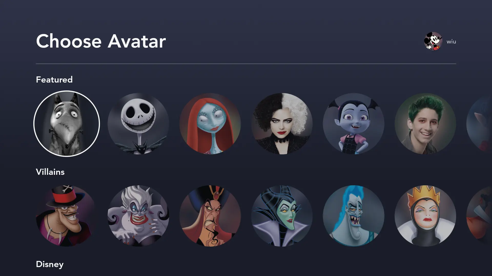|

## PinScrollWindow

Indicates if scroll window should be pinned to top for current focus view. This is used to enforce the RecyclerView to snap scroll state to top of the RecyclerView. This is mainly used by the `brand` and `featured` container on the `home` collection.

??? example "Demo tag PinScrollWindow"
    |No Tag|With Tag|
    |-|-|
    |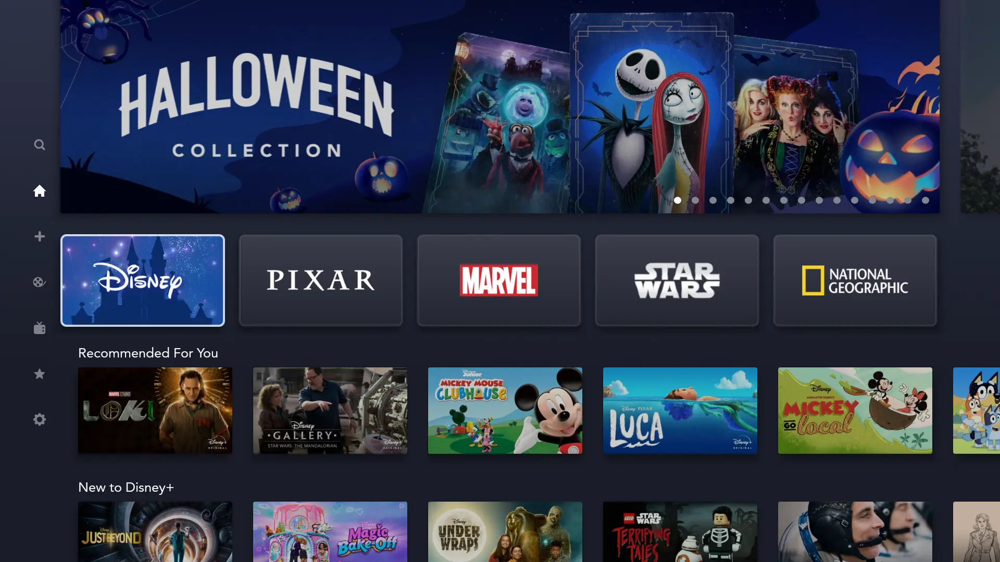|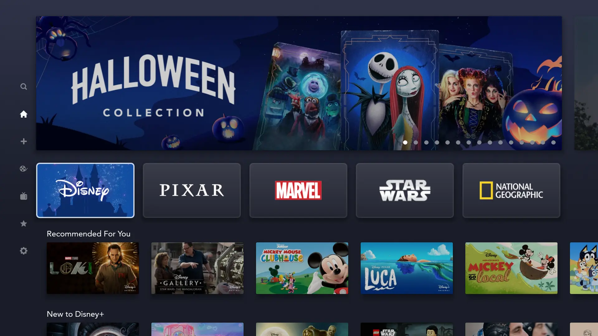|

## RouteToPlayback

Indicates if an `AiringItem` should route to playback instead of to the details page.

## NoAspectRatioBasedMinHeight

Indicates if the ShelfNoSnapItem should not set the minimum height based on the aspectRatio. This is useful on containers where the tile doesn't match the aspectRatio because there is an additional metadata view on the side (ContinueWatching on Star+), or the collection view doesn't take the full width (explore with grid keyboard).

??? example "Demo tag NoAspectRatioBasedMinHeight"
    |No Tag|With Tag|
    |-|-|
    |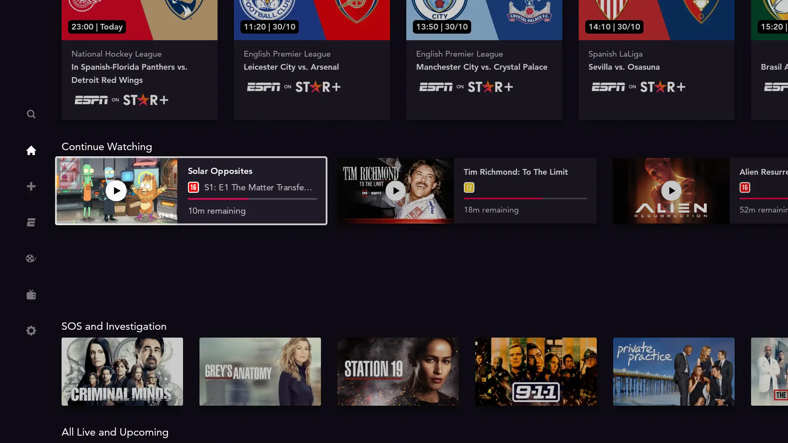|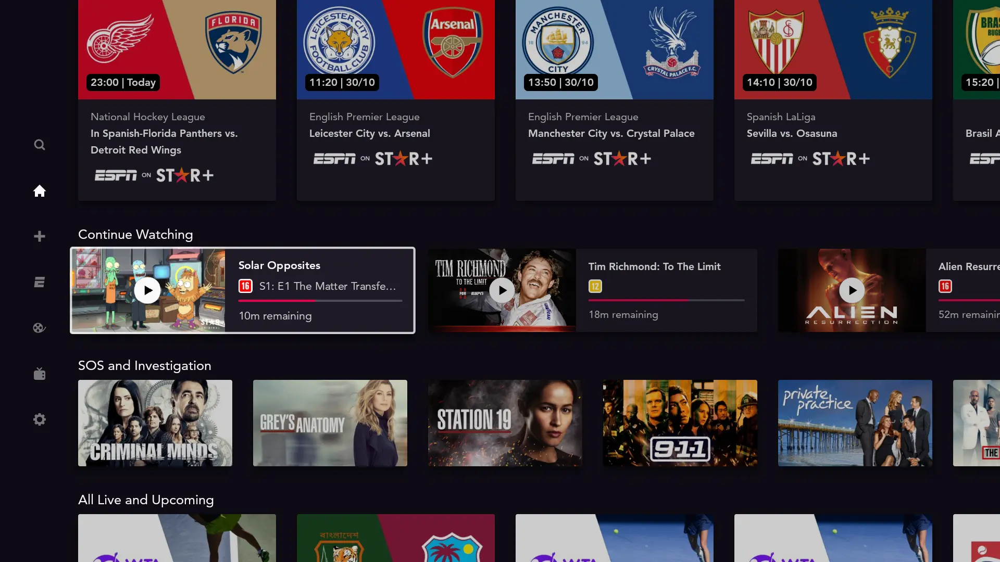|

## FocusedAssetVideoArtSupport

Indicates if the set supports playback of VideoArt on asset focus. I.e. this is used for all sets on brand page & the heroInteractive set on home / espn page.

## LeftFocusDoesNotOpenNav

Indicates that focusing left will not open the nav bar. This was introduced when adding the grid keyboard on search. Focusing left needs to focus that grid keyboard, not open the nav bar.

## AlphaFocusEffectEnabled

Indicates that an alpha animation will be applied when focusing/unfocusing the item.
Unfocused items will have their alpha dimmed.

This tag will be ignored programmatically on lite mode devices

??? example "Demo tag AlphaFocusEffectEnabled"
    |No Tag|With Tag|
    |-|-|
    |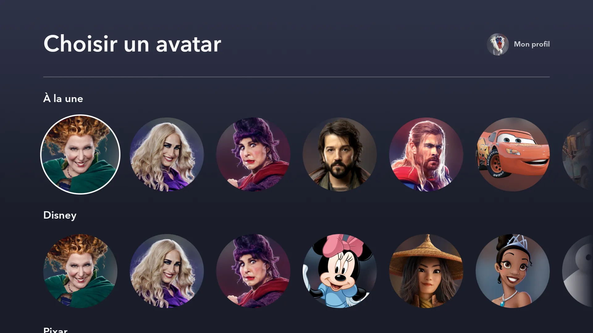|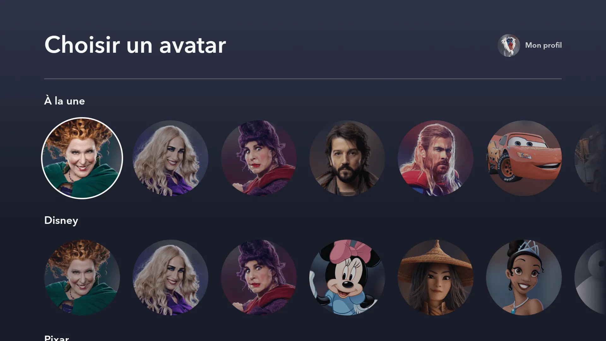|
