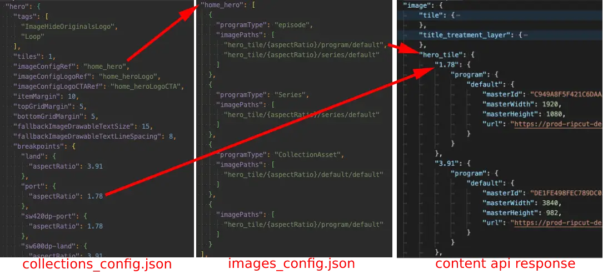

# Images Config

In a similar fashion, images are retrieved based on a configuration file named [images_config.json](https://github.bamtech.co/Android/Dmgz/blob/development/features/config/src/main/res/raw/images_config.json). Each entry in this json file could be resolved with the `ImageConfigResolver.resolve(imageConfigId: String, aspectRatio: AspectRatio)` method. The `aspectRatio` parameter will be used to replace the optional `{aspectRatio}` placeholder in each image path.

The structure of the `images_config.json` file has been updated per v2.8. See the [changelog](https://github.bamtech.co/Android/Dmgz/blob/development/features/collections/CONFIG_CHANGELOG.md) for the complete list of changes.
???+ info "Basic structure"
    ```json
    {
    "imageConfigIdMapping": {
        "channels_tile": "default_tile"
    },
    "$imageConfigId": {
        "default": [],
        "$programType1": [],
        "$programType2": []
    }
    "home_brandFocused": {
        "default": [
        "tile_white/{aspectRatio}/default/default"
        ]
    },
    "search_default": {
        "default": [
        "tile/{aspectRatio}/video/default",
        "tile/{aspectRatio}/program/default",
        "tile/{aspectRatio}/series/default"
        ],
        "episode": [
        "thumbnail/{aspectRatio}/program/default"
        ]
    },
    "default_hero_titleTreatmentLayer": {
        "default": [
        "title_treatment_layer/{aspectRatio}/program/default"
        ],
        "collection": [
        "logo_layer/{aspectRatio}/default/default",
        "title_treatment_layer/{aspectRatio}/default/default"
        ],
        "episode": [
        "title_treatment_layer/{aspectRatio}/program/default",
        "title_treatment_layer/{aspectRatio}/series/default"
        ],
        "series": [
        "title_treatment_layer/{aspectRatio}/series/default"
        ]
    },
    "event_mobile": {
        "default": [
        "title_treatment_centered/1.78/program/default",
        "title_treatment_bottom/1.78/program/default",
        "logo/1.00/team/default?source=eventCompetitors,numberOfImages=2",
        "logo/1.00/league/default?source=eventLeague"
        ]
    }
    }
    ```

In this file, we declare a `imageConfigId` and then specify the different image paths for that reference. When it is required to have different image paths based on the Asset programType value, you can define a different array of image paths under the programType node. Some examples of the possible programType node name values are: `collection`, `episode`, `series`, `movies`, `marqueeEvent`, `sport`, `league`, `team`. Note that there should always be `default` node with an array of image paths.  

Each value in the `images_config.json` will be parsed into an [ImageConfig](https://github.bamtech.co/Android/Dmgz/blob/development/coreContentApi/src/main/java/com/bamtechmedia/dominguez/core/content/ImageConfig.kt) object that contains an array of [ImagePath](https://github.bamtech.co/Android/Dmgz/blob/development/coreContentApi/src/main/java/com/bamtechmedia/dominguez/core/content/ImageConfig.kt) objects. Each ImagePath represents the path to an image that is provided on asset level within the Content API response.

## ImagePath parameters

With the addition of sport images for S+, it was a requirement to have multiple images with a different source. This is where the ImagePath parameters comes into effect. At the end of each image path, parameters could be added by adding the following postfix: `?key1=value1,key2=value2`. Currently, there are 2 types of parameters supported: `source` and `numberOfImages`.

* The `source` parameter is used to define where the image should be taken from. With the addition of sport events, it is a requirement to resolve images from the main asset level (which is the default) or `sportTags`, `eventLeague` and `eventCompetitors` source.
* The `numberOfImages` parameter is used to define the required number of images. If the required number of images for this path doesn't match, it will skip the image path and tries the next one.

??? example "Some examples of ImagePaths with parameters"
    ```text
    "logo/1.00/team/default?source=eventCompetitors,numberOfImages=2"
    "logo/1.00/league/default?source=eventLeague"
    "tile/{aspectRatio}/sport/default?source=sportTags"
    "logo/{aspectRatio}/sport/default?source=sportTags"
    ```

## imageConfigIdMapping

???+ info "In `images_config.json`"
    ```json
    {
    "imageConfigIdMapping": {
        "channels_tile": "default_tile"
    }
    }
    ```

The special element `imageConfigIdMapping` allows the mapping of some of the image config reference ids into other ids to avoid repeating configurations that are equivalent. In the case of the example above, the `channels_title` reference is mapped into our `default_tile` below.

## Examples of resolving ImageConfig

There are mainly 2 different ways of resolving an ImageConfig.

The first way is by injecting the `ImageConfigResolver` instance into your class and invoke `resolve` with `imageConfigId` and the desired `aspectRatio`.

???+ note "Use ImageConfigResolver - `resolve` "
    ```kotlin
    imageConfigResolver.resolve("default_heroFullscreen_eventLogo", AspectRatio.RATIO_ORIGINAL)
    imageConfigResolver.resolve("default_heroFullscreen_logo", AspectRatio.RATIO_16x9)
    ```

The second way is by referencing the `imageConfigId` in the `collections_config.json` in one of the `imageConfigRef`, `imageConfigLogoCTARef`, `imageConfigLogoRef`, `imageConfigFocusedRef`,  `backgroundImageConfigRef` or `titleImageConfigRef`.

For this approach, the `ContainerConfigResolverImpl` takes care of parsing the `imageConfigId` value and resolve the ImageConfig with the `imageConfigId` and `aspectRatio` values from the `collections_config.json`.  

In the example `collections_config.json` below, the `imageConfigRef` value is referring to `default_tile` which is specified in the `images_config.json`. Besides that, `backgroundImageConfigRef` and `titleImageConfigRef` are specified for the `brand` collection.

???+ note "Referencing the `imageConfigId`"

    ```json
    {
    "brand": {
        "backgroundImageConfigRef": "default_landingBackground",
        "displayType": "brandLanding",
        "titleAspectRatio": 2.0,
        "titleImageConfigRef": "brand_landingTitle",
        "sets": {
        }
    },
    "home" : {
        "sets" : {
        "default": {
            "shelf_grid": {
            "imageConfigRef": "default_tile",
            "breakpoints": {
                "land": {
                "aspectRatio": 3.91
                },
                "port": {
                "aspectRatio": 1.78
                }
            }
            }
        }
        }
    }
    }
    ```

This indicates that for this Combination of collection, content type and container style, the `imageConfigRef` should be read from `images_config.json` in the key `default_tile`.

When resolving the config, [ImageConfigResolver](https://github.bamtech.co/Android/Dmgz/blob/development/coreContent/src/main/java/com/bamtechmedia/dominguez/core/content/imageconfig/ImageConfigResolverImpl.kt) would combine the Container Info retrieved from `collections_config.json` to determine which aspect ratio is needed, with the Image config info found on `images_config.json` to resolve an effective path or list of paths from which to retrieve the most appropriate image for that tile.

???+ example "ImagesConfig example"
    
