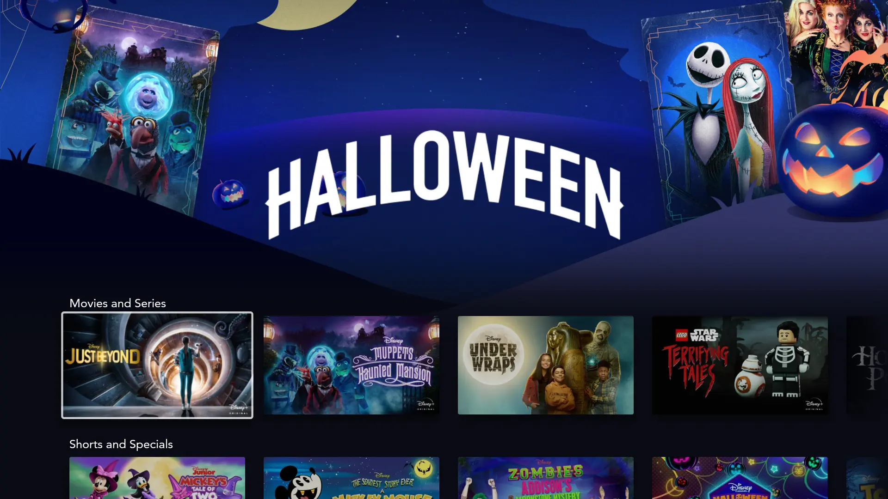
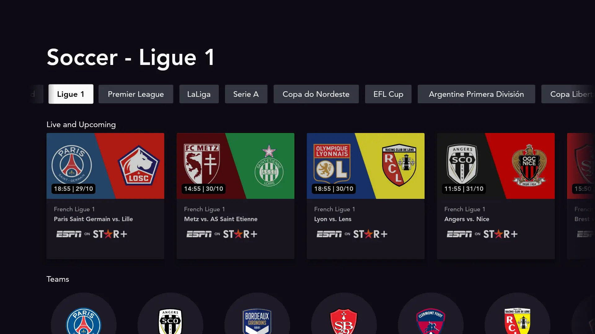

# Collection

The top most concept is that of a Collection.

A Collection is a group of ordered containers with a collection identifier that indicates something about the content. This is what the client devices call for displaying app screens such as `/home/` or `/explore/`.

Essentially, a collection represents all the items presented on a page and is comprised of a list of [containers](../container), with each of these having a [set](../set).

A simple example of the response model for the collections endpoint is as follows:

??? example "Collection response model"
    ```json
    {
      "data": {
        "Collection": {
            "callToAction": null,
            "collectionGroup": {
                "collectionGroupId": "0830390a-b0f3-4420-8a7f-2e541798f9e8",
                "contentClass": "home",
                "key": "home",
                "slugs": [{
                    "language": "en",
                    "value": "home"
                }]
            },
            "collectionId": "3ea37bc7-5439-48e2-a0e2-e920e5ce9867",
            "containers": [
                {
                    "set": {
                    }
                },
                {
                    "set": {
                    }
                }
            ],
            "text": {
                "title": {
                    "full": {
                        "collection": {
                            "default": {
                                "content": "Home",
                                "language": "en-GB",
                                "sourceEntity": "collection"
                            }
                        }
                    }
                }
            },
            "type": "StandardCollection",
            "subType": "StandardCollection",
            "videoArt": []
        }
      }
    }
    ```

## Collection metadata

The response of a collection request contains several metadata values. This subject is used to sum up the most important values and explain what these mean. As an example, see the response of the `home` collection request in the [collection](#collection) subject.

### contentClass

The `contentClass` is a key which is used to determine what type of collection needs to be resolved. This will be combined with the `slug` value to link to a specific collection, where the `contentClass` presents the collection type and `slug` the unique identifier. The collection will be resolved by the `getCollection` endpoint.

To resolve a collection, both the `contentClass` and `slug` values are part of the endpoint. Possible values for the `contentClass` are: `home`, `watchlist`, `contentType`, `originals`, `espn`, `explore`, `brand`, `avatars`, `editorial`, `character`.

See the implementation [SlugProvider](https://github.bamtech.co/Android/Dmgz/blob/development/coreContent/src/main/java/com/bamtechmedia/dominguez/core/content/collections/SlugProviderImpl.kt) for a complete list of used collections.

???+ info "Endpoint example"
    The endpoint looks like this:
    `/svc/content/Collection/StandardCollection/version/5.1/region/*/audience/*/maturity/*/language/*/contentClass/$CONTENT_CLASS/slug/$SLUG`
    where the `CONTENT_CLASS` and `SLUG` placeholders should be replaced by the contentClass and slug values.

??? example "Some examples to illustrate the usage of the `contentClass` and `slug` values in the endpoint."
    ```text
    contentClass/home/slug/home
    contentClass/watchlist/slug/watchlist
    contentClass/contentType/slug/movies
    contentClass/contentType/slug/series
    contentClass/character/slug/black-widow
    contentClass/editorial/slug/halloween
    contentClass/brand/slug/disney
    contentClass/brand/slug/marvel
    contentClass/explore/slug/explore
    ```
    

### slug

Slugs represent vanity urls defined for a specific collection and can be used to identify that collection in some cases, through the `getCollection` endpoint. In that case, they are mapped into a [CollectionIdentifier](https://github.bamtech.co/Android/Dmgz/blob/development/coreContentApi/src/main/java/com/bamtechmedia/dominguez/core/content/collections/CollectionIdentifier.kt) as a `Slug`

### collectionGroupId

Uniquely identifies the collection in order to retrieve it through the `getCollectionById` endpoint. It's mapped into a [CollectionIdentifier](https://github.bamtech.co/Android/Dmgz/blob/development/coreContentApi/src/main/java/com/bamtechmedia/dominguez/core/content/collections/CollectionIdentifier.kt) as a `CollectionGroupId`.

The `collectionGroupId` is used for nested collections which are commonly used for sports content (leagues, teams, competitions and so on). For a complete overview on the access path via the `getCollectionById` endpoint, see the [FEDSA nested collection](https://github.bamtech.co/pages/fed-solutions/documentation/content/collections-sets.html#nested-collections) documentation.

The response does contain a `collectionGroupId` of the parent collection and does an additional request to resolve the parent collection if needed.
???+ info "Endpoint example"
    The endpoint looks like this:
    `/svc/content/Collection/StandardCollection/version/5.1/region/*/audience/*/maturity/*/language/*/collectionGroupId/$COLLECTION_GROUP_ID`
    where the `$COLLECTION_GROUP_ID` placeholder will be replaced by the unique collectionGroupId value.

??? example "Some examples to illustrate the usage of `collectionGroupId` values when loading the `soccer` collection with the `ligue 1` child collection selected."
    ```text
    collectionGroupId/7df2c5de-8dcf-4f59-9eeb-c63c1107abcc // Soccer collection
    collectionGroupId/3469921c-8baf-4b18-ab12-e26a238ab583 // Ligue-1 collection
    ```

    

### collectionId & key

Unique collection identifier & key which are used for analytics purposes.
