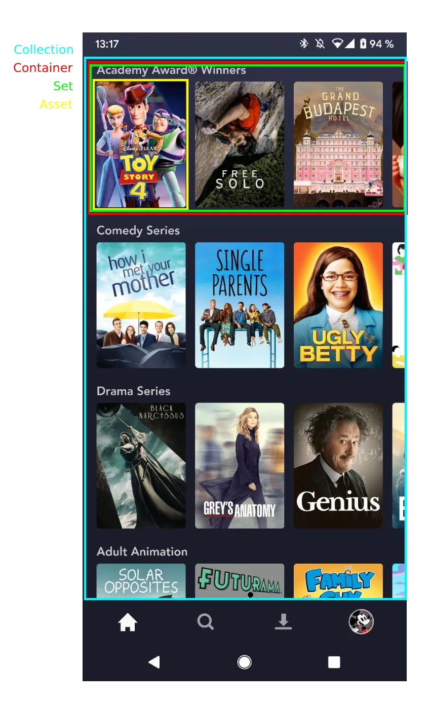
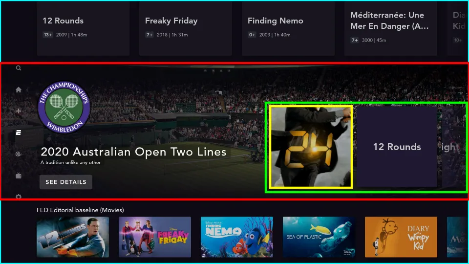

# Collections

Collections is a big feature within Dominguez, as most of the screens that display a list of elements, are modelled as a [Collection](https://github.bamtech.co/Android/Dmgz/blob/development/coreContentApi/src/main/java/com/bamtechmedia/dominguez/core/content/collections/Collection.kt). This includes pages such as Partner pages (Star, Disney, Star Wars...), the Search screen, the Home screens, or the List of Avatars.

A specific terminology was devised from the Content perspective to refer to the different parts that comprise the concept of a Collection.

???+ example "Terminology"
    <figure markdown>
        { width="400" }
    </figure>
     <figure markdown>
        { width="700" }
    </figure>
