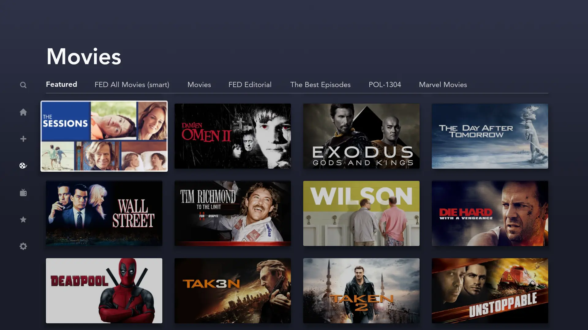
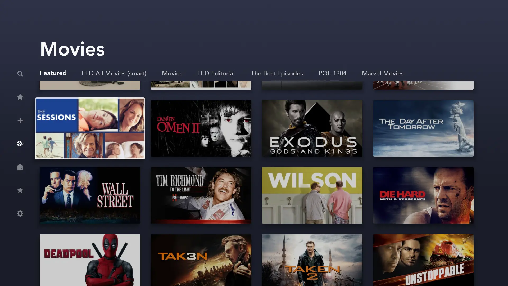
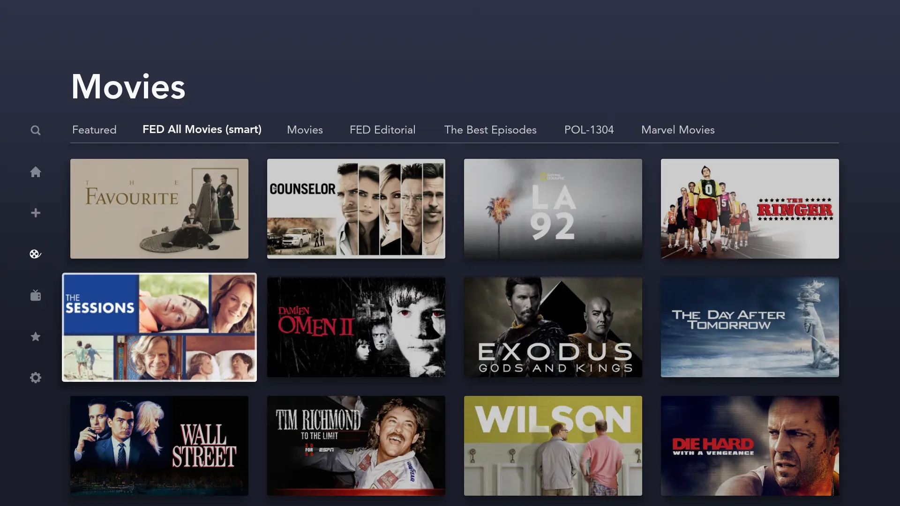
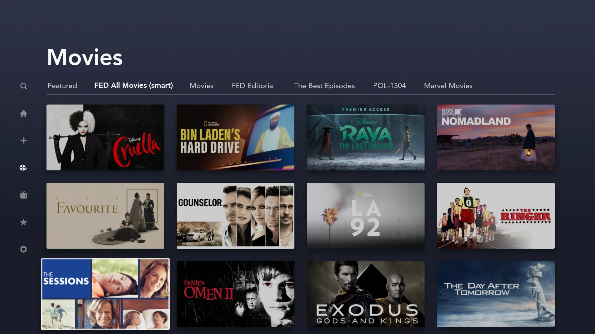
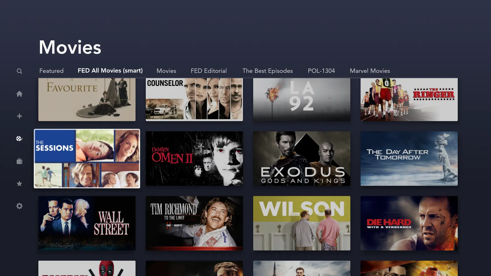
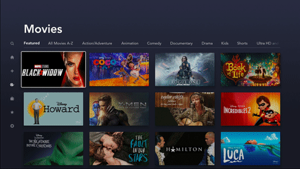

# Snap and Scroll behavior

Each collection based fragment requires its own scroll behavior. Therefore, the [RecyclerViewSnapScrollHelper](https://github.bamtech.co/Android/Dmgz/blob/development/core-utils/src/main/java/com/bamtechmedia/dominguez/core/recycler/RecyclerViewSnapScrollHelper.kt) has been created. There are 4 different `SnapType`s defined in the RecyclerViewSnapScrollHelper implementation: `Start`, `Level`, `Center` and `CenterNoInsets`.

In order to make use of the `RecyclerViewSnapScrollHelper`, it is only required to inject it into the presenter and trigger the init method with the desired `SnapType`, `RecyclerView` and the `viewLifecycleOwner`.

The `RecyclerViewSnapScrollHelper.init` method is responsible for checking whether to support the snap scroll logic, which is limited to the television devices or any other device with focus navigation support.

???+ info "Init"
    ```kotlin
    recyclerViewSnapScrollHelper.init(
        fragment.viewLifecycleOwner,
        binding.collectionRecyclerView,
        RecyclerViewSnapScrollHelper.SnapType.Center
    )
    ```

## SnapType.Start

The `Start` type snaps the focused view to the top of the RecyclerView. It takes a `scrollOffsetDimenRes` parameter to define a certain amount of additional offset to be added on top.

| Start | Start(20dp) |
|-|-|
|||

??? example "Start gif"
    <figure markdown>
        { width="650" }
    </figure>

## SnapType.Level

The `Level` type snaps the focused view on a specific row. It takes the `level` parameter to determine on which row it should snap. Passing 0 as level is basically the same as using `SnapType.Start`.

| Level(1) | Level(2) |
|-|-|
|||

??? example "Level(1) gif"
    <figure markdown>
        { width="650" }
    </figure>

## SnapType.Center

The `Center` type snaps the focused view in the center of the RecyclerView. It takes the padding top & bottom values into account and centers in the middle of the padded scroll window.

| Center |
|-|
| <figure markdown>{ width="700" }</figure>|

??? example "Center gif"
    <figure markdown>
        { width="650" }
    </figure>

## SnapType.CenterNoInsets

The `CenterNoInsets` type snaps the focused view in the center of the RecyclerView. Compared to `Center`, it doesn't take the padding top & bottom values into account as you can pass these values as a parameter to bypass the padded scroll window.
???+ info "CenterNoInsets"
    ```kotlin
       SnapType.CenterNoInsets(
           view.collectionRecyclerView.paddingTop,
           view.collectionRecyclerView.paddingBottom
        )
    ```
    will center in the middle of the RecyclerView, regardless the paddingTop/paddingBottom values.

| CenterNoInsets |
|-|
| <figure markdown>{ width="700" }</figure>|

??? example "CenterNoInsets gif"
    <figure markdown>
        { width="650" }
    </figure>
