# FEDSA Container Styles

Here is an overview of the available FEDSA container styles. Most of the container styles are using the [default](./item_view_type_content#itemviewtypedefault) ItemViewType. When a different ItemViewType is used, it is mentioned explicitly per container style.

|containerStyle      | Available in D+ | Available in S+ | Comments |
|-|:----:|:----:|-|
|`brand`                  | X |   |    |
|`brandSix`               | X |   |    |
|`character`              | X | X |    |
|`collectionLogos`        |   | X |    |
|`contentType`            | X |   | Mobile / Tablet only   |
|`continueWatching`       |   | X |    |
|`ContinueWatchingSet`    | X |   |    |
|`default`                | X | X |    |
|`editorial`              | X | X |    |
|`editorialPanel`         | X | X |    |
|`editorialPanelLarge`    | X | X |    |
|`episode`                | X | X |    |
|`featured`               | X |   | Appears on kids profiles only. |
|`hero`                   | X |   |    |
|`heroInline`             | X | X |    |
|`heroInlineGE`           | X | X |    |
|`heroInlineSlim`         | X | X |    |
|`heroInteractive`        |   | X |    |
|`heroSingle`             |   | X |    |
|`poster`                 | X | X |    |
|`results`                | X | X |    |
|`star`                   | X |   |    |
|`WatchlistSet`           | X | X |    |

## brand

The `brand` style represents the different brand tiles. This row could be found as second row beneath the hero container on the D+ home screen only. It does contain the 5 different brand tiles. It uses the [brand](./item_view_type_others#itemviewtypebrand) ItemViewType.

??? example "Demo brand"
    

## brandSix

The `brandSix` style represents the different brand tiles. This is basically the same as the `brand` style, but it has the `Star` brand in addition. It does contain the 6 different brand tiles. It uses the [brand](./item_view_type_others#itemviewtypebrand) ItemViewType.

!!! note
    This style will only be visible for Welch supported countries.

??? example "Demo brand"
    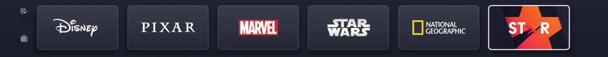

## character

The `character` style is used on the avatar selection screen in the profile setting screen. It uses the [character](./item_view_type_others#itemviewtypecharacter) ItemViewType.

??? example "Demo character"
    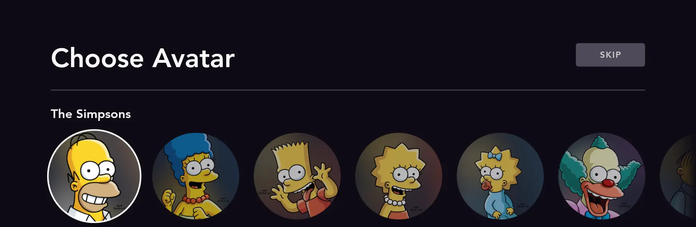

## collectionLogos

The `collectionLogos` style is used to show any sport, league or team collection tile. Since this is related to sport content only, the container style is available in Star+ only. There are some examples on the `home` and `espn` collection. It uses the [sportsCategory](./item_view_type_others#itemviewtypesportscategory) ItemViewType.

??? example "Demo collectionLogos"
    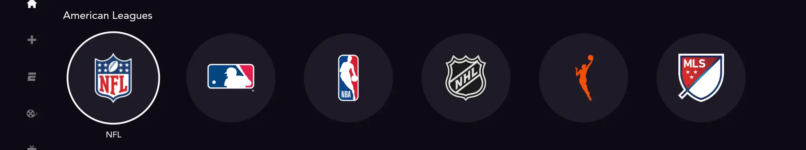

## contentType

The `contentType` style is used to show the different categories (`Originals`, `Movies` and `Series`) on the explore collection in Disney+. It's being presented on mobile and tablet devices only. It uses the [category](./item_view_type_others#itemviewtypecategory) ItemViewType.

??? example "Demo contentType"
    <figure markdown>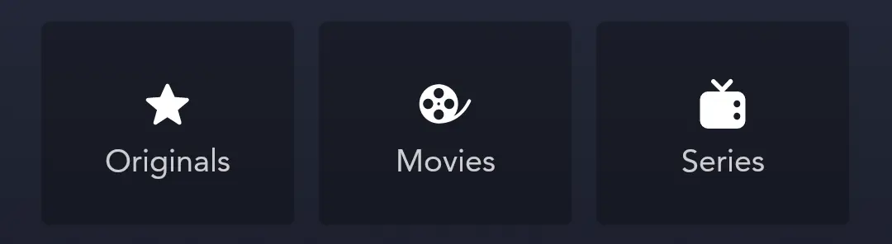{ width="400" }</figure>

## continueWatching

The `continueWatching` style represents the content with an active bookmark. This is used in Star+ only and could be found on the `home` collection. It uses the [bookmarkV2](./item_view_type_content#itemviewtypebookmarkv2) ItemViewType.  

??? example "Demo continueWatching"
    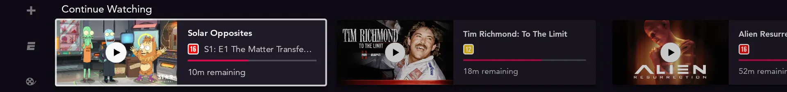

## ContinueWatchingSet

The `ContinueWatchingSet` style represents the content with an active bookmark. This is the equivalent of `continueWatching` container style, but it is used in Disney+ only. It uses the [bookmark](./item_view_type_content#itemviewtypebookmark) ItemViewType.

??? example "Demo ContinueWatchingSet"
    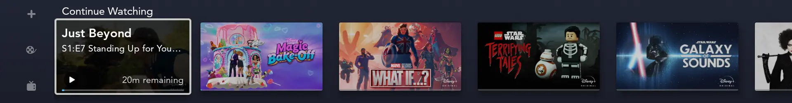

## editorial

The `editorial` style is used to display the content is the most basic way (same as the [default](./local_container_styles#default) style). This style could be found on most of the collection screens. It uses the [default](./item_view_type_content#itemviewtypedefault) ItemViewType.

??? example "Demo editorial"
    |Mobile|Television|
    |-|-|
    |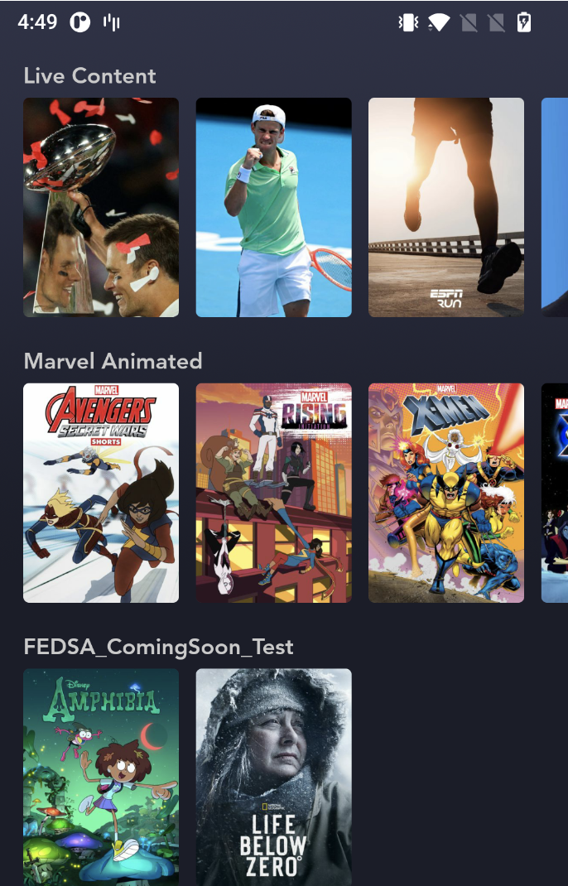|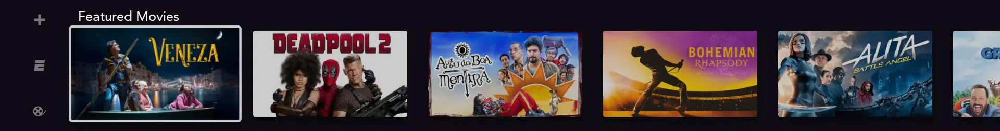|

## editorialPanel

The `editorialPanel` style uses the [editorialPanel](item_view_type_content#itemviewtypeeditorialpanel). There are several examples on the `home` and `espn` collection in Star+.

!!! note
    This container style is set up for Disney+ as well, but at the moment only showing in the [heroInline](#heroinline) container style on television devices.

??? example "Demo editorialPanel"
    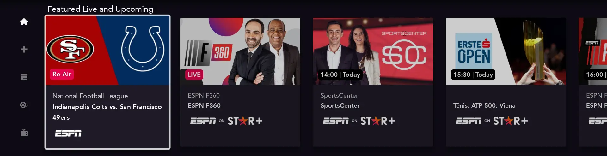

## editorialPanelLarge

This is the same style as [editorialPanel](#editorialpanel) but with a little difference in the number of visible tiles per row.  

## episode

The `episode` style looks like the [default](./local_container_styles#default) style, but displays the item with different images. The `thumbnail` images are being presented instead. There are not so many places where this style is used, but there might be some examples in any of the nested collections of `The Simpsons` collection in Disney+. It uses the [episode](./item_view_type_content#itemviewtypeepisode) ItemViewType.

Relevant deep links might be [https://www.disneyplus.com/franchise/the-simpsons](https://www.disneyplus.com/franchise/the-simpsons) and [https://www.disneyplus.com/franchise/the-simpsons-sports](https://www.disneyplus.com/franchise/the-simpsons-sports).

??? example "Demo episode"
    |Mobile|Television|
    |-|-|
    |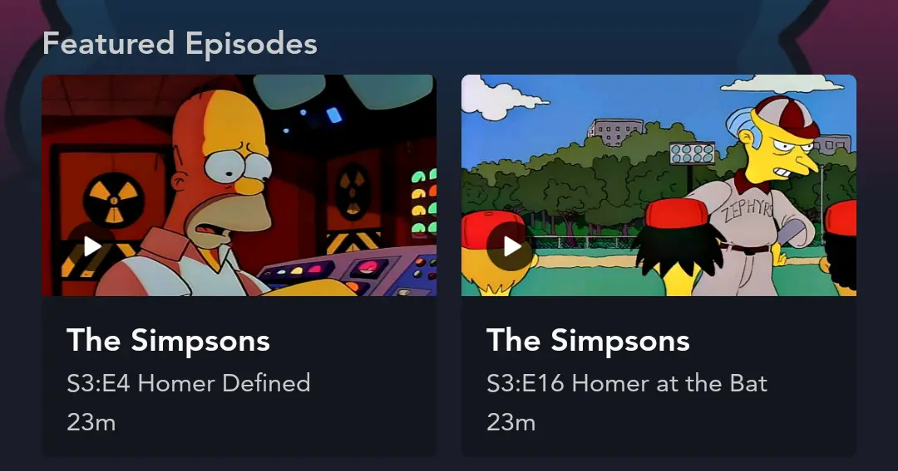|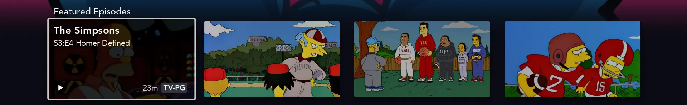|

## featured

The `featured` style represents the different featured tiles. This row could be found as second row beneath the hero container on the Disney+ home screen on a kids profile only. It uses the [featured](./item_view_type_content#itemviewtypefeatured) ItemViewType.

??? example "Demo featured"
    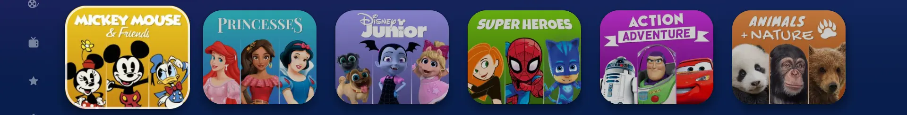

## hero container style

For the `hero` container style, there are 2 different possible `containerType`s available. The `containerType` defines what kind of hero view the user will see. There is a `hero` and `hero_full_bleed` container type. Both hero container types are limited to the first row of the `home` collection of Disney+ only.

### hero

This is the default containerType used for the `hero` style. It will display a container with just one completely visible tile and a small portion of the previous / next tile on each side. Since this is a infinite loop, the user might scroll in both directions through the content. It uses a 1.78 aspect ratio for mobile and 3.91 for tablet / television devices. The asset item implementation with this style could be found in the [HeroViewPagerItem](https://github.bamtech.co/Android/Dmgz/blob/development/features/collections/src/main/java/com/bamtechmedia/dominguez/collections/items/HeroViewPagerItem.kt).

??? example "Demo hero"
    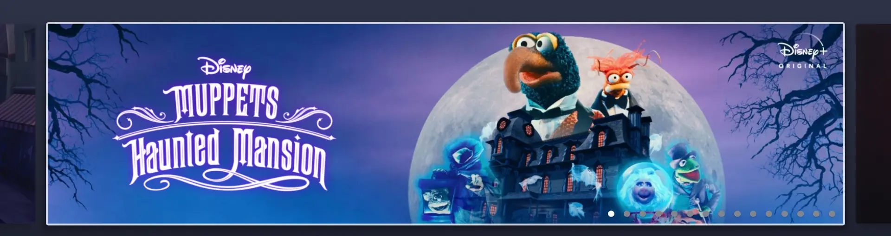

### hero_full_bleed

This is the additional containerType used by D+ television devices only. It displays the hero content in a more immersive way where the user is able to navigate through the items in a horizontal direction. Note that, compared to the `hero` implementation, there is no glimpse of the previous / next item. The asset item implementation with this style could be found in the [FullBleedItem](https://github.bamtech.co/Android/Dmgz/blob/development/features/collections/src/main/java/com/bamtechmedia/dominguez/collections/items/FullBleedItem.kt).

??? example "Demo hero_full_bleed"
    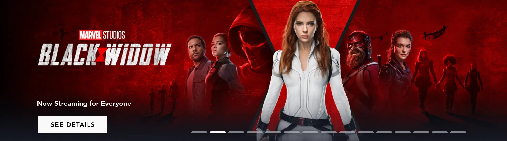

### heroInline

The `heroInline` container could be found on the `home` and `espn` collection. It uses the [heroInline](item_view_type_hero#itemviewtypeheroinline) ItemViewType.

??? example "Demo heroInline"
    

### heroInlineGE

The `heroInlineGE` container could be found on the `home`, `espn`, `movies` (Star+ only), `series`
(Star+ only), `character`, `editorial`,  `franchise`, `sport`, `league`, `marqueeEvent` collections.
It uses the [heroInlineGE](./item_view_type_hero#itemviewtypeheroinlinege) ItemViewType.

??? example "Demo heroInline"
    

### heroInlineSlim

The `heroInlineSlim` container could be found on the `home`, `espn`, `movies`, `series`, `character`, `editorial`,  `franchise`, `sport`, `league`, `marqueeEvent` collections.
It uses the [heroInlineSlim](./item_view_type_hero#itemviewtypeheroinlineslim) ItemViewType.

??? example "Demo heroInline"
    

### heroInteractive

The `heroInteractive` container could be found on the `home` and `espn` collection in Star+ only. It uses the [heroInteractive](./item_view_type_hero#itemviewtypeherointeractive) ItemViewType.

??? example "Demo heroInteractive"
    

### heroSingle

The `heroSingle` container could be found on the `home` and `espn` collection in Star+ only. It uses the [heroSingle](./item_view_type_hero#itemviewtypeherosingle) ItemViewType.

??? example "Demo heroSingle"
    

### poster

The `poster` style is used to display a basic tile just as the [editorial](#editorial) style does. Compared to the `editorial` style, this style uses the 0.71 aspect ratio on all devices. It uses the [default](./item_view_type_content#itemviewtypedefault) ItemViewType.

??? example "Demo poster"
    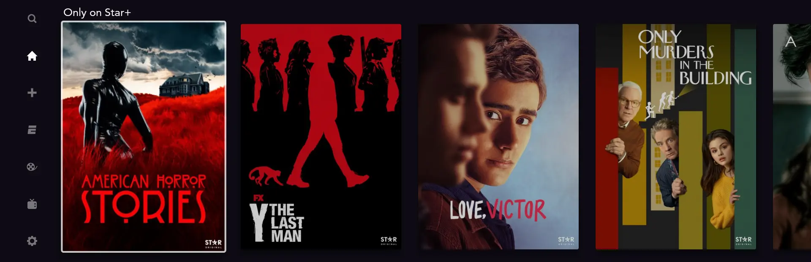

### results

It uses the [default](./item_view_type_content#itemviewtypedefault) ItemViewType on Disney+ and the [editorialPanel](./item_view_type_content#itemviewtypeeditorialpanel) ItemViewType on Star+.

??? example "Demo results"
    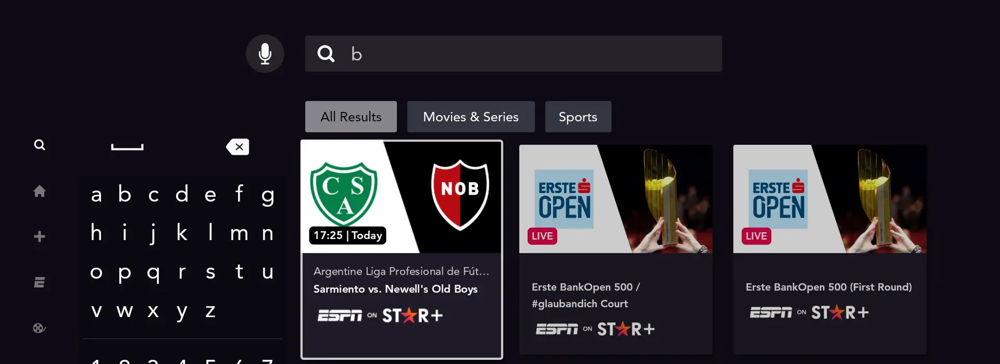

### star

The `star` style is used on Disney+ onboarding page for a Star enabled country (NL for example). You can test it by resetting the star onboarding flow of your Disney+ account [override account tool](https://overrider-prod.us-east-1.bamgrid.net/overrides/account) `More options - Reset Star Onboarding`

??? example "Demo star"
    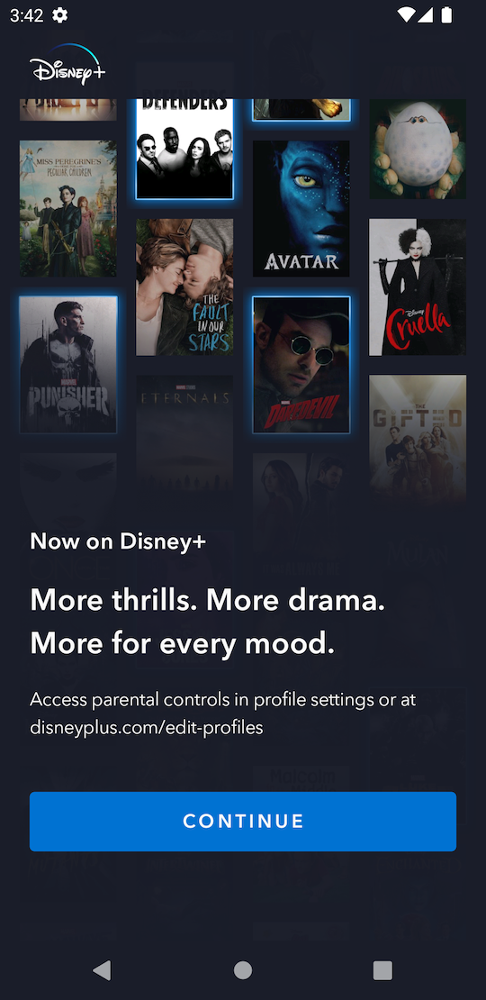{ width="200" }

### WatchlistSet

The `WatchlistSet` is used to display a container with items that are on your watchlist. There is a `WatchlistSet` on the `home` collection on Disney+ with a Australian location override on QA environment only. Make sure there are some assets in your watchlist. It uses the [default](./item_view_type_content#itemviewtypedefault) ItemViewType.

??? example "Demo WatchlistSet"
    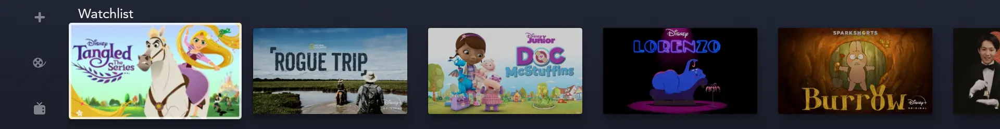
