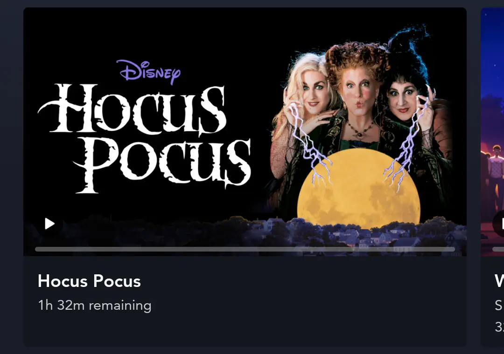
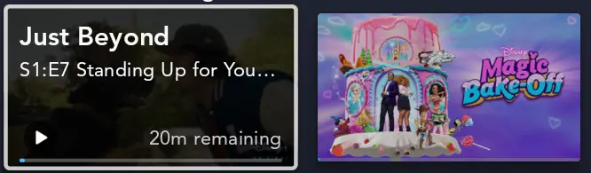
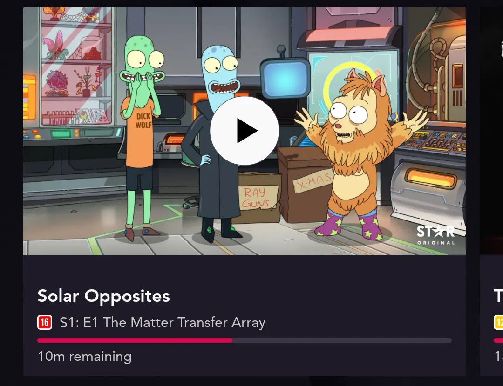
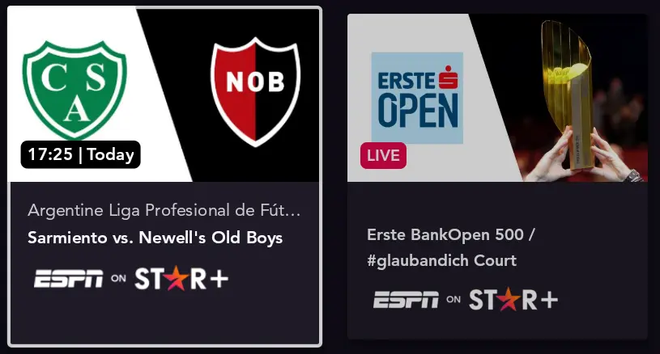
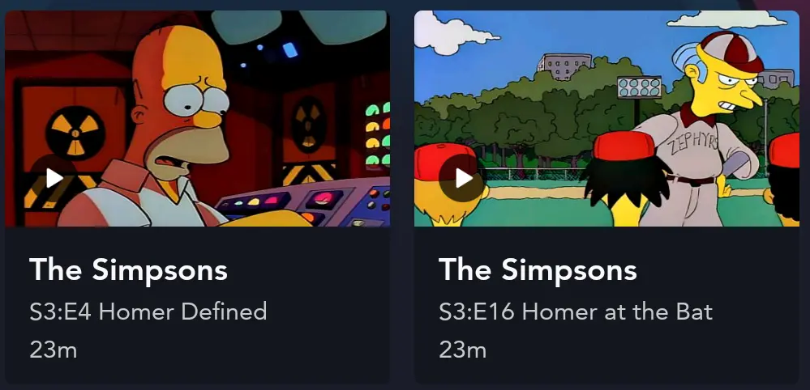
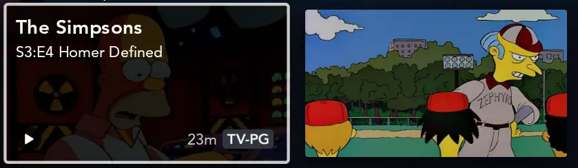
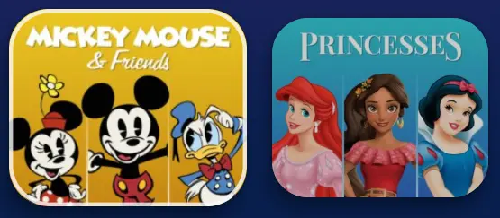

# ItemViewType used for display Titles Content

## ItemViewType.bookmark

For each asset with `bookmark` as `ItemViewType`, an [ContinueWatchingItem](https://github.bamtech.co/Android/Dmgz/blob/development/features/collections/src/main/java/com/bamtechmedia/dominguez/collections/items/ContinueWatchingItem.kt) will be created.

??? example "Demo bookmark"
    |Mobile|Television|
    |-|-|
    |<figure markdown>{ width="400" }</figure>|<figure markdown>{ width="400" }</figure>|

## ItemViewType.bookmarkV2

For each asset with `bookmarkV2` as `ItemViewType`, an [ContinueWatchingItem](https://github.bamtech.co/Android/Dmgz/blob/development/features/collections/src/main/java/com/bamtechmedia/dominguez/collections/items/ContinueWatchingItem.kt) will be created.

??? example "Demo bookmarkV2"
    |Mobile|Television|
    |-|-|
    |<figure markdown>{ width="400" }</figure>|<figure markdown>{ width="400" }</figure>|

## ItemViewType.default

The `default` ItemViewType is more or less the most used type in both the Disney+ and Star+ apps. It displays a basic tile with an image only.
It uses the 0.71 ratio for mobile and 1.78 ratio for tablet / television devices. The implementation of this ItemViewType could be found in the [ShelfListItem](https://github.bamtech.co/Android/Dmgz/blob/development/features/collections/src/main/java/com/bamtechmedia/dominguez/collections/items/ShelfListItem.kt) with the `shelf_list_item` layout.

??? example "Demo default"
    <figure markdown>{ width="400" }</figure>

## ItemViewType.editorialPanel

The `editorialPanel` ItemViewType is used to display any sport related content, but also movies / series could be displayed. It shows a metadata block below the image. The implementation of this ItemViewType could be found in the [PanelItem](https://github.bamtech.co/Android/Dmgz/blob/development/features/collections/src/main/java/com/bamtechmedia/dominguez/collections/items/editorialpanel/PanelItem.kt).

??? example "Demo editorialPanel"
    <figure markdown>{ width="400" }</figure>

## ItemViewType.episode

The `episode` ItemViewType is used to display episode content. Compared to the default ItemViewType, the episodic `thumbnail` images will be displayed. It also displays some additional episode title and other metadata. The implementation of this ItemViewType could be found in the [ShelfListItem](https://github.bamtech.co/Android/Dmgz/blob/development/features/collections/src/main/java/com/bamtechmedia/dominguez/collections/items/ShelfListItem.kt) with the `shelf_list_item_episode` layout.

??? example "Demo episode"
    |Mobile|Television|
    |-|-|
    |<figure markdown>{ width="400" }</figure>|<figure markdown>{ width="400" }</figure>|

## ItemViewType.featured

The `featured` ItemViewType does look like the [default](#itemviewtypedefault) ItemViewType, but it has a bigger rounded corner radius. The implementation of this ItemViewType could be found in the [ShelfListItem](https://github.bamtech.co/Android/Dmgz/blob/development/features/collections/src/main/java/com/bamtechmedia/dominguez/collections/items/ShelfListItem.kt) with the `featured_shelf_list_item` layout.

??? example "Demo featured"
    <figure markdown>{ width="400" }</figure>
