# Hero ItemViewType

## ItemViewType.heroInline

The `heroInline` ItemViewType represents a collection in an immersive way. There is a huge difference between the mobile and television implementation of the `heroInline` ItemViewType. The implementation of this ItemViewType could be found in the [HeroInlineItem](https://github.bamtech.co/Android/Dmgz/blob/development/features/collections/src/main/java/com/bamtechmedia/dominguez/collections/items/heroinline/HeroInlineItem.kt).  

On mobile and tablet, it will just display the collection as one big clickable tile that takes you to the collection landing page. On television, a immersive collection image is visible with a scrollable shelf to present asset items with the [EditorialPanel](fedsa_container_styles#editorialpanel) ItemViewType.

??? example "Demo heroInline"
    |Mobile|Television|
    |-|-|
    |<figure markdown>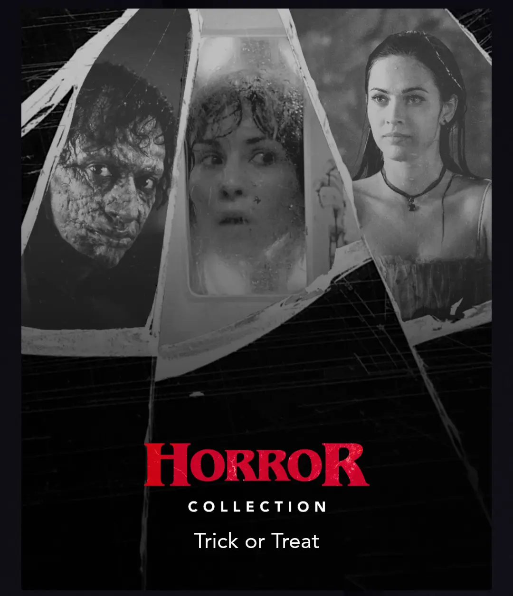{ width="400" }</figure>|<figure markdown>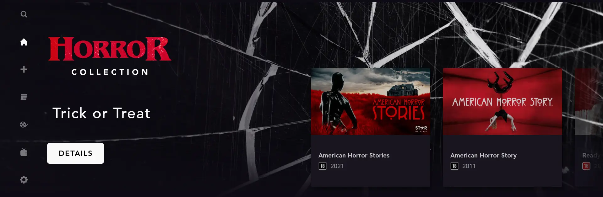{ width="400" }</figure>|

## ItemViewType.heroInlineSlim

The `heroInlineSlim` ItemViewType represents a collection in an immersive way. There is a huge
difference between the mobile and television implementation of the `heroInlineSlim` ItemViewType. The implementation of this ItemViewType could be found in the [HeroInlineItem](https://github.bamtech.co/Android/Dmgz/blob/development/features/collections/src/main/java/com/bamtechmedia/dominguez/collections/items/heroinline/HeroInlineItem.kt).

On mobile and tablet, it will just display the collection as one big clickable tile that takes you to the collection landing page. On television, a immersive collection image is visible with a scrollable shelf to present asset items with the [EditorialPanel](fedsa_container_styles#editorialpanel) ItemViewType.

??? example "Demo heroInlineSlim"
    |Mobile|Tablet|Television|
    |-|-|-|
    |<figure markdown>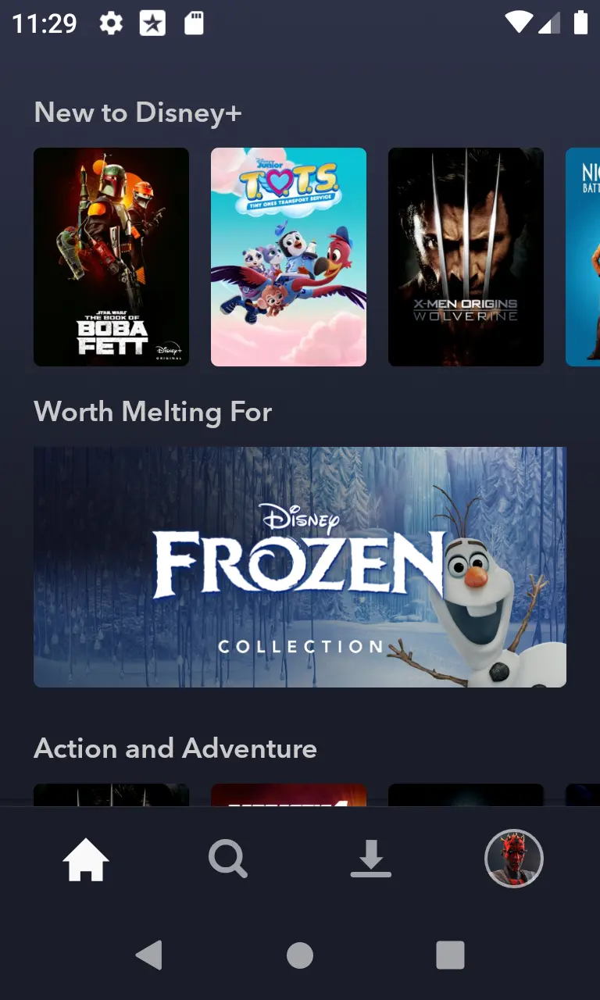{ width="400" }</figure>|<figure markdown>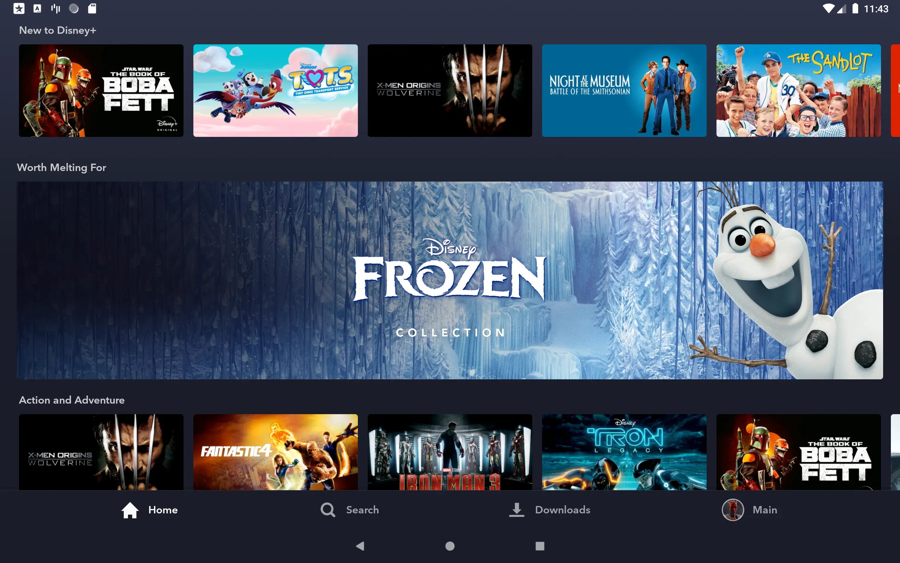{ width="400" }</figure>|<figure markdown>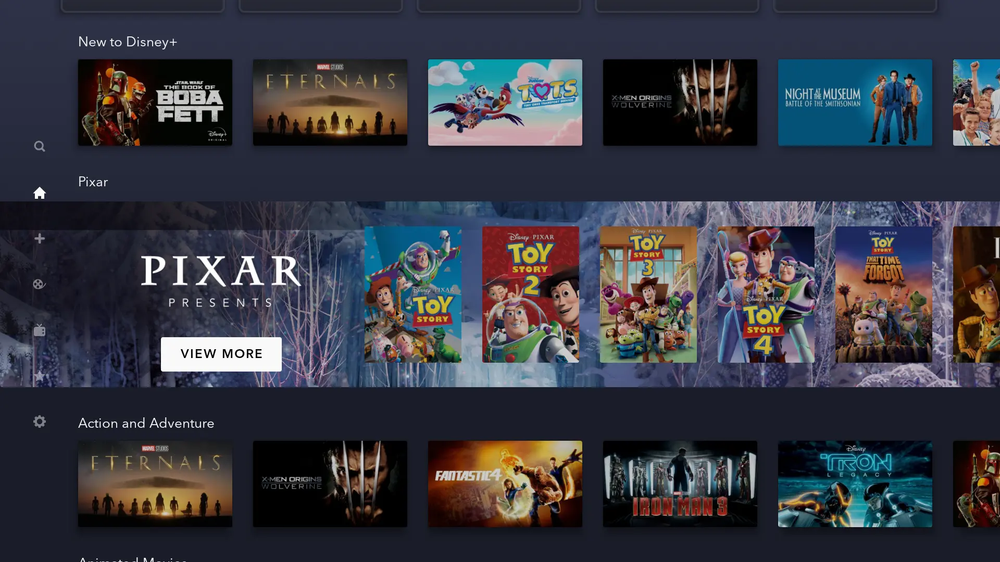{ width="400" }</figure>|

## ItemViewType.heroInlineGE

The `heroInlineGE` ItemViewType represents a collection in an immersive way. There is a huge
difference between the mobile and television implementation of the `heroInlineGE` ItemViewType. The implementation of this ItemViewType could be found in the [HeroInlineItem](https://github.bamtech.co/Android/Dmgz/blob/development/features/collections/src/main/java/com/bamtechmedia/dominguez/collections/items/heroinline/HeroInlineItem.kt).

On mobile and tablet, it will just display the collection as one big clickable tile that takes you to the collection landing page. On television, a immersive collection image is visible with a scrollable shelf to present asset items with the [EditorialPanel](fedsa_container_styles#editorialpanel) ItemViewType.

??? example "Demo heroInlineSlim"
    |Mobile|Tablet|Television|
    |-|-|-|
    |<figure markdown>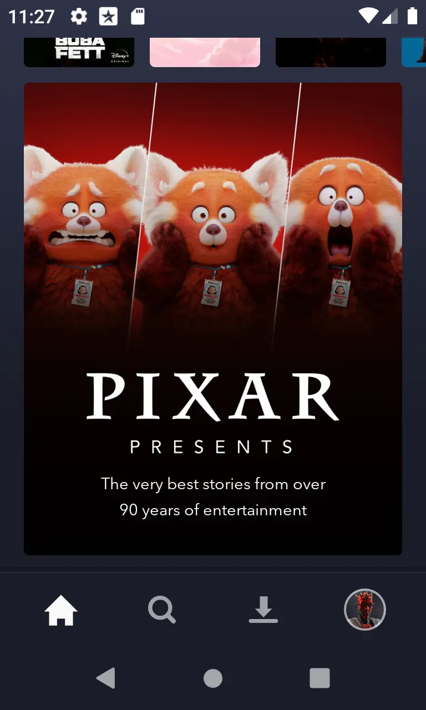{ width="400" }</figure>|<figure markdown>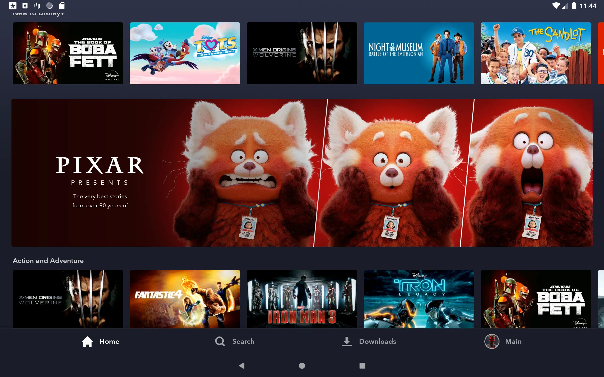{ width="400" }</figure>|<figure markdown>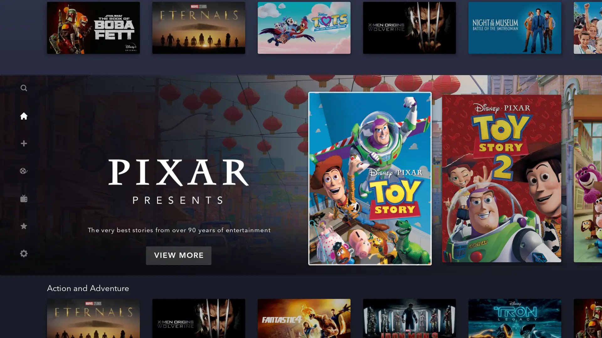{ width="400" }</figure>|

## ItemViewType.heroInteractive

The `heroInteractive` ItemViewType represents an immersive view type for showing content in a hero container. There is a huge difference between the mobile and television implementation of the `heroInteractive` style.

For mobile / tablet devices, the default `HeroViewPagerItem` will be used as described in [hero](./fedsa_container_styles#hero) subject. In addition to the 1.78 & 3.91 aspect ratio, 0.8 might be used as well.

For television devices, there is 3.0 aspect ratio media block and shelf beneath with max 5 content tiles. Whenever one of the tiles gets focused, the logo and background image in the media block will be replaced by the selected asset images.

The asset item implementation with this style for television devices could be found in the [HeroInteractiveItem](https://github.bamtech.co/Android/Dmgz/blob/development/features/collections/src/main/java/com/bamtechmedia/dominguez/collections/items/HeroInteractiveItem.kt).

### Background video support

The `heroInteractive` implementation on television is one of the places where we have support for background videos. After focussing an asset that contains some `VideoArt`, it will replace the images first and then play the `VideoArt` in the media block.

Note that there are a few conditions to have background video support, see [BackgroundVideoSupport](https://github.bamtech.co/Android/Dmgz/blob/development/features/collections/src/main/java/com/bamtechmedia/dominguez/collections/assettransition/BackgroundVideoSupport.kt) for more details.

??? example "Demo heroInteractive"
    |Mobile|Television|
    |-|-|
    |<figure markdown>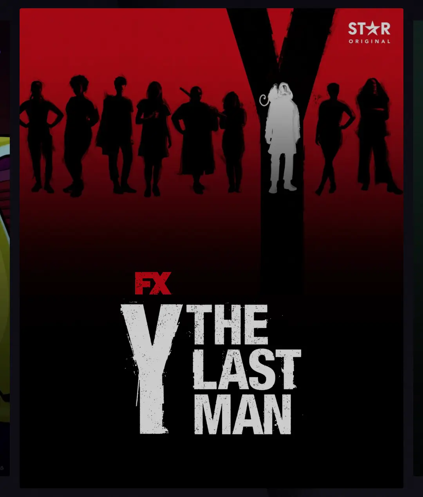{ width="400" }</figure>|<figure markdown>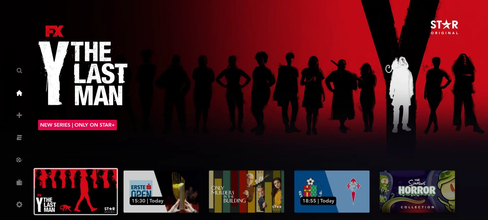{ width="400" }</figure>|

## ItemViewType.heroSingle

The `heroSingle` ItemViewType represents an immersive view type for showing a single item in a hero container. Same as the `heroInteractive` style, there is a difference between the mobile and television implementation.

For mobile / tablet devices, the default `HeroViewPagerItem` will be used as described in [hero](./fedsa_container_styles#hero) subject. In addition to the 1.78 & 3.91 aspect ratio, 0.8 might be used as well. Since this is limited to a single asset, it might not look like the default hero container as the user will not be able to scroll through.

For television devices, there is 3.0 aspect ratio media block with a background, logo, some metadata and a button. The asset item implementation with this style for television devices could be found in the [HeroSingleItem](https://github.bamtech.co/Android/Dmgz/blob/development/features/collections/src/main/java/com/bamtechmedia/dominguez/collections/items/HeroSingleItem.kt).

Compared to `heroInteractive`, the `heroSingle` ItemViewType doesn't have background video support.

??? example "Demo heroSingle"
    |Mobile|Television|
    |-|-|
    |<figure markdown>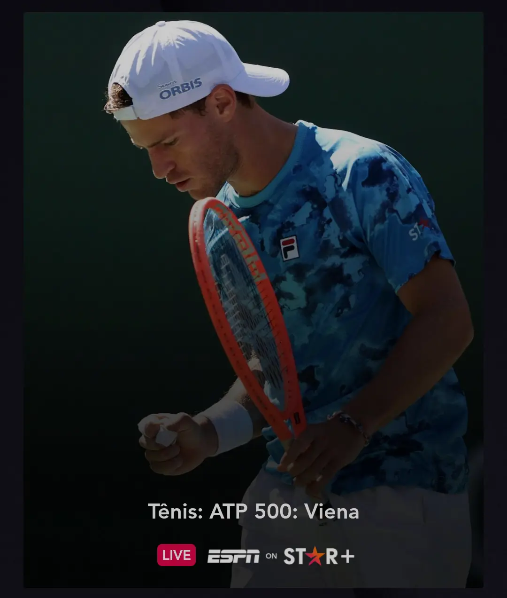{ width="400" }</figure>|<figure markdown>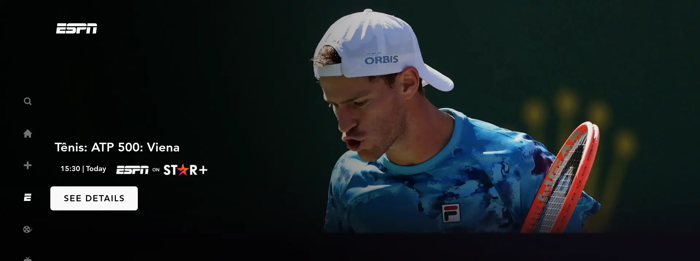{ width="400" }</figure>|
