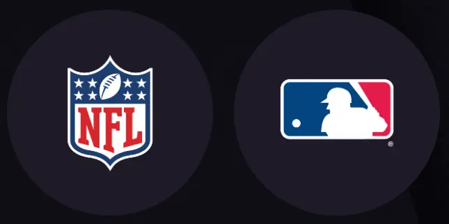
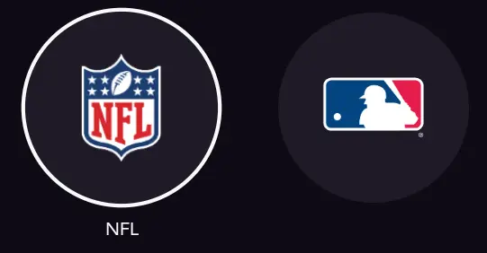

# Others ItemViewType

## ItemViewType.brand

The `brand` ItemViewType is used for the brand tiles on the Disney+ `home` collection. In general, it might look like the [default](item_view_type_content.md#itemviewtypedefault) ItemViewType.

On television devices, whenever the user focuses a brand tile, the tile background will be replaced by the playback of its brand `VideoArt`.

The implementation of this ItemViewType could be found in the [ShelfListItem](https://github.bamtech.co/Android/Dmgz/blob/development/features/collections/src/main/java/com/bamtechmedia/dominguez/collections/items/ShelfListItem.kt) with either the `animated_brand_shelf_list_item` or `brand_shelf_list_item` layout.

??? example "Demo brand"
    <figure markdown>{ width="400" }</figure>

## ItemViewType.category

The `category` ItemViewType is used to show the collection tiles with a different content type, like `Originals`, `Movies` and `Series`. It does contain a small icon and a simple title below.

The implementation of this ItemViewType could be found in the [ShelfCategoryItem](https://github.bamtech.co/Android/Dmgz/blob/development/features/collections/src/main/java/com/bamtechmedia/dominguez/collections/items/ShelfCategoryItem.kt).

??? example "Demo category"
    <figure markdown>{ width="400" }</figure>

## ItemViewType.character

The `character` ItemViewType is used to show the different avatar icons in a circular view.

The implementation of this ItemViewType could be found in the [ShelfListItem](https://github.bamtech.co/Android/Dmgz/blob/development/features/collections/src/main/java/com/bamtechmedia/dominguez/collections/items/ShelfCategoryItem.kt) with the `shelf_list_item_avatar` layout.

??? example "Demo character"
    <figure markdown>{ width="400" }</figure>

## ItemViewType.sportsCategory

The `sportsCategory` ItemViewType is used to display any sport, league or team collection tile. It displays a circular view with a logo.

On television, the asset title will be visible once the user moves focus to the tile.

The implementation of this ItemViewType could be found in the [ShelfListItem](https://github.bamtech.co/Android/Dmgz/blob/development/features/collections/src/main/java/com/bamtechmedia/dominguez/collections/items/ShelfCategoryItem.kt) with the `shelf_list_item_sports_category` layout.

??? example "Demo sportsCategory"
    |Mobile|Television|
    |-|-|
    |<figure markdown>{ width="400" }</figure>|<figure markdown>{ width="400" }</figure>|
