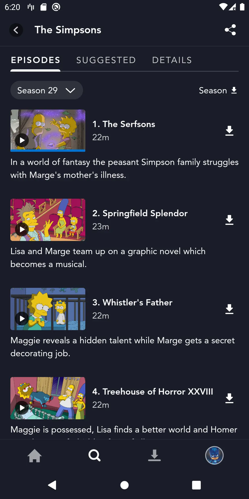
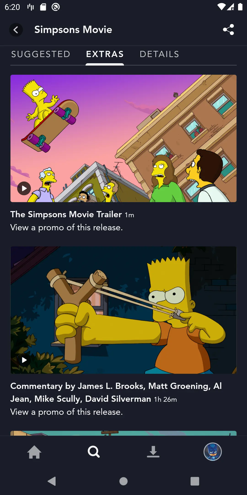
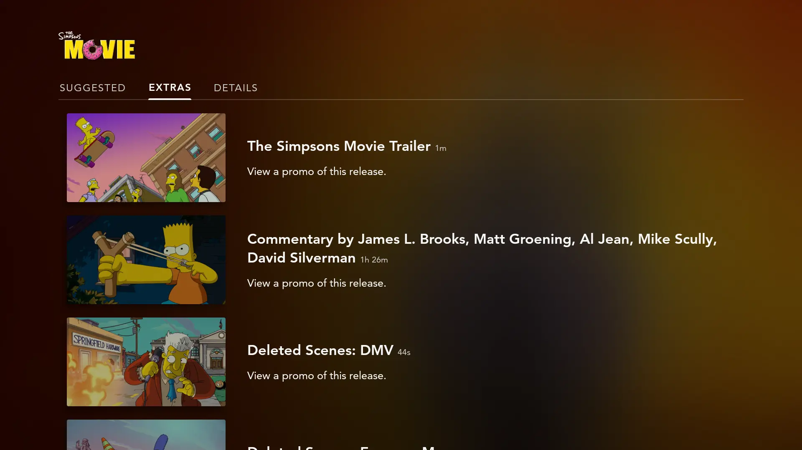
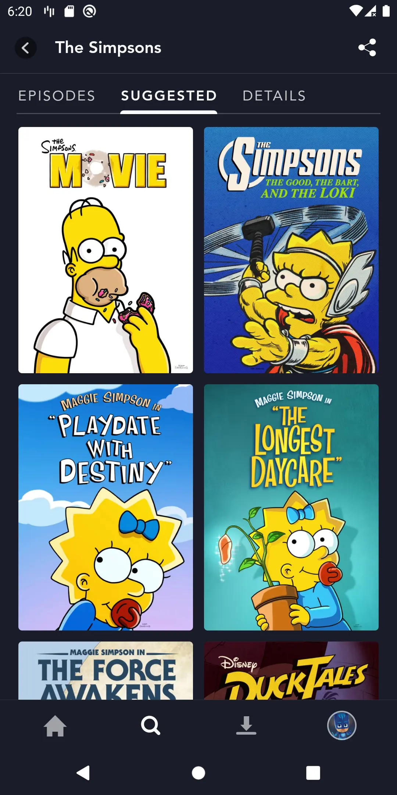
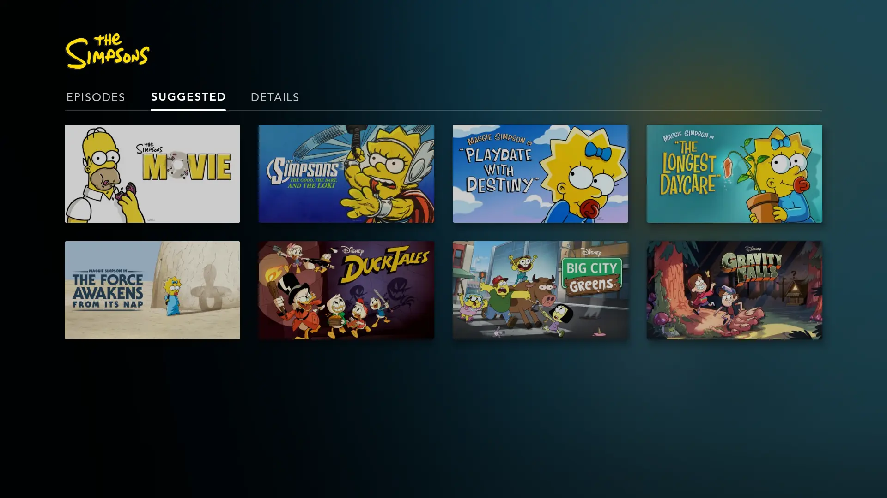
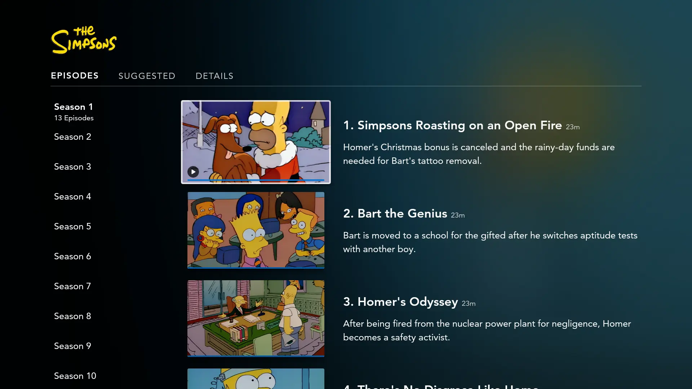
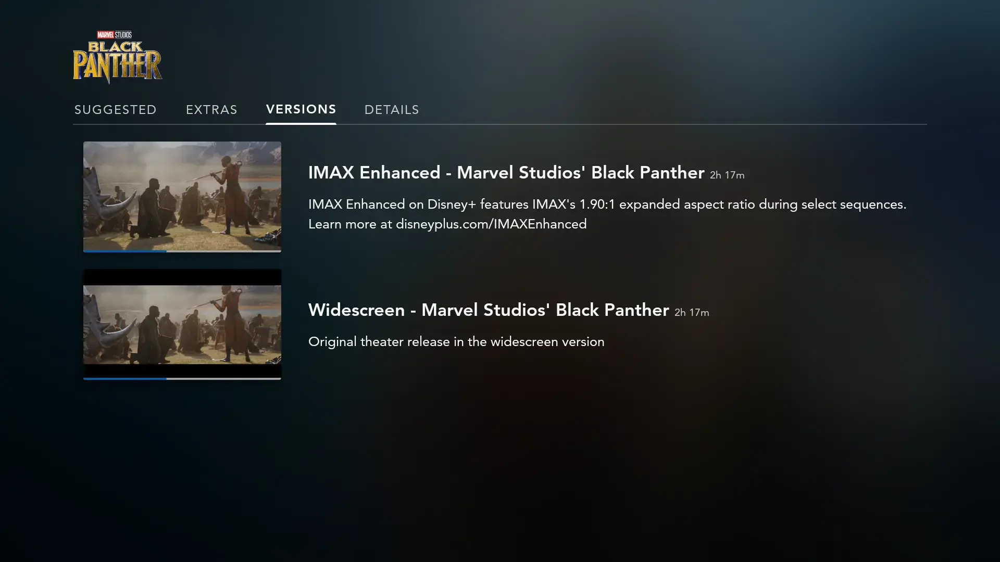
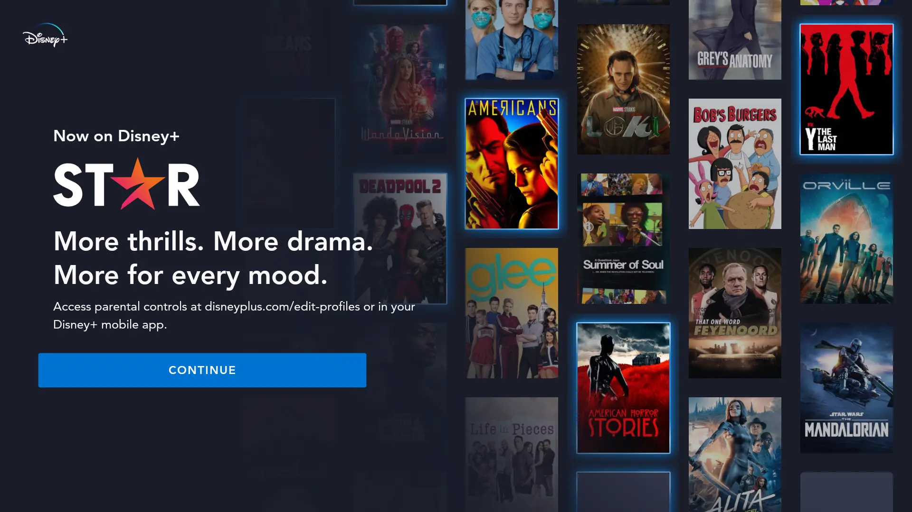

# Local Container Styles

## categories

The `categories` style is used by the search feature on Star+. It represents the category buttons on top of the search results list. The implementation of this style could be found in [SearchCategoriesItem](https://github.bamtech.co/Android/Dmgz/blob/development/features/search/src/main/java/com/bamtechmedia/dominguez/search/category/SearchCategoriesItem.kt).

??? example "Demo categories"
    

## default

This is the default containerStyle. If a container style has not been specified in one of the `collections_config.json` files, it will fallback to the `default` container style.

??? example "Demo default"
    |Mobile|Television|
    |-|-|
    |||

## episodes

The `episodes` style is used for the `Episodes` tab on the content detail page on mobile and tablet.

??? example "Demo episodes"
    <figure markdown>{ width="400" }</figure>

## extras

The `extras` style is used for the `Extra` tab on the content detail page on mobile and tablet.

??? example "Demo extras"
    <figure markdown>{ width="400" }</figure>

## extrasV2

The `extrasV2` style is used for the `Extra` tab on the content detail page on television.

??? example "Demo extrasV2"
    

## related

The `related` style is used for the `Suggested` tab on the content detail page.  

??? example "Demo related"
    |Mobile|Television|
    |-|-|
    |||

## seasonsV2

The `seasonsV2` style is used for the `Episodes` tab on the content detail page on television.

??? example "Demo seasonsV2"
    

## versions

The `versions` style is used for IMAX content where it represents the different versions in a tab. See the [IMAX Documentation](https://github.bamtech.co/Android/Dmgz/blob/development/docs/IMAX.md) for exact steps to find the `Versions` tab.

??? example "Demo versions"
    

## star (MaturityRating collection)

The `star` style is used in the maturity rating onboarding flow for Welch supported countries. It represents the asset carousel in the background. Therefore, the `maturityRating` collection has been added with the `star` style.

??? example "Demo star"
    
