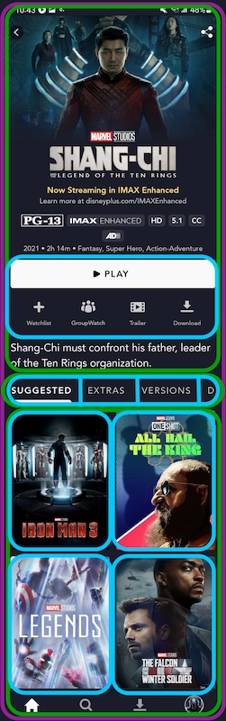

# Glimpse RecyclerView Tracking

Our screens often have multiple dynamic containers (collections and detail pages) which can make it challenging to track what the user sees as they navigate. See the below image as an example.

- Green outline = container to be tracked
- Blue outline = elements within a container



## Overview of implementation

- `RecyclerViewContainerTracking` creates `PositionItemDecoration` and adds them to RecyclerViews
- `PositionItemDecoration` reports visible positions to the `ViewedItemsTracker`
- `ViewedItemsTracker` emits untracked positions
- `HawkeyeContainerTracker` subscribes to `ViewedItemsTracker` and maps the untracked positions to `Flowable<List<HawkeyeContainer>>`
- `HawkeyeViewModel` subscribes to stream of `HawkeyeContainers` from `HawkeyeContainerTracker`
- `HawkeyeViewModel` passes these containers to the `GlimpseApi` for tracking

## Getting Started

**Before implementing**, ensure you've setup PageView tracking for the screen. See the "How To" guide [here](./how_to.md). This approach assumes the screen is built using Recyclerviews and Groupie Items.

### 1) Use RecyclerViewContainerTracking to report visible positions of the RecyclerViews

A screen may contain a parent recyclerview and any number of child recyclerviews (for nested scrolling items).

#### Bind the parent RecyclerView

Use `trackParentVisibility(YOUR_RECYCLER_VIEW)` from `RecyclerViewContainerTracking`

```kotlin
class DetailPresenter @Inject constructor(
    private val fragment: Fragment,
    private val recyclerViewContainerTracking: RecyclerViewContainerTracking
) {

    private val binding by fragment.viewBinding { FragmentDetailBinding.bind(it) }

    /**
     * Initial setup of the Detail page view
     */
    fun setup() {
        binding.detailRecyclerView?.let { recyclerViewContainerTracking.trackParentVisibility(it) }
    }
```

#### (Optional) Bind child RecyclerViews

If a screen contains Groupie Items which have nested RecyclerViews (collection pages). The `RecyclerViewContainerTracking` class can be used to report their positions as well.

In `onCreateViewHolder` child items should invoke `trackVisibilityInParent(recyclerView, positionInParent)`. When Items are bound or rebound in the RecyclerView they will need to be updated so that the underlying decoration is updated with the correct position in the parent. This occurs in `onBindViewHolder/bind`.

```kotlin
class CarouselItem(
    private val containerTracking: RecyclerViewContainerTracking,
    private val adapter: GroupAdapter<GroupieViewHolder>,
    private val positionInParent: Int
) : Item() {

    ...

    override fun createViewHolder(itemView: View): ViewHolder {
        return super.createViewHolder(itemView).also { viewHolder ->
            ...                        
            containerTracking.trackVisibilityInParent(recyclerView, positionInParent)
        }
    }

    override fun bind(viewHolder: ViewHolder, position: Int) {
        ...
        containerTracking.bindVisibilityTrackingInParent(recyclerView, positionInParent)
    }
}
```

### 2) Implement HawkeyeTargetItem interface on the Groupie Item that should be tracked

#### For "simple" Items (Items with no additional elements or nested scrolling children)

Use the `ElementTarget` interface

```kotlin
class CarouselCardItem(
    private val id: ViewLookupId,
) : Item<GroupieViewHolder>(), HawkeyeTargetItem.ElementTarget {

    override fun bind(viewHolder: GroupieViewHolder, position: Int) {
        viewHolder.root.setTag(R.id.view_lookup_tag_key, id)
    }

    override val viewLookupId: String
        get() = id
    override val lookupInfo: HawkeyeTargetInfo?
        get() = HawkeyeTargetInfo(...)
}
```

- The `ElementTarget` interface requires a `ViewLookupId` and `HawkeyeTargetInfo`.  
    - `ViewLookupId` is a unique ID for every item. It is used to "lookup" additional data (HawkeyeTargetInfo) about the view for analytics purposes.
    - `HawkeyeTargetInfo` is a marker interface to be implemented by features to provide customizable analytic payload data

!!! tip "What is HawkeyeTargetInfo?"

	`RecyclerViewContainerTracking` handles automatically looping through the items in the RecyclerView and registering the analytic payload data (`HawkeyeTargetInfo`) to a shared map. When items become visible to the user, the visible positions will be looked up in this map and their `HawkeyeTargetInfo` will be retrieved. The `HawkeyeTargetInfo` is a marker interface and thus customizable to the feature. For example,  the Collections feature will have very different payload data than that of the Detail feature.

Example of the `HawkeyeTargetInfo` used in Collections:

```kotlin
/**
 * Collections feature implementation of [HawkeyeTargetInfo]. Contains required data for tracking items
 * within a Collection.
 */
sealed class CollectionsItemLookupInfo(
    val config: ContainerConfig,
) : HawkeyeTargetInfo {

    /**
     * An item that is backed by an Asset
     * @property asset - the backing [Asset] tied to this item or null if not available/loaded yet.
     * @property indexInSet - the index of this item within the overall set
     * @property additionalElements - list of additional elements to track in addition to the asset (i.e. "details" button
     * on some hero containers)
     */
    class AssetLookupInfo(
        config: ContainerConfig,
        val asset: Asset?,
        val indexInSet: Int,
        val additionalElements: List<AdditionalElement>? = emptyList()
    ) : CollectionsItemLookupInfo(config)
    
    ...
```

#### For Items with nested scrolling (i.e. shelves on collection pages)

Use the `ContainerTarget` interface

```kotlin
class CarouselItem(
      private val childItems: List<CarouselCardItem>
) : Item(), HawkeyeTargetItem.ContainerTarget {

  	...

    override fun bind(viewHolder: ViewHolder, position: Int) {
        ...
    }

    override val children: List<ElementTarget>
        get() = childItems.filterIsInstance<ElementTarget>()
}
```

### 3) Implement the HawkeyeContainerTracker interface

```kotlin
/**
 * Responsible for converting untracked positions exposed by the ViewedItemsTracker into HawkeyeContainers
 * to be tracked by Glimpse.
 */
interface HawkeyeContainerTracker {

    /**
     * A stream of HawkeyeContainers as they become visible to the user.
     */
    fun containersStream(): Flowable<List<HawkeyeContainer>>
}
```

- This class requires the most "manual" work.
- It is responsible for taking the positions emitted by the `ViewedItemsTracker` and mapping them into `HawkeyeContainers` using the `HawkeyeLookupRegistry`.
- The logic within this class will vary depending on the feature

Here is an example (pseudo) that acheives this:

```kotlin
class GlimpseSomeFeatureContainerTracker @Inject constructor(
    private val viewedItemsTracker: ViewedItemsTracker,
    private val lookupRegistry: HawkeyeLookupRegistry
) : HawkeyeContainerTracker {

    override fun containersStream(): Flowable<List<HawkeyeContainer>> =
        viewedItemsTracker.stateStream
            .map { untrackedPositions ->
                when (untrackedPositions) {
                    is ParentPositions -> mapParentToContainer(untrackedPositions)
                    is ChildPositions -> mapChildToContainer(untrackedPositions)
                }
            }
            
    private fun mapParentToContainer(parentPositions: ParentPositions): List<HawkeyeContainer?> =
        parentPositions.positions
            .map { position ->
                // in real app log or handle error if viewLookupId is missing
                val viewLookupId = parentPositions.getViewLookupId(position) ?: return@map null
                // in real app log or handle error if lookupInfo is missing
                val lookupInfo = lookupRegistry.getInfo(viewLookupId) ?: return@map null
                return@map HawkeyeContainer(
                    containerType = GlimpseContainerType.SHELF,
                    containerKey = lookupInfo.containerKey,
                    elements = emptyList(),
                    verticalPosition = position,
                    horizontalPosition = 0
                )
            }
 	
 	private fun mapChildToContainer(childPositions: ChildPositions): List<HawkeyeContainer?> =
 		...
}
```

!!! tip

	Additional real-world examples can be found in the project. See HawkeyeCollectionsContainerTracker or DetailHawkeyeContainerTracker.

### 4) Bind the newly created HawkeyeContainerTracker to the Hawkeye instance

```kotlin
@AndroidEntryPoint
class SomeFeature : Fragment(), TrackedPage, Hawkeye.Target {

    ...

    @Inject
    lateinit var containerTracker: GlimpseSomeFeatureContainerTracker
    
    @Inject
    lateinit var hawkeye: Hawkeye

    override fun onViewCreated(view: View, savedInstanceState: Bundle?) {
        super.onViewCreated(view, savedInstanceState)
        hawkeye.markPage(HawkeyePage(pageName = PageName.SOME_FEATURE))
        // attach the GlimpseSomeFeatureContainerTracker to enable automatic item tracking
        hawkeye.setContainerTrackers(listOf(containerTracker))
    }
    
    override val glimpseMigrationId: GlimpseMigrationId
        get() = GlimpseMigrationId.DISCOVER

}
```

!!! note

	In production code, we would normal abstract the Hawkeye logic from the Fragment and move it into its own Analytics class.

The `HawkeyeViewModel` will automatically handle the subscription to the `HawkeyeContainerTracker` and pass along the emitted GlimpseContainers to `GlimpseApi` for tracking.

With the above setup you should now see containers automatically firing! :smile:
