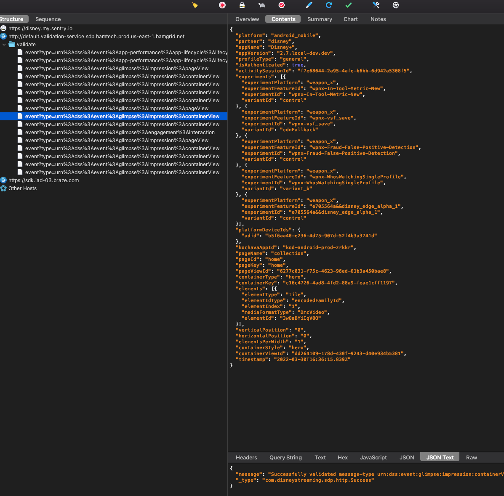
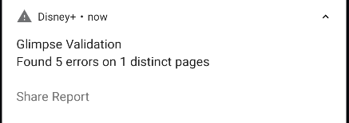

# Migration Workflow

The codebase is currently transitioning to using the new Glimpse framework (called Hawkeye) outlined [here](./how_to.md). This page documents the process of migrating an existing screen to the new framework. This process will be updated and continually improved upon as we migrate more and more pages.

## GlimpseMigrationId

During the migration process, the screen that implements `Hawkeye.Target` will require returning a `GlimpseMigrationId`. This ID helps in enabling/disabling the new implementation for specific pages via configs. If a screen supports both the new (Hawkeye) and the old (v2) implementations, **make sure to update the AnalyticsSection in the old implementation** to pass the `GlimpseMigrationId` also. This allows disabling the old events if the new implementation is enabled (preventing duplicate events from sending).

## Migrating an Existing Page

Due to the complexity of the migration, several tools can be used to verify and test the new implementation for a given page.

### 1) Enable [Charles](../../tools/charles_proxy/charles_proxy.md)

This will allow you to see events being sent to the validation endpoint.



### 2) Enable Jarvis Toggles (under Glimpse section)

#### Enable Hawkeye validation

This toggle enables the FED validation endpoint in Charles for the new implementation and also enables the [GlimpseIntegrationValidator](https://github.bamtech.co/Android/Dmgz/blob/development/features/analyticsGlimpse/src/main/java/com/bamtechmedia/dominguez/analytics/glimpse/hawkeye/GlimpseIntegrationValidator.kt). This class compares the events of the new implementation with the events of the old implementation to ensure consistency and identify any potential issues.

#### Enable Hora validation

This toggle enables the new EDS (engineering data strategy) service. This service "is used to validate events from the various Disney streaming applications with the goal of making sure the data is of high quality. Hora uses an aggregate validation system, sending the same event to multiple downstream services to verify that the data is acceptable." Hora performs a series of checks on the events and returns a list of successful and unsuccessful validations.

### 3) Add the GlimpseMigrationId to the AnalyticSection (legacy/v2)

Ensure you have added the GlimpseMigrationId for the page you are updating to its legacy `AnalyticsSection`. The legacy Glimpse implementation has Fragments implement the `AnalyticsStateProvider` or `RxAnalyticsStateProvider` to provide details about the page being tracked.

```kotlin
override fun getAnalyticsSection(): AnalyticsSection =
        AnalyticsSection(
            pageName = AnalyticsPage.WELCOME.pageName,
            glimpseV2PageName = PageName.PAGE_WELCOME,
            pageId = "welcome",
            pageKey = "welcome",
            glimpseMigrationId = GlimpseMigrationId.WELCOME
        )
```

### 4) Add the GlimpseMigrationId to supportedGlimpseHawkeyePages in GlimpseConfig

#### supportedGlimpseHawkeyePages

The `supportedGlimpseHawkeyePages` is a list of string representations of GlimpseMigrationIds for which Hawkeye should be used. If added to this list, the old Glimpse implementation will not be used. This allows us to enable and disable the new implementation on a per-screen basis.

```kotlin
 private val supportedGlimpseHawkeyePages: List<GlimpseMigrationId>
        get() = listOf(
            GlimpseMigrationId.PLAN_SELECTOR,
            GlimpseMigrationId.CHANGE_SUBSCRIPTION,
            GlimpseMigrationId.CUSTOMER_SERVICE,
            GlimpseMigrationId.DATA_USAGE_TV,
            GlimpseMigrationId.DOB_ENTER
         )
```

#### disabledGlimpseHawkeyePages

This is an additional config that can be used so that we are able to turn off Hawkeye on specific pages. There may be occasions where we may need to temporarily rollback the new framework on a page if there are issues in production. When a GlimpseMigrationId is added to this list, the legacy Glimpse implementation will be used instead (assuming the page supports it).

### 5) Implement Glimpse Events

Following the documentation outlined [here](./how_to.md). Add the necessary Glimpse events for a screen.

### 6) Test the Implementation

- Run the app and navigate to the screen you've added events for.
- Perform whatever actions you may need to trigger the events (scrolling, clicking, etc).
- Navigate away from the screen being tested (ideally via an interaction event)
- When you navigate away from the current screen being tested to another screen, both the `GlimpseIntegrationValidator` (local) and the Hora validation (remote) will perform their checks (assuming they are both enabled). If there are any errors a notification will pop up on the device.
- Hora will perform the validation on all Glimpse events between two pageViews. `| pageView -> containerViews -> interaction -> pageView |`
- The debug logs are also helpful when testing and may provide more context.



- Clicking "Share Report" will allow you to copy or share the report. Below is an example:

```text
Glimpse Validation Report:
Metrics:
  - 3 total errors
  - 2 pages with errors
  - 3 unique pages
Findings:
collection:pixar
  - com.bamtechmedia.dominguez.analytics.glimpse.hawkeye.validator.GlimpseValidationError$GeneralEventError$MissingEvents@a6ccd4
collection:home
  - MismatchContainerView(containerKey=fdbaabd5-aefc-4397-bc33-ef4e4f3f7ccf, fieldsNotEqual=[elements], fieldsOnlyInHawkeye=[], fieldsOnlyInV2=[])
  - UnknownContainerView(containerKey=fdbaabd5-aefc-4397-bc33-ef4e4f3f7ccf)
App Version: 2.7.local-dev
```

**It may not be obvious which container the error message belongs to. For instance, on Collection pages (Discover, Landing, Brand, etc) a collection's container keys are a unique id. If that is the case, [Pluck](https://xce-pluck-ui.us-east-1.bamgrid.net/) can be used to identify the container.** Just plug in the containerKey from the error message.

This validation and report is continually being improved. It is not perfect but it does help quickly identify and catch potential issues with the new implementation. The goal is to eventually automate this and use these checks in tests.
