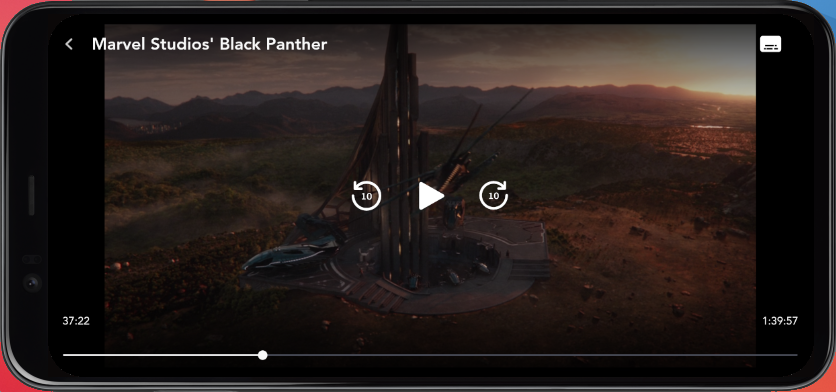
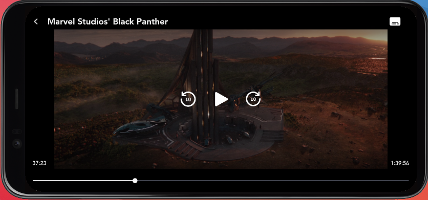
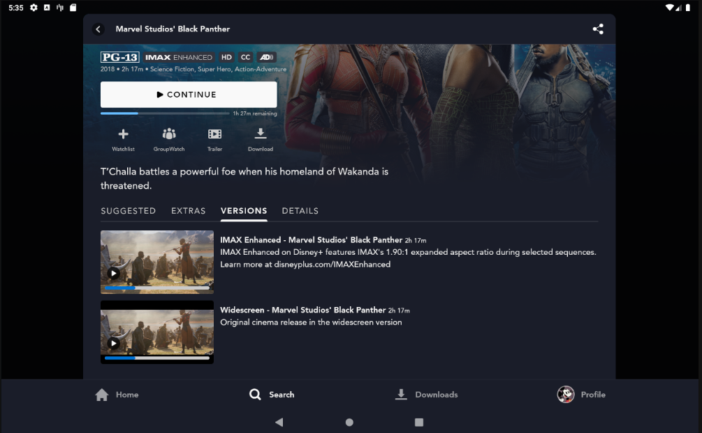
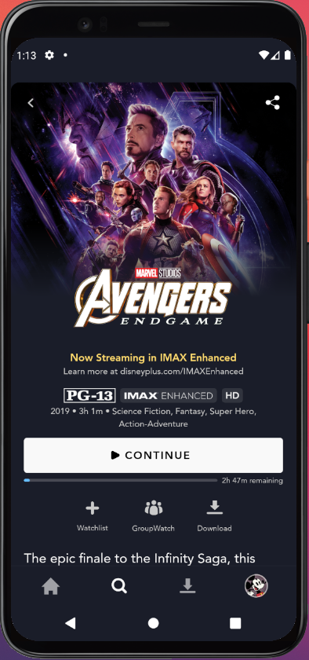
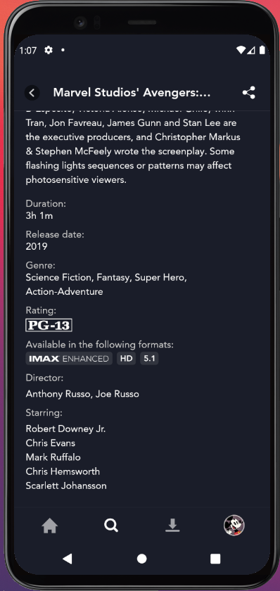
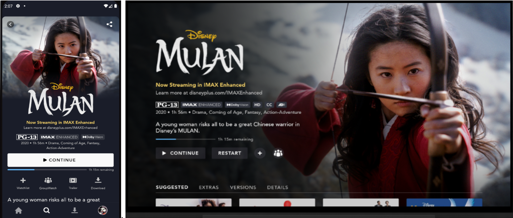
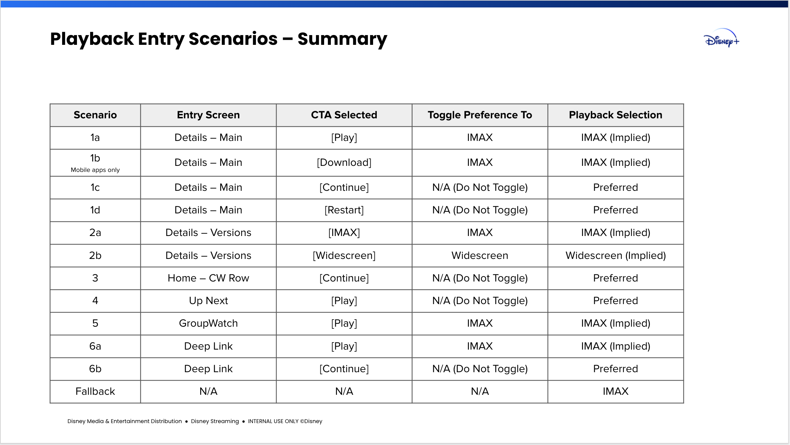

# IMAX

Disney has partnered with IMAX to provide specific titles in a new "IMAX Enhanced" version in Disney+. This version will exist side-by-side with the "standard" or widescreen version. IMAX variant will only be available for movies, not series.

<figure markdown>
{ width="400" }
<figcaption>IMAX Version</figcaption>
</figure>

<figure markdown>
{ width="400" }
<figcaption>Widescreen Version</figcaption>
</figure>

**How to check if IMAX variant is available**

Example of a video with a default 16x9 and an IMAX variant:

```json
{
  "type": "DmcVideo",
  "mediaMetadata": {
    "facets": [{
      "label": "default",
      "activeAspectRatio": 2.39
    },
    {
      "label": "ImageAspectRatio=190",
      "activeAspectRatio": 1.90
    }]
  }
}
```

Here `"label": "ImageAspectRatio=190"` indicates an IMAX version. In `PlayableImaxCheckImpl.kt` class, the `hasImax` method is used to determine if a movie has IMAX support and this is also the place where the feature flag is being checked. And, if needed, you only have to inject the `PlayableImaxCheck.kt` interface. Also the visibility of all IMAX related components (badges, promo labels, versions tab & on detail tab) is based on the `hasImax` check.

```kotlin
/**
 * Helper class to determine if the given [Playable] has IMAX support while taking the feature / debug flags from
 * [ImaxConfig] into account.
 */
class PlayableImaxCheckImpl @Inject constructor(private val imaxConfig: ImaxConfig) : PlayableImaxCheck {

    /**
     * Method to check if given [playable] has IMAX feature support. Note that this is protected by the
     * 'contentDetail.isImaxEnabled' feature flag.
     */
    override fun hasImax(playable: Playable): Boolean =
        imaxConfig.isImaxEnabled && playable is Movie && playable.hasFacetWithLabel(imaxConfig.imaxFacetLabel)
}
```

## IMAX UI indications

### Versions Tab

If a movie is available in IMAX version then its Details screen should show the new Versions tab that will contain previews for both the IMAX Enhanced version and the widescreen version of the film.

??? example "Versions Tab"
	

The implementations of `DetailsTabHelper.kt` interface is used for creating tabs on the Details page and for Versions tab, `VersionsTabHelper.kt` is the implementation class. This tab will contain playable item for both IMAX and widescreen versions. The item UI is different on mobile than that for TV so there are separate presenters each, `DetailVersionMobilePresenter.kt` and `DetailVersionTvPresenter.kt`. Furthermore, have separate Playable item for mobile and TV, `DetailPlayableMobileItem.kt` and `DetailPlayableTvItem.kt` respectively.
When any version is clicked, the `onPlayableClick` method of `PlayableItemHelperImpl.kt` is called and along with `Playable` and `DetailAnalyticsInfo` , `PlaybackOrigin` data is passed to this method. And, depending on `PlaybackOrigin` value the playback preference is set, whether to play the content in IMAX or Widescreen version. Also, for both version items the movie `Playable` will be same and hence there isn't a separate bookmark for each version. More info about playback preference in [IMAX Playback preference](#imax-playback-preference) section.

### Badge

If a title is available in IMAX variant, the IMAX enhanced badge should be present in the metadata row on the Details Page, as well as in the 'Available formats' section in Details Tab.

**Badge placement rules**

- If an IMAX badge is available and more than 2 badges, wrap metadata text to the next line.
- The IMAX badge should always be displayed first, before the HD or 4K Ultra HD badges and before the Dolby badge (if applicable).
- Suppress additional badges if Dolby Vision badge is present (mobile and tablet only).

??? example "IMAX badge"
    |IMAX badge in header|IMAX badge in the Details tab|
    |-|-|
    |<figure markdown>{ width="250" height="450" }</figure>|<figure markdown>{ width="250" height="450" }</figure>|

**If DolbyVision and IMAX are both available, other additional badges should be removed(mobile and tablet only).**

??? example "Additional badges visibility"
	<figure markdown>{ width="1000" height="450" }</figure>

### Promo Label

For a title that is available in IMAX Enhanced then IMAX promo label should be shown in Details Page header. However if there is any other promo label or premier access block, the IMAX promo label should not be visible. For example, if a "Coming Soon" label exists for the title, the "Coming Soon" label should be shown.

??? example "IMAX Enhanced promo label"
	<figure markdown>{ width="250" height="450" }</figure>

See `getPromoLabel` method of `DetailPromoLabelPresenter.kt` for promo label logic.

## IMAX Playback preference

The playback preference is whether the content should be played in IMAX version or default version and is dependent on from where the playback is initiated. Updating the preference should be done prior to playback and only if the current preference is different than the new preference.
So for any title that is available in IMAX Enhanced should play the IMAX version by default when the Play button is pressed. If user has started playback in Widescreen version via the Versions tab, any Resume actions should playback the Widescreen version for that title likewise below table shows preference based on playback entry scenarios. See more information about toggle preference in this [presentation](https://docs.google.com/presentation/d/1P4G_Y9u_sPXmckZdyygzbW-ST4lvFt8NAlkvPzNOgIs/edit#slide=id.gb814adffe0_0_700)

??? example "IMAX playback preference"
	<figure markdown>{ width="550" height="450" }</figure>

The `PlaybackOrigin.kt` is an enum class with types to identify from where the media playback is initiated and have a lambda to determine playback preference(IMAX, Widescreen, Unchanged). The `playbackOrigin` value is passed to `SessionStarter.kt` for setting the playback preference(boolean `preferImaxEnhanced`). So, when triggering the `ImaxPreferenceApi.updateImaxPreference` method, it will hit the `graphApi` to update the `PlaybackSetting.preferImaxEnhanced` attribute and the updation will only happen if the new preference differs from the current profile preference. Once that request is finished, the `mediaApi` could be hit to fetch the updated media. See the implementation in `ImaxPreferenceApiImpl.kt` class.

## IMAX Download

When a user triggers a download request for an asset that has IMAX support, the IMAX profile preference should be updated to IMAX. That request should be completed before it fetches the media item with the MediaApi, which means that the movie will always be downloaded in IMAX format.
`Downloadable` content is stored in a database, which is built on the `OfflineItem` entity. Normally, the `PlayableImaxCheck.hasImax(playable)` takes the `mediaMetadata`(see above JSON) from the playable to check whether the asset has IMAX support or not. The `OfflineItem` doesn't store the `mediaMetadata`, so `hasImax` has been added to the `DownloadState` object, which is stored as part of OfflineItem in the database.

**Download flow for content with IMAX support**

1)So whenever the user clicks on the download button, it will convert the asset to an OfflineItem instance; see `Downloadable.asOfflineItem` method in `OfflineContentStoreImpl.kt`

2)Check if it has IMAX support using `PlayableImaxCheck.hasImax(playable)` and stores that value into the `DownloadState.hasIMAX`; see `Downloadable.initialDownloadState()` method in `OfflineContentStoreImpl.kt`

3)Pass `hasImax` boolean to `DownloadSdkInteractor` `startDownload` and `predictedMediaSizeOnce`; see `DownloadsSdkInteractorImpl.kt`

4)Update playback preference; see `getMedia` in `DownloadsSdkInteractorImpl.kt`

## Feature Info

### Availability

|       | Availability |
| ----------- | :-----------: |
| :icons-disney-logo: Disney+ | :white_check_mark: |
| :icons-star-logo: Star+ | :x: |
| :fontawesome-solid-mobile: Mobile | :white_check_mark: |
| :fontawesome-solid-tv: TV | :white_check_mark: |
| :material-earth: Regions | :white_check_mark: All regions |

### How to test

Currently this feature is protected by a feature flag `contentDetail.isImaxEnabled`.

- On QA env, Black Panther and Avenger Endgame are the movies with IMAX support.
- On PROD env, a selection of Marvel movies already has IMAX Support, like Avengers Endgame.

IMAX enabled in Prod: 11/11/2021.

### Product Tickets

- [Jira link to IMAX tickets](https://jira.disneystreaming.com/issues/?jql=project%20in%20(DMGZAND%2C%20DMGZANDSTB)%20AND%20issuetype%20%3D%20Story%20AND%20component%20%3D%20IMAX)

### Designs

- [Mobile Zeplin specs](https://app.zeplin.io/project/5aecb868bfc8d1a3521b7a12/screen/60b954cca3961c9724e6b5c1)
- [Tablet Zeplin specs](https://app.zeplin.io/project/5aecb868bfc8d1a3521b7a12/screen/60b9557770664ea3af861e5f)
- [TV Zeplin specs](https://app.zeplin.io/project/5c8019017e270e628038f6b6/screen/60b963fb0c34846689ac5e97)
- [FEDSA doc](https://github.bamtech.co/pages/fed-solutions/documentation/media/aspect-ratio-preferences.html#imax)
