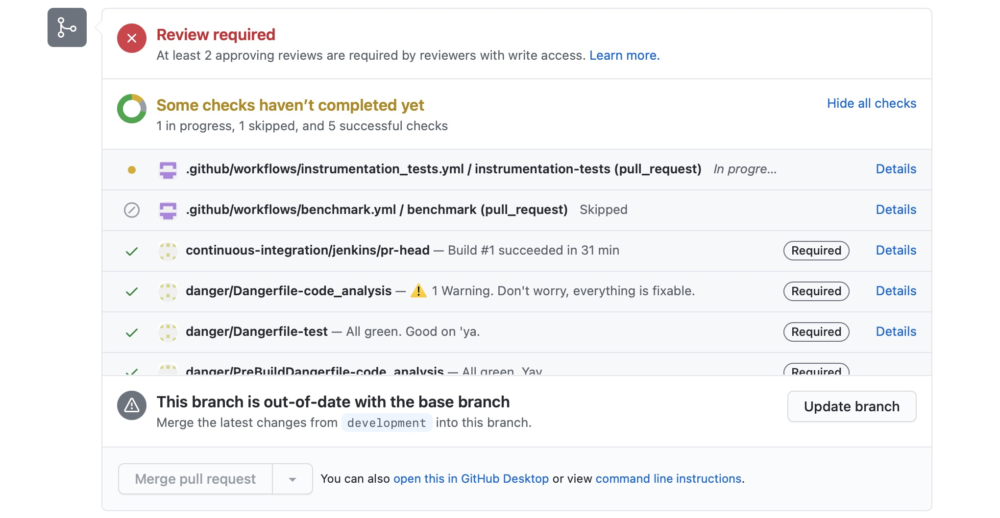
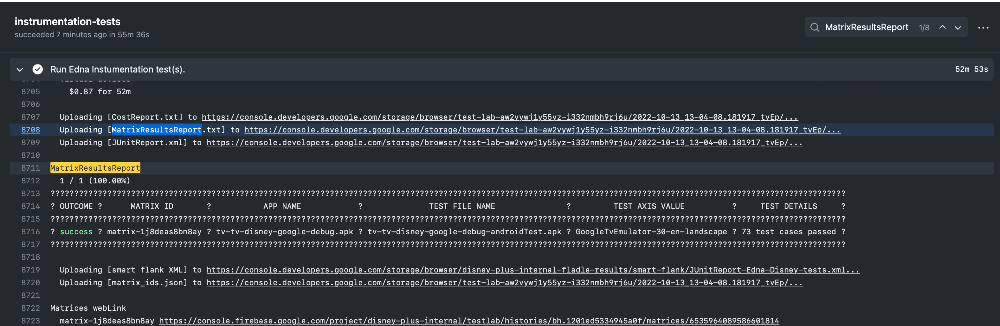
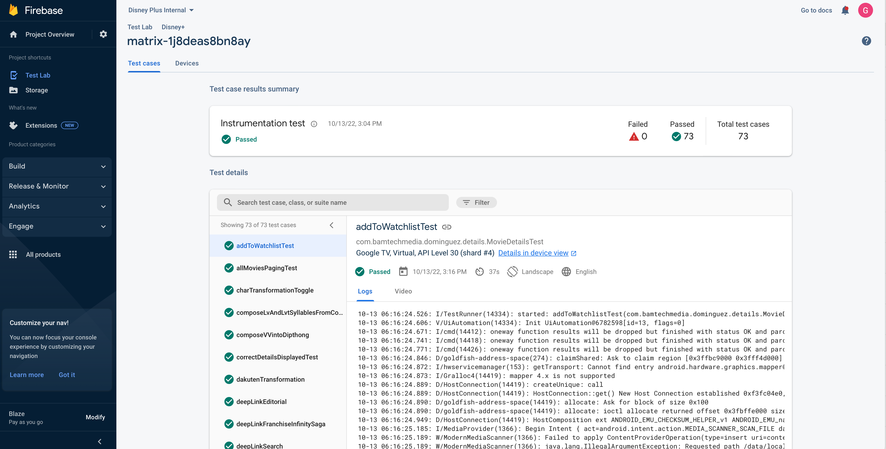
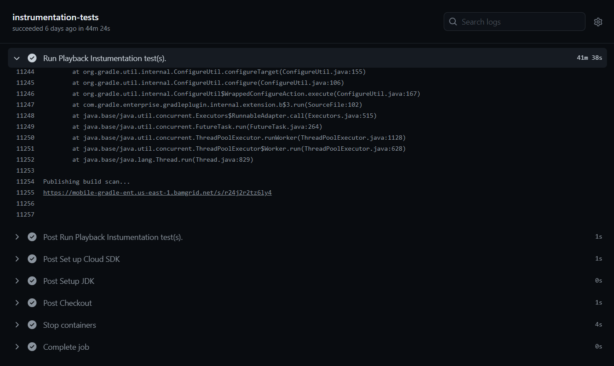
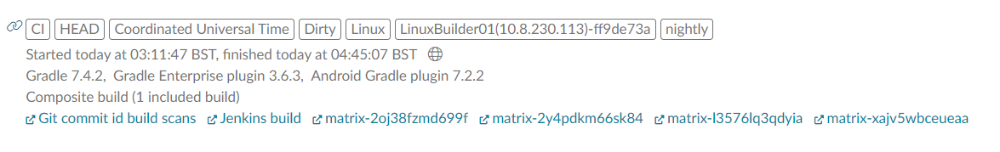

# Integrations

## PR Integration

Integration that allows developers to trigger instrumentation tests from PRs. It uses a GitHub Action that triggers the execution of instrumentation tests whenever an "Instrumentation Test" label is added to the PR. The tests run on Firebase Testlab for mobile and TV.
This integration allows developers to get quicker feedback about regressions introduced in the code and makes it visible to the PR owner and its reviewers.

!!! note

    Note that developers can add a label anytime, and a test failure will not prevent PRs from being merged. So it's up to the team to decide how to handle a failed test: Fix the issue in the same PR, or add the @IgnoreOnCI annotation with Jira ticket reference to track a known issue to be fixed later, while also keeping the nightly build stable.

See Below a list of available labels:

* `Edna Instrumentation Tests` - Runs all tv/mobile tests for Edna
* `Mandalorian Instrumentation Tests` - Runs all tv/mobile tests for Mandalorian
* `Russell Instrumentation Tests` - Runs all tv/mobile tests for Russell
* `Tesseract Instrumentation Tests` - Runs all tv/mobile tests for Tesseract
* `Bender Instrumentation Tests` - Runs all tv/mobile tests for Bender
* `Playback Instrumentation Tests` - Special case that runs tests related to playback on real devices
* `Core Instrumentation Tests` - Run the build containing all instrumented tests from the above teams

!!! info

    Since emulators are not available on GitHub Actions, we can only run the instrumentation tests from mobile and tv modules, which are the ones running in Firebase TestLab. We are working on migrating instrumentation tests from other modules to TestLab as well.

### Results

After adding a label to run the tests, click on the "instrumentation_tests" action link at the bottom of your PR to check the progress:



To see the results from Firebase TestLab, search for "MatrixResultsReport" on the logs. You should find the information about 4 runs, mobile/Disney+, TV/Disney+, mobile/Star+, and TV/Star+. They are not close to each other, though:



Then click on "Matrices weblink" to go to Firebase TestLab. There you'll find the test cases, logs and videos from each test:



Or you can go into your build scan, clicking on the link provided in the end of the build log.



And there you can see all the matrices related to that build.



!!! info

    1. Re-run tests: To re-run the same tests remove and add the label.
    2. Running tests for more than one team: Make sure you removed the previous label before adding the label related to the other team.

## Mobilebot

This Slack integration allows developers to kick builds that execute instrumentation tests for which a specific team is responsible for. This integration is helpful when you wish to run several tests but don't have a PR ready.

Steps to kick builds from slack:

1. Push your branch to the repository

2. Go to the Slack channel: #dsplus-android-builds

3. Send the command to kick a build:

```bash
@mobilebot android-build-block Dmgz {branch name} {block name}
```

Example:

```bash
@mobilebot android-build-block Dmgz gb/DMGZAND-1111-r2d2-presentation mandalorian
```

Currently the mapping between team and tests is done based upon this [wiki page](https://wiki.disneystreaming.com/display/DMGZ/Android+Team+Structure).

## R2D2 Test Script

R2D2 Script makes running instrumentation tests easier.

### Features

* Allow developers to easily run tests by using a .txt file with multiple tests or selecting which test class/method to run.

* Simple build variant selection, either run the tests for Disney+ or Star+

* Filter which tests to run by annotation, for example `@IgnoreOnCI` (Only available when not running from a file)

* Run Mobile and TV tests easily by simply having the device you want to run on already connected (Only 1 device at a time)

### How to

Simply run the following command on your terminal `./scripts/r2d2-tests.sh` and follow the script through.

Here is a quick video on how to execute it from a file:


The contents of the file should contain a list of line separated test classes and optionally methods, eg:

```kotlin
com.bamtechmedia.dominguez.login.LoginFlowTest#loginFlowSuccess
com.bamtechmedia.dominguez.login.LogoutFlowTest
com.bamtechmedia.dominguez.logoutall.LogOutAllDevicesTest
```

And another one executing a single class:


