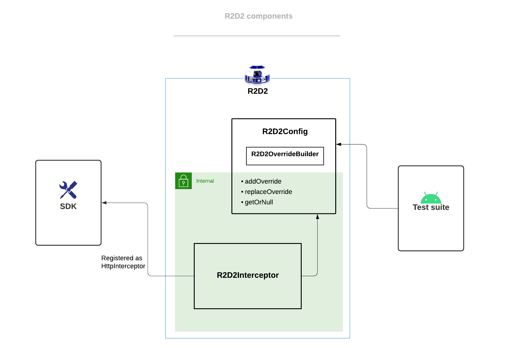
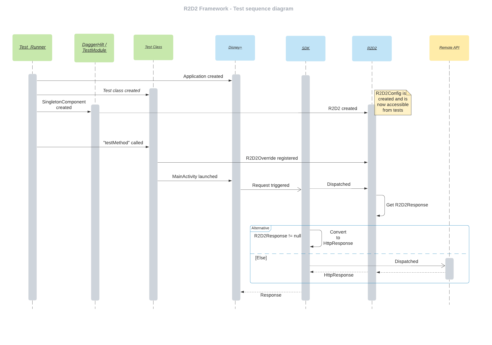
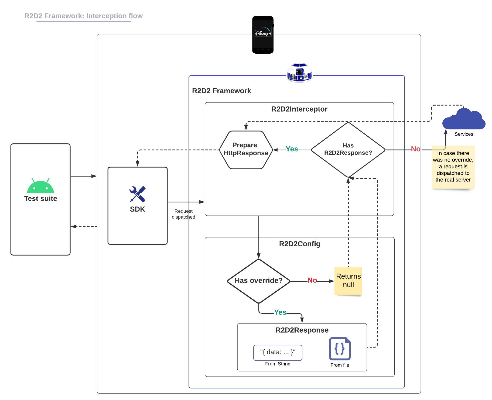

# R2D2 Framework

R2D2 Framework makes writing instrumented tests easier and more predictable while using a clean and simple domain-specific language (DSL).
It provides mechanisms that allow android developers to set up and manipulate the app’s state while the tests are running.

## Features

* Manipulation of state before, during and after each test.
* Allows developers to easily override Http responses while running the tests.
* Simple DSL to write instrumentation tests.

## Motivation

* Hard to set up and reset states between tests when using the real remote services: Account, Paywall, Profiles, Language, etc.
* Avoid IP blocks - Your IP address could be blocked due the amount of requests being triggered while instrumented tests were running.
* Reduce flaky tests

## Components

The R2D2 Framework has two main components: `R2D2Config` and `R2D2Interceptor`.

Scope of R2D2 Framework and how it connects with “external” components (SDK and test suite):



## [R2D2Config](https://github.bamtech.co/Android/Dmgz/blob/development/coreAndroidTest/r2d2framework/src/main/java/com/bamtechmedia/dominguez/r2d2/config/R2D2Config.kt)

This class centralizes the R2D2 Framework's configuration. It allows developers to register overrides for a specific request.
All its methods are internal and used by specific components:

* `addOverride` and `replaceOverride` methods are used by `R2D2OverrideBuilder` to build and register `R2D2Override`s.

* `getOrNull` is accessed by `R2D2Interceptor` to check for registered overrides which will be used to intercept requests and override responses.

### R2D2OverrideBuilder

Builder which provides a fluent API to create and register `R2D2Override`s:

```kotlin
r2d2Config.givenRequestInvoked("/subscriptions")
            .whenAcceptAllVariables()
            .thenRespondWithFile("subscriptions/subscriptions_subscribed_bamtech.json")
```

## [R2D2Interceptor](https://github.bamtech.co/Android/Dmgz/blob/development/coreAndroidTest/r2d2framework/src/main/java/com/bamtechmedia/dominguez/r2d2/server/R2D2Interceptor.kt)

It observes and potentially prevents requests to go out and hit the real server by providing a previously configured mock response instead.
This is an implementation of `OkHttp`'s interceptor that can be added to an `OkHttpClient` (in our case, it’s registered through the `SDK`).

## [R2D2Override](https://github.bamtech.co/Android/Dmgz/blob/development/coreAndroidTest/r2d2framework/src/main/java/com/bamtechmedia/dominguez/r2d2/config/R2D2Override.kt)

Represents the configuration and necessary information so that R2D2 framework can determine if a request should be intercepted and a custom response should be returned.

## [R2D2Response](https://github.bamtech.co/Android/Dmgz/blob/development/coreAndroidTest/r2d2framework/src/main/java/com/bamtechmedia/dominguez/r2d2/config/R2D2Response.kt)

Custom response to be returned for a registered `R2D2Override`.

## How to

The code snippet below shows a test that registers an override for a specific request, starts the `MainActivity`, and asserts the expected `View` is visible:

```kotlin
r2d2.givenRequestInvoked("/v1/public/graphql")
    // Variable "operationName" needs to be equals to "Check". Any other variable will be ignored.
    .whenPartialVariablesMatch(mapOf("operationName" to "check"))
    // Returns string as response
    .thenRespond("""
          {
              "data": {
                "check": {
                  "__typename": "Operations",
                  "operations": ["Login", "OTP"]
                }
              },
              "extensions": {
                "sdk": {
                  "token": null,
                  "session": null,
                  "grant": null
                }
              }
        }
    """)

// Starts MainActivity. The Application class of the app is already created at this point.
ActivityScenario.launch(MainActivity::class.java).onActivity {

    withId(R.id.welcomeButtonLogIn).waitUntilIsDisplayed().perform(click())
    withId(R.id.editFieldEditText)
        .waitUntilIsDisplayed()
        .perform(replaceText("luke.skywalker@disneystreaming.com")) // Enter email

    clickButton(R.id.continueLoadingButton) // Taps the continue button on LoginEmail screen

    withId(R.id.passwordOnboardingToolbar)
        .waitUntilIsDisplayed() // Assert app navigates to LoginPassword screen as an existing user
}
```

The following sequence diagram is a representation of the test above. It shows the moment `R2D2` is created and is ready to register overrides, as well as the flow related to request interception:



It is also possible to register/replace overrides in the middle of a test (when the application is already started for example):

```kotlin
r2d2Config.givenRequestInvoked("/paywall")
    .whenAcceptAllVariables()
    .thenRespond("{ Example... }", replaceExisting = true)
```

## Interception Flow

`AndroidTestFramework_AppModule` binds `R2D2Interceptor` as one of the interceptors passed to the `SDK`. It will, therefore, intercept all requests that the app does through the `SDK`.

When a request is intercepted by `R2D2Interceptor`, in combination with `R2D2Config`, it checks whether an override is registered for that specific request. If an override exists, the response associated with it is returned, otherwise, the request is dispatched to the real server:



## [Matchers](https://github.bamtech.co/Android/Dmgz/blob/development/coreAndroidTest/r2d2framework/src/main/java/com/bamtechmedia/dominguez/r2d2/utils/VariablesMatcher.kt)

`VariablesMatcher`s are an important part of the logic that determines if a registered override should be used for a given request.

A combination of the `path` of a request and the `variablesMatcher` will form the "key" which the override is registered with.

### "Key" combination

The `path` is the entire path of the URL. For a given `okhttp3.Request`, it is accessed via `okhttp3.HttpUrl.encodedPath`. Note that it will start with `"/"`.
`variablesMatcher` is related to the request’s variables. If `path` matches with `okhttp3.HttpUrl.encodedPath`, this matcher will be used to determine
if the variables from the given request satisfy the "match" logic of the registered `VariablesMatcher`.

### Matcher Implementations

#### AcceptAllVariablesMatcher

Implementation of `VariablesMatcher` which always returns true. Used to indicate that the variables will be always accepted.

Override:

```kotlin
r2d2Config.givenRequestInvoked("/subscriptions")
   .whenAcceptAllVariables()
   .thenRespond(" { “data”: “Example...” } ")
```

Request matches :white_check_mark:

Endpoint: `https://global.edge.bamgrid.com/subscriptions`

Variables:

```kotlin
mapOf(
         "var_1" to "Example 1",
         "var_2" to "Example 2"
     )
```

Request doesn’t match :x:

Endpoint: `https://global.edge.bamgrid.com/token`

Variables:

```kotlin
mapOf(
         "var_1" to "Example 1",
         "var_2" to "Example 2"
     )
```

#### MatchAllVariablesMatcher

Implementation of [VariablesMatcher] which makes sure every variable presented in a request should match the expected ones configured for an override.

Override:

```kotlin
r2d2Config.givenRequestInvoked("/v1/public/graphql")
   .whenAllVariablesMatch(
        mapOf("var_1" to "Example 1", "var_2" to "Example 2")
   )
   .thenRespond(" { “data”: “Example...” } ")
```

Request matches :white_check_mark:

Endpoint: `https://global.edge.bamgrid.com/v1/public/graphql`

Variables:

```kotlin
mapOf(
         "var_1" to "Example 1",
         "var_2" to "Example 2"
     )
```

Request doesn’t match :x:

Endpoint: `https://global.edge.bamgrid.com/v1/public/graphql`

Variables:

```kotlin
mapOf(
         "var_1" to "Example 1",
         "var_2" to "Example text not expected"
     )
```

#### MatchPartiallyVariablesMatcher

Implementation of [VariablesMatcher] which facilitates the configuration since it takes into account only the part of the variables in order to match request and override.

Override:

```kotlin
r2d2Config.givenRequestInvoked("/v1/public/graphql")
   .whenPartialVariablesMatch(mapOf("var_2" to "Example 2"))
   .thenRespond(" { “data”: “Example...” } ")
```

Request matches :white_check_mark:

Endpoint: `https://global.edge.bamgrid.com/v1/public/graphql`

Variables:

```kotlin
mapOf(
         "var_1" to "Example 1",
         "var_2" to "Example 2"
     )
```

Request doesn’t match :x:

Endpoint: `https://global.edge.bamgrid.com/v1/public/graphql`

Variables:

```kotlin
mapOf(
         "var_1" to "Example 1",
         "var_2" to "Example text not expected"
     )
```

#### MatchAggressivelyVariablesMatcher

Implementation of `VariablesMatcher` which aggressively matches requests where the variable’s value contains (doesn't have to be equalTo, just contains) the the expected text.

Override:

```kotlin
r2d2Config.givenRequestInvoked("/v1/public/graphql")
   .whenAggressiveMatch(ExpectedAggressiveMatch("var_1", "bunch of"))
   .thenRespond(" { “data”: “Example...” } ")
```

Request matches :white_check_mark:

Endpoint: `https://global.edge.bamgrid.com/v1/public/graphql`

Variables:

```kotlin
mapOf(
         "var_1" to "var 1 and a bunch of other stuff",
         "var_2" to "Example 2"
     )
```

Request doesn’t match :x:

Endpoint: `https://global.edge.bamgrid.com/v1/public/graphql`

Variables:

```kotlin
mapOf(
         "var_1" to "Example 1",
         "var_2" to "Example 2"
     )
```
