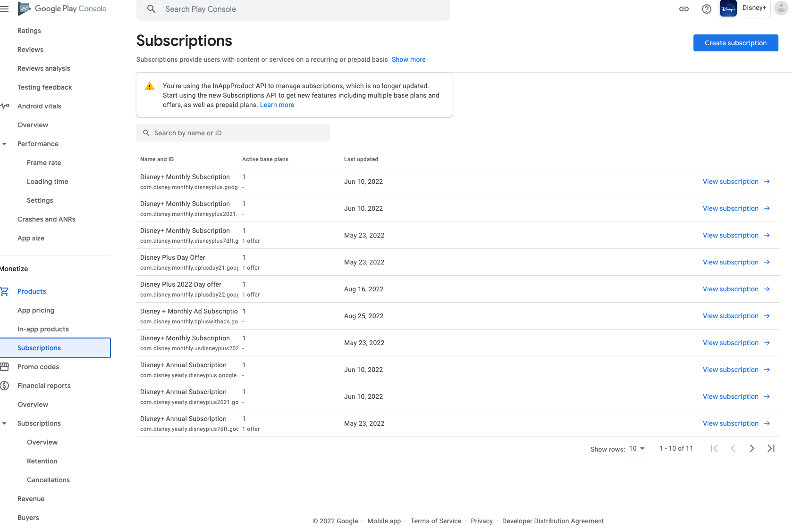
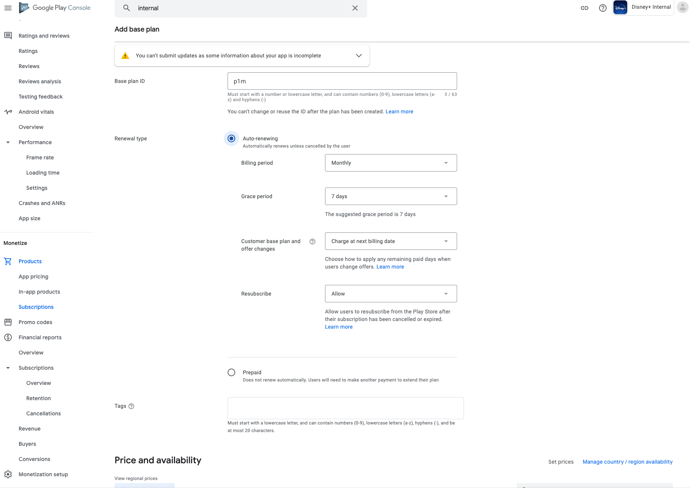
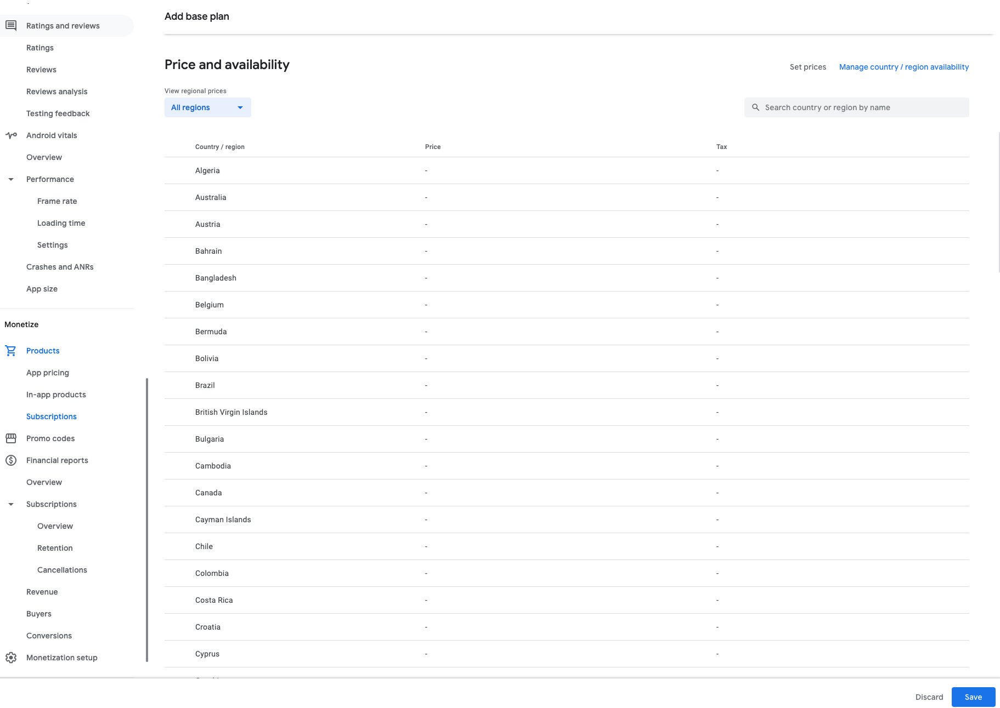
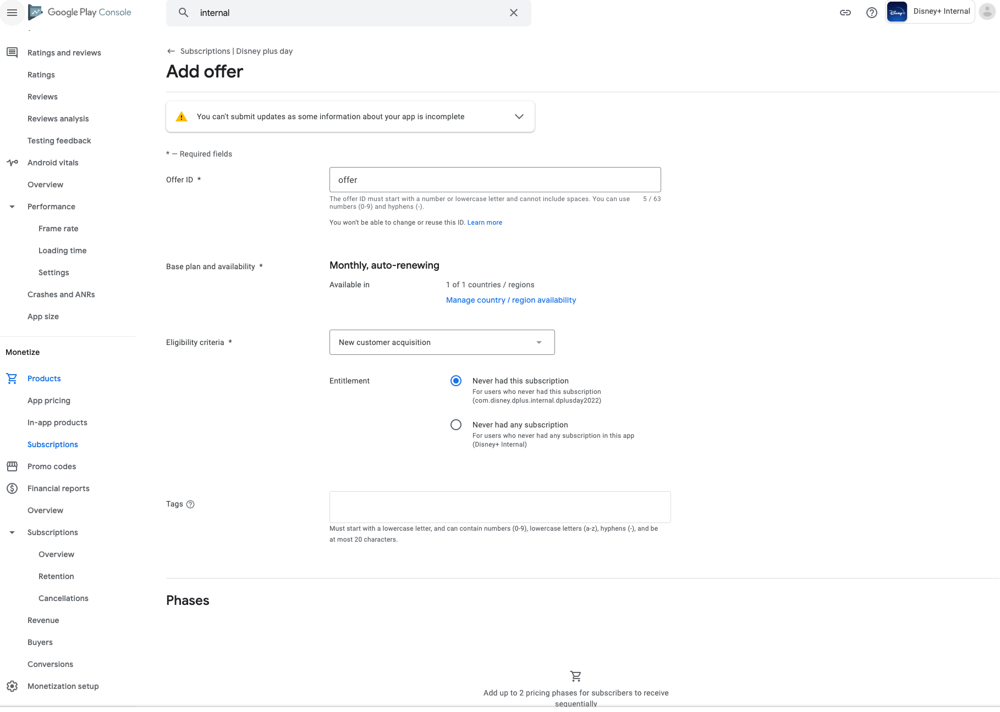
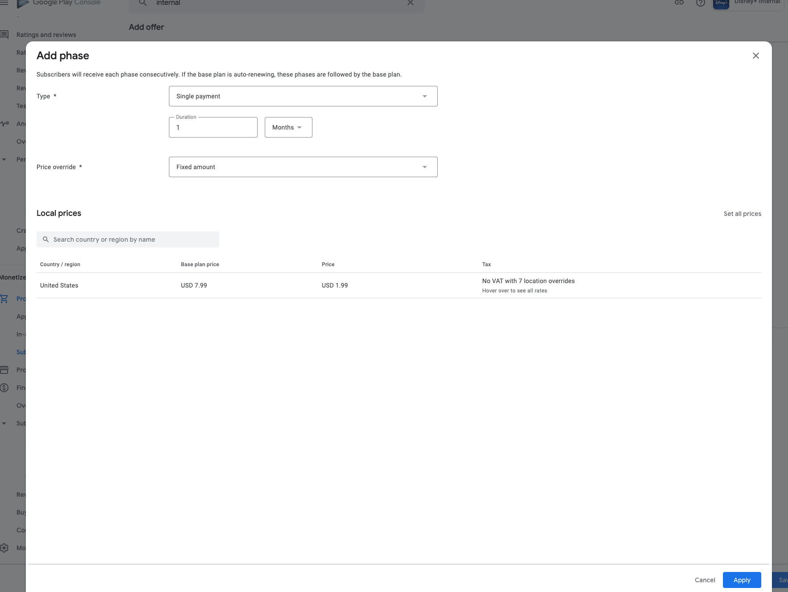
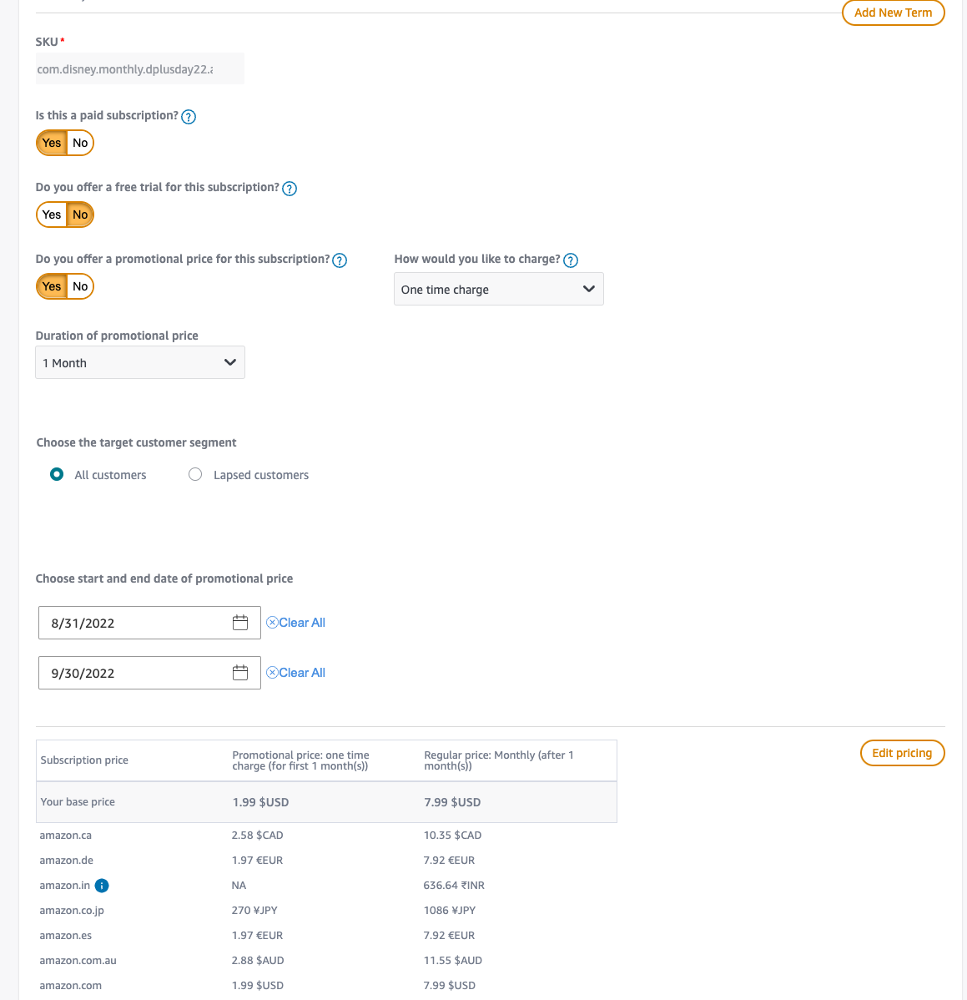

# Disney Plus Day

This document outlines the preparation steps, console setup, and testing, including the result from devices in 2022.

* Overall steps
    * Determine whether new SKU will be needed or can run promotion based off existing SKU  (Collaboration with the Paywall Team)
    * Once decision is made, set up SKUs in the console.
    * Set up Jarvis toggle for testing (Amazon only)
    * Validate D+ day flow
    * Set up the exact same app-config from Jarvis in prod on launch day.

## Preparation

* Google
    * As of version 2.2, the DMGZ project reacts to intro price availability from the SKU from the Google billing library.
        * The Paywall Service returns the SKUs, and the app queries them from the app store to provide the subsection product to users.
        * If the SKU has an intro price active, the code will display the intro price on the welcome/paywall screen.
* Amazon
    * As of version 2.2, the DMGZ project reacts to the intro price available from the app config.
        * With Amazon In-App Purchasing v2.0 library, it doesn't have intro price enabled, and only Amazon built-in dialog can show promotional price.
        * We have a [ticket](https://jira.disneystreaming.com/browse/ANDROID-4672) to let the new SDK (Amazon Appstore SDK V3)will provide intro price instead of the app config.
        * If the config has the intro price availability and the SKU's intro price is not expired from the amazon console, the code will display the intro price in the welcome/paywall screen.
        * As of 9/16/2022, the DMGZ project reacts to the intro price available from the app config.
            * With IAP library V2, it doesn't have intro price enabled, and only Amazon built-in dialog can show promotional price.
            * We have a [ticket](https://jira.disneystreaming.com/browse/ANDROID-4672) to let the new SDK provide intro price instead of the app config.
            * If the config has the intro price availability and the date/time does not expire the SKU, the code will display the intro price in the welcome/paywall screen.

## Console setup

* Google
    * Go to [play store console](https://play.google.com/console/u/0/developers/7700171517953165945/app-list?pli=1)
    * Choose Disney App
    * Click Subscriptions (From Monetize, right below In-App-Products) at the left menu
    * On the Right top corner, Create Subscription.
    * SKU name should be determined by paywall team.  (Phillipneris, Anna <Anna.Marie.Phillipneris@disney.com> or Gianni, Amanda <Amanda.L.Gianni@disney.com>)
    * Enter the SKU for productId (40 characters limit) and descriptive product name product name
    * Add base plan, save
    * Add offer

* Amazon
    * Go to Amazon developer console
    * Choose Disney App
    * Go to In-App Items from the left menu
    * Create a new SKU or click exiting SKU
    * Enabled promotional price, set 1 month, and one-time change
    * Set all customers
    * Set start date and end date (Amazon date is based on UT)
    * Intro price function from SDK is not enabled as of Today (Sep 28th, have a ticket to enable it from code with the new app store SDK)
    * The team has done applying [config](https://github.bamtech.co/Mobile/dmgz-android-appconfig/pull/1338) to update the intro price.

## Testing

* Google
    * Jarvis In App Purchase & Paywall -> D+ Day Config - Google
* Amazon
    * Jarvis In App Purchase & Paywall -> D+ Day Config - Amazon - In Enabled Regions
    * Currently it has 2022 date on the [config](https://github.bamtech.co/Mobile/dmgz-android-appconfig/blob/qa/outputs/transformations/all.json)
    * After, [ticket](https://jira.disneystreaming.com/browse/ANDROID-4672) we do not need to have intro prices in the config.
    * We still need to keep the introPricingEndDateTime since Amazon expiration date/time is set up for UTC timezone.
* Recommend Fresh Install D+ app
* Check if the promo price shows up on the welcome screen
* After sign up, check the intro price shows up correctly on the paywall
* Verify if the platform's purchase dialog's price matches the expected promo price
* Screen shots are in [here](https://github.bamtech.co/Mobile/dmgz-android-appconfig/pull/1338)

## Launch

* The launch started at 12 am EST/9 pm PST.
* Deploy any necessary client feature flag config to Prod at the launch time.
* Have one or two members monitor #disneyplus-support-general (Better to have an [on-call spreadsheet](https://docs.google.com/spreadsheets/d/1XwOMpkVAuO2O3rvniRJf3m7tcpdiPVnx52Cgj2ENcI0/edit#gid=1779325713) prepared)

## Helpful notes to read

* For 2022, it was our first time to launch amazon's new tier SKU with app store SDK 2.0
* Right after D+ day 2022, we upgraded the amazon app store SDK to 3.0.
* D+ 2022 SKU in Amazon plans to change the name to D plus premium to support the ad vs. the no-ad tier group.
* Amazon intro price date/time is based on UT, so make sure you give +/- day buffer to that console won't block the eligibility. The paywall service will be handling the promo time window.
    * ex: If a date is set to 9/28/2022 to end, it means it will end at 9/28/2022 at 8 pm EST/ 5 pm PST
* [Spike ticket](https://jira.disneystreaming.com/browse/ANDROID-4342) for Disney Day 2022
* [On-call docs](https://docs.google.com/spreadsheets/d/1XwOMpkVAuO2O3rvniRJf3m7tcpdiPVnx52Cgj2ENcI0/edit#gid=1779325713)
* Contact info who were involved in D+ day launch in 2022
    * Amazon: Rajan, Priya <prirajan@amazon.com>; N S, Goutham <gouths@amazon.com>
    * Disney TAM: Coppola, Jason <Jason.Coppola@disney.com>; Koenig, Alana <Alana.Koenig@disney.com>;
    * Disney DEV: Kim, Kisik <kisik.kim@disneystreaming.com>
