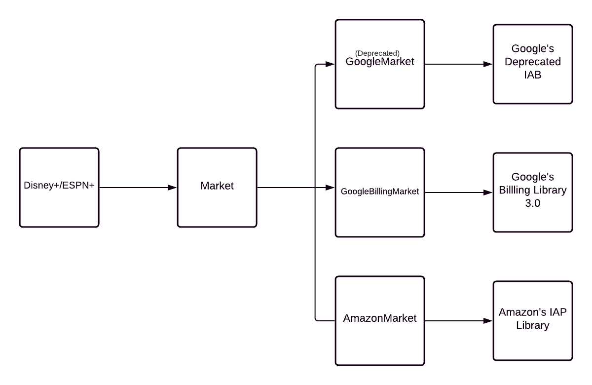

# Paywall

## Refactor

A refactor of the paywall has begun. More information can be found [here](refactor.md).

## Components

There are three important components that make up the entirety of what we call the "Paywall". They are outlined below.

### Paywall Service

The first is the Paywall service. This has the following responsibilities:

* Fetching SKU's
* Fetching the Paywall Hash
* Fetching the Entitlement Context
    * This value is used to determine the users current entitlement value.
    * There are five options (as of 03/03/2021):
        * `account_active_entitlement` - This means the user is currently subscribed to Disney+ with an active entitlement (meaning they can view content).
        * `account_expired_entitlement` - This means the user was previously entitled and their subscription lapsed. As a result, they cannot enter the application and will instead hit the paywall when logging in. This is used to take the user to what we call the "Paywall Interstitial" (see [fragment](https://github.bamtech.co/Android/Dmgz/blob/development/features/paywall/src/main/java/com/bamtechmedia/dominguez/purchase/complete/PaywallInterstitialFragment.kt#)) screen with text informing the user to "restart" their subscription.
        * `account_never_entitled` - This means the user is logged in but has never been entitled. As a result, they will be taken to the paywall. If the user is a first time user (meaning they're coming in from the registration screen), we skip the Paywall Interstitial screen and take the user directly to the paywall. Otherwise, we show the Interstitial informing them to "complete" their subscription. If a user completed Signup (created an account) but never completed a purchase, they would see the "Complete Purchase" version of the paywall interstitial page on subsequent logins, until an initial purchase has been made on this account. You can only ever be in this context once...between Signing Up and the first purchase.
        * `account_on_billing_hold` - This means the user is in an Account Hold state, and must be blocked from entering the application. Here, they will have a chance to fix their payment. For more information, see [Terminology](#terminology). For the conditions that must be met, see [FEDSA-280](https://jira.disneystreaming.com/browse/FEDSA-280).
        * `anonymous` - This means that the user is not logged in. The user should be directed to the welcome screen in this case.

### Market

The second is the `Market` component. This refers to the third party marketplaces that we support. As of today, the markets we support are:

* [Google Play Billing](https://developer.android.com/google/play/billing)
* [Amazon IAP](https://developer.amazon.com/docs/in-app-purchasing/iap-overview.html)

This is responsible for the following:

* **Querying products** - When the Paywall service (outlined above) returns SKU's, we pass those SKU's to the `Market` to fetch the product information. This includes ALL of the metadata associated with the product, including:
    * Pricing information
    * Currency information
    * The Market's also handle when and how to renew. It handles the grace period as well as the account holds.
* **Querying purchases** - As of Google Play Billing 3.0, and since the beginning of Amazon, we are required to query the user's purchases on every app open. This will allow us to restore purchases for the user that may have been purchased outside of the application, as well as handle pending purchases.
    * For example, on Google Devices, it may be possible to redeem a promotion for a subscription or (in a future release) subscribe to the app directly in the Google Play Store _before_ installing the app. For more information, see [Handling purchases made outside your app](https://developer.android.com/google/play/billing/integrate#ooap) and [Handling pending transactions](https://developer.android.com/google/play/billing/integrate#pending).
* **Making a purchase** - Perhaps the second most important component of the app (behind playback), the  Market is responsible for purchasing subscriptions on Android.

The Market delegates the actual work to the Disney Streaming IAP Library.  Read more about this below.

#### Disney Streaming IAP Library

The [Disney Streaming IAP Library](https://github.bamtech.co/mobile-core/android-bamnet-iap) is an internal library used to obfuscate the implementation details of the individual third party billing libaries. The below chart shows how this is done:

<!-- TODO - Update this to use Mermaid -->

Effectively, the client apps interface with a shim called `Market`. Under the hood, the market is implemented by the proper third party library and exposed in the app based on the market flavor.

* The `GoogleBillingMarket` is provided via `storeGoogle`'s `Store_AppModule`.
* The `AmazonMarket` is provided via `storeAmazon`'s `Store_AppModule`.

This allows the client app to interface with a single class and not need to worry about the implementation details.

### Activation Service

The final component is the Activation service. This is another internal service to Disney Streaming that is responsible for the following:

* **Redeeming a purchase** - Once a purchase is made via the `Market`, we take the receipt (called an `orderId` for Google and a `receipt` for Amazon) and pass that along to activation services via the [SDK](https://github.bamtech.co/mobile-core/android-sdk/blob/master/extension-iap/src/main/kotlin/com/dss/sdk/purchase/PurchaseExtension.kt#L15).
  If successful, this will entitle the device to be able to view content.
* **Linking a subscription to an account** - As of the time of this writing, the process of redeeming a purchase actually entitles the _device_ not the _account_. As a result, we must link the entitlement to an account, if possible.
  This is done through the [SubscriptionApi](https://github.bamtech.co/mobile-core/android-sdk/blob/7981471d6ce316751757c3d84c2ddf121668cbd8/plugin-iap-subscription/src/main/kotlin/com/dss/sdk/subscription/SubscriptionApi.kt#L33).
  Without this, when logging in to the same account on another device (the web for example), the user will hit the paywall. Note: an entitlement can only be linked to one account at a time and vice-versa.
* **Restoring purchases** - This differs from redeeming in that the purchase has already been redeemed. This can happen for users on Amazon/Google when they are attempting to sign in to an unentitled Disney+ account on a device with an entitled Google/Amazon account.
* **Temporary Access** - The user can be in the Temporary Access state in the event that a purchase fails to activate. For example, after a purchase is made and the app attempts to redeem via activation services, an error can occur (server side) when verifying the purchase. As a result, Activation services will grant temporary access to the device, allowing them to playback content.
  Meanwhile, the app will attempt to fix the issue by retrying to redeem the purchase and thus verifying the purchase. According to Activation, temporary access lasts for as long as the session lasts.
* **Acknowledging Google Purchases** - As of Google Billing 2.0.0, any subscription must be acknowledged within 3 days of a purchase being made. If it is not, Google will refund the user. Historically, this was done in the android application (see `MarketInteractor.acknowledgePurchase`).
  However, at launch in 2019, ~3% of _all_ purchases were not acknowledged. This resulted in Google communicating that we need to fix that. Over 2020, we reduced that to ~0.5%.
  In late 2020, activation implemented [acknowledgement](https://developers.google.com/android-publisher/api-ref/rest/v3/purchases.subscriptions/acknowledge) on the server. Since then, unacknowledged purchases have fallen to ~0.3%. Note: Amazon still requires us to "consume" the purchase.

## Setting up SKU's

See documentation on how to add SKU's to the Amazon and Google Play Store [here](set_up_sku.md)

## Testing Purchases

See documentation on testing purchases in the [Testing Purchases documentation](testing.md)

## Important Resources

* [Paywall Service Wiki](https://wiki.disneystreaming.com/display/PROD/Paywall+API)
* List of currently supported SKU's:
    * [Subscriptions](sku_list.md) - List of SKU's used for subscribing to the service.
    * [In App Products](product_sku_list.md) - List of SKU's used for Premier Access (or PPV).
* [Library Update Documentation](iap_library_updates.md)
* Slack Channels
    * `#activation` - Used to communicate with the Activation service folks
    * `#mobile-core-support` - Used to communicate with Mobile Core team, the team that maintains the libraries.
    * `#account_hold` - Used to discuss features around the Account Hold.
    * `#offer-management-support` - Used to communicate with the Offer Management team.

## Terminology

* **SKU** - An identifier for a specific product. Specifically, it stands for "Stock keeping unit". An example is `com.disney.yearly.disneyplus.google`.  
* **Grace Period** - A period of time where the users card was attempted to be charged, but failed. As a result, we grant them a "grace period" where they are able to continue to use the service. This can happen, for example, if the users credit card has expired. As of the time of this writing, we give users a seven day grace period. For more information, see [here](https://developer.android.com/google/play/billing/subscriptions#grace).
* **Account Hold** - A period of time where the users card was attempted to be charged, but failed, and the user has already surpassed their Grace Period. In this instance, the users subscription is still "active", but they are now unable to use the application. If the user remediates their payment issue, they are then able to re-gain access to the application. For more information, see [here](https://developer.android.com/google/play/billing/subscriptions#account-hold).
* **Receipt** - The response given to the app via the `Market` from Amazon. This is what activation uses to verify the purchase and entitle the device.
* **orderId** - The response given to the app via the `Market` from Google. This is what activation uses to verify the purchase and entitle the device.
* **Temporary Access** - A state that the user is placed in the event that Activation fails to properly communicate with Amazon's or Google's servers. The user will be able to temporarily access the application.

## Additional Reading

* [IAP Library Updates](iap_library_updates.md) - Documentation on how to update the IAP library.
* SKU Lists:
    * [Product SKU List](product_sku_list.md) - A list of all "product" SKU's. These are generally
    * [Subscription SKU List](sku_list.md) - A list of all subscriptions SKU's.
* [Refactor](refactor.md) - Documentation on the ongoing paywall refactor effort.
* [Setting up SKU's](set_up_sku.md) - Documentation on how to go about setting up a SKU.
* [Testing IAP](testing.md) - Documentation on how to test the IAP flows.
