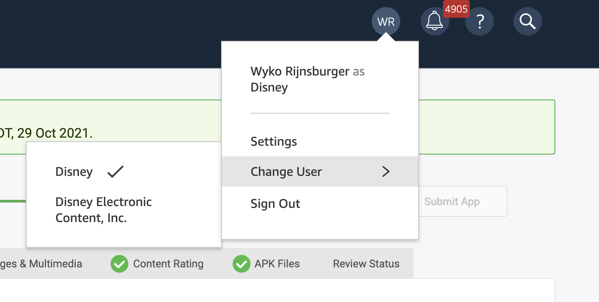
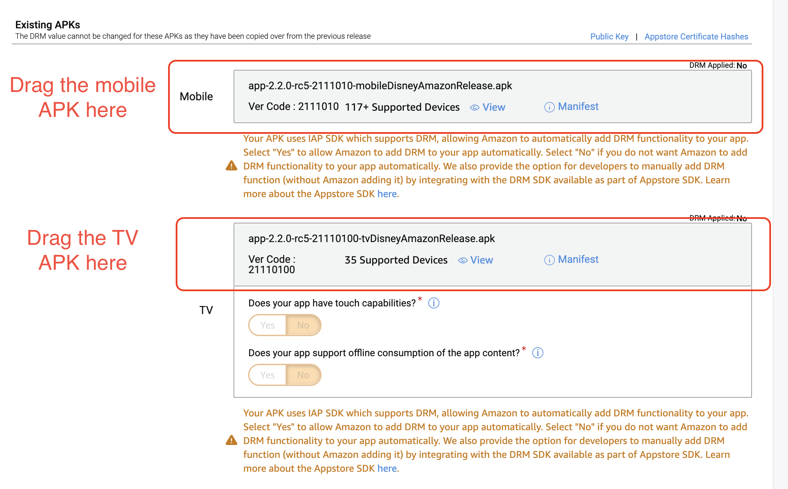
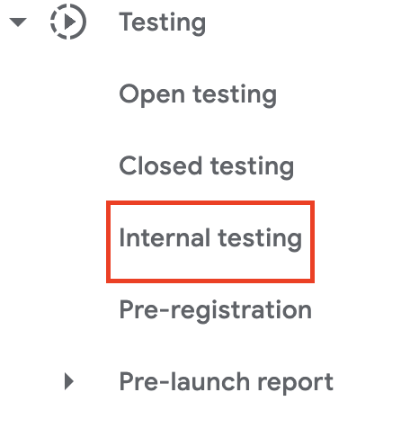
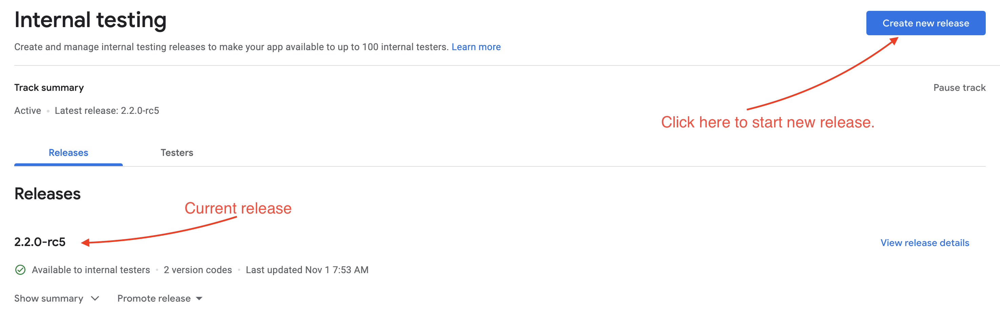
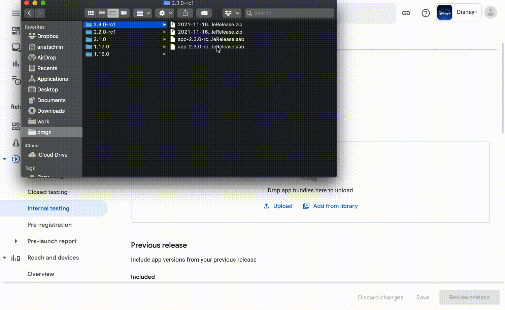
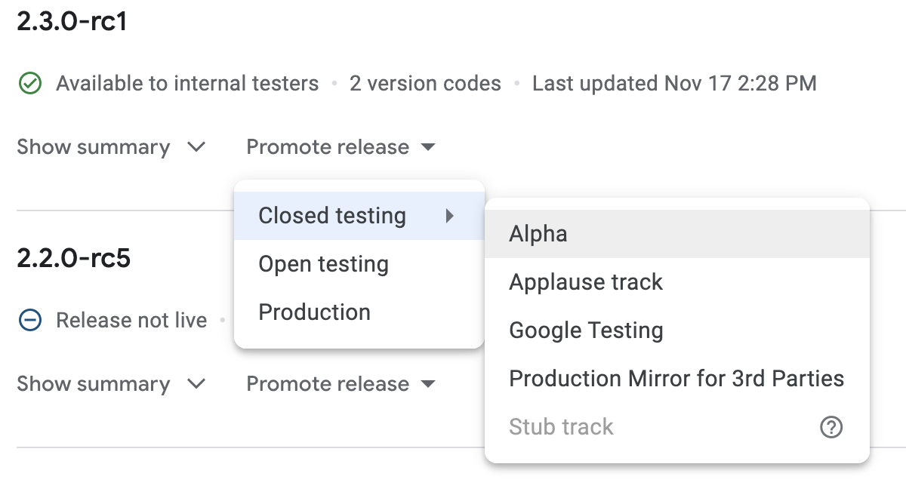

# Live App Testing and Alpha releases

This page details how to go about testing purchases on our IAP platforms.

## LAT (Live App Testing)

Normal debug builds do not interact with any Amazon service. For more info on this, see the [Paywall Testing docs](testing.md). To test interaction with Amazon services, we need to use [Live App Testing](https://developer.amazon.com/docs/app-testing/live-app-testing-getting-started.html) (LAT) . LAT is a way to distribute test builds that interact with Amazon services.

To do LAT releases, you need access to the Amazon developer console. To request access, reach out to an Android team lead.

### Uploading a LAT release

- **Warning: do not end tests unless there is a specific request/reason for this**. By stopping a
  test, you will remove all the existing testers that are able to download the test.
- Download the release you want to upload from [AppCenter](https://install.appcenter.ms/apps). You
  need to download both the Amazon TV and mobile APKs. You can also find the builds in
  the `#dsplus-android-builds` Slack channel.
- Go to [Amazon developer console](https://developer.amazon.com/apps-and-games/console/) and select
  the app to release.
    - Note: you might need to switch **User** to find the proper app. Disney+ is managed by the
    **Disney Electronic Content, Inc.** user, while Star+ is managed by the **Disney** user. You
    can switch users by hovering over your profile icon in the top menu bar and selecting **Change
    user**.
    - [Disney+ listing](https://developer.amazon.com/apps-and-games/console/app/amzn1.devportal.mobileapp.506ac6bea9a244c3a7f5b328713ce3b2/release/amzn1.devportal.apprelease.e6142b5a16934f7881c5378db5e5c4c8/general/detail?returnFromLogin=1&) (
    only accessible when switched to the **Disney Electronic Content, Inc.** user).
    - [Star+ listing](https://developer.amazon.com/apps-and-games/console/app/amzn1.devportal.mobileapp.506ac6bea9a244c3a7f5b328713ce3b2/release/amzn1.devportal.apprelease.e6142b5a16934f7881c5378db5e5c4c8/general/detail?returnFromLogin=1&) (
    only accessible when switched to the **Disney** user).

{ width="500" }

- Select **Live App Testing** in the menu.
- Select **New Test**.
- Select **APK files**. All metadata is copied from the previous release and usually does not need
  to be changed.
- Replace the existing APKs with the new ones downloaded from App Center.

{ width="500" }

- Select **Submit App**.
- The release is now submitted. It will take a moment (usually less than an hour) for the release to
  be processed and available. **Do not stop any existing test**. This will happen automatically when
  the next release is processed. By stopping the previous release, you will remove all the existing
  testers that are able to download the test.

## Alpha & Internal Tracks

Google provides multiple tracks for testing purposes. We utilize
the [Alpha closed track](https://play.google.com/console/about/closed-testing/) as well as
the [Internal test track](https://play.google.com/console/about/internal-testing/). To do a release
to the Google Play Store, you will need access to
the [Google Play Console](https://play.google.com/console/u/0/developers/7700171517953165945/app-list)
. If you do not have access, please reach out to one of the leads.

### Obtain AAB Files

We upload the [Android App Bundles](https://developer.android.com/guide/app-bundle) (AAB) to the
Google Play Store. As a result, you will first need to obtain the AAB files.

- A build will be kicked in the #dsplus-android-builds Slack channel.
- Once the build successfully completes, links to the builds will be commented in a thread of the
  original post. For example, you can see an example with the 2.3.0-rc1 builds
  via [this slack message](https://bamtechmedia.slack.com/archives/G01BPDQQ58F/p1637071720044900).
- Find the **Release AAB**'s. It will be structured in the following format:

  ```text
  build_status_android/Dmgz/release%2F2.3_4_mobileStarGoogleReleaseBundle: Uploaded successfully to https://bamazon-mobile-android-test-app-delivery.s3.amazonaws.com/2021-11-16_14-07-55_app-2.3.0-rc1-2111160-mobileStarGoogleRelease.zip with password: [PASSWORD_HERE]
  ```

- It includes the following:
    - A link to a .zip file.
    - The version of the app
    - The variant of the build (e.g. `2.3.0-rc1-2111160-mobileStarGoogleRelease`)
    - A password.
- Copy the password
- Click the link. A zip file will be downloaded to your device.
- Open the zip file.
- Input the password.
- The `.aab` file will be placed in the same directory as the zip file.
- Do this for the Mobile and TV builds.

### Upload to The Google Play Store

Next, we want to upload the AAB's to the Google Play Console.

- Open the Google Play Console.
    - [Disney+](https://play.google.com/console/u/0/developers/7700171517953165945/app/4974830683713314200/app-dashboard)
    - [Star+](https://play.google.com/console/u/0/developers/7700171517953165945/app/4975987970990828319/app-dashboard)
- Submit to Internal Test track:
    - Select `Testing -> Internal Testing`. This will ensure we upload to the list of "Internal"
      testers. This is a specific test track for internal testers. Find out
      more [here](https://play.google.com/console/about/internal-testing/).
      { width="300" }
    - Click the `Create new release` button.
      <br> { width="300" }
    - Locate the AAB's that you downloaded.
    - Select all available AAB's (the TV and mobile files)
    - Drag and drop into the available space
      <br> { width="300" }
    - Scroll Down to the `Release Details`
    - Edit the Release Name so that it reflects the version name and build (e.g. `2.3.0-rc1`).
    - For the release notes, it's sufficient to just do English and note the version:

      ```xml
      <en-US>
        2.3.0-rc1 - Internal
      </en-US>
      ```

    - Click `Save`
    - Click `Review release`
    - Browse the information to make sure nothing is out of place. Ensure the build numbers are
      as expected; ensure that no new unexepected permissions were added; etc.
    - Click `Start rollout to Internal testing`
    - Click `Rollout`. This will begin immediately.
  
- Submit to Alpha Channel
    - Click `Promote release -> Closed testing -> Alpha`
      <br> { width="300" }
    - This will create a new release with the uploaded AAB files that were added to the Internal
      track.
    - Ensure that all looks as it is supposed to.
    - Remove the `Internal` portion in the release notes.
    - If you made edits, click `Save`.
    - Click `Review Release`
    - Again, ensure that everything looks in order.
    - Scroll down to the `Staged roll-out` section. For alpha, there's no need to do a staged
      rollout. Leave this value at 100%.
    - Click `Start rollout to Alpha`
    - Click `Rollout`
