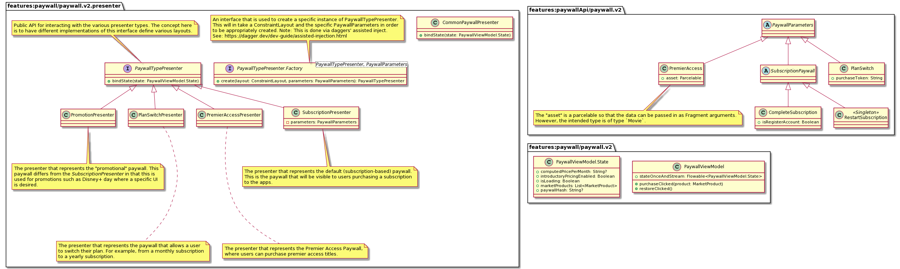
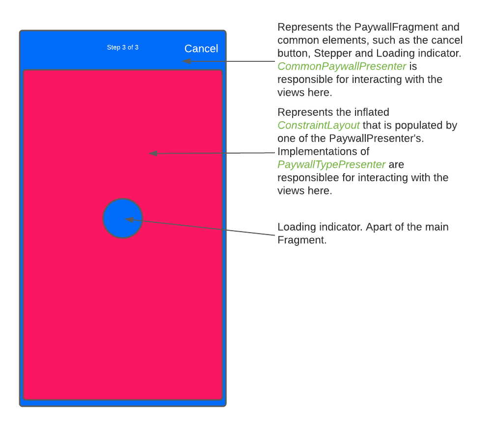
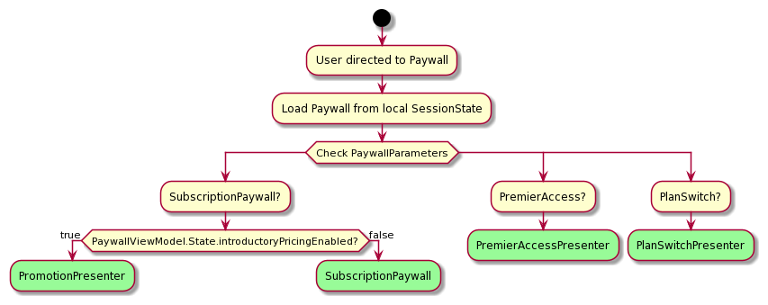
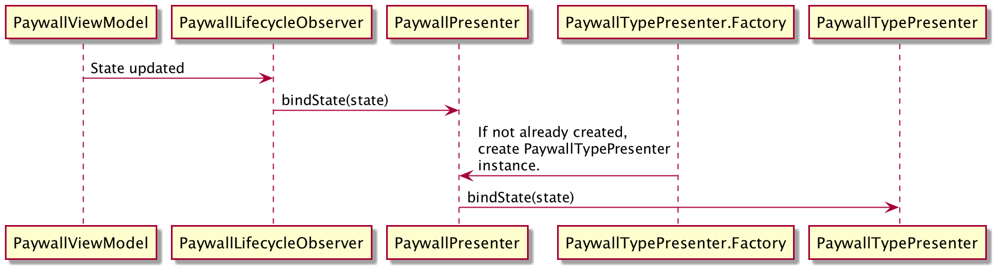
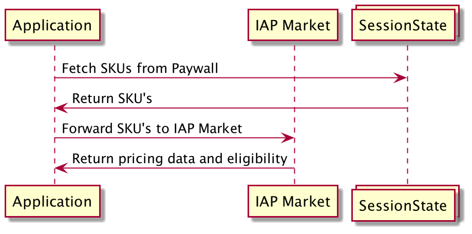

# Paywall Refactor

This document outlines the details of the paywall refactor. This was started in late 2021 with the following goals:

* Update the Paywall to the latest standards of the codebase.
* Reduce complexity within the Paywall codebase.
* Remove redundant classes/files (such as `DmgzPaywall` and `PaywallProduct`) and replace with more recent classes such as `MarketProduct` and `Paywall<SessionState.Product>`.

There are several ways that the paywall has come to be defined over the past several years, resulting in multiple "types". These types include:

* **Subscription Paywall** - The paywall that the users sees when entering the application as an unentitled user. This will allow the user to purchase a subscription. This is further broken down in to two additional types that simply alter the text on the screen:
  * Complete Subscription - This indicates the user is a first time user and has never subscribed previously.
  * Restart Subscription - This indicates the user has previously been subscribed, but their entitlement has expired.
* **Premier Access Paywall** - The paywall that the user sees when attempting to purchase a Premier access title. This is a single-button Paywall with an altered logo.
* **Plan Switch Paywall** - The paywall that the user sees when attempting to switch their current subscription from a Monthly subscription to a Yearly subscription.
* **Promotion Paywall** - The paywall that the user sees when attempting to purchase a subscription during a promotional period, such as the offer used in 2021 for Disney+ Day. The UI was significantly altered in this scenario to bring further attention to the monthly price.

## Implementation

### Class diagram

High level diagram of the UI set up:

### Starting the Paywall

To start the Paywall, one must define the proper `PaywallParameters` and pass that in to the `PaywallFragment.newInstance()` method. There are several options available that correspond with the types of paywall listed above.

* `SubscriptionPaywall` - This will start the Paywall for the Subscription Paywall use case. Just like above, this is broken in to two types:
  * `CompleteSubscription` - This starts the Paywall in the "Complete Subscription" state and takes a boolean that determines if we're in the "RegisterAccount" flow (which will ensure that the proper subscription confirmation dialog is displayed for this use case, post purchase).
  * `RestartSubscription` - This starts the Paywall in the "Restart Subscription" state.  
* `PremierAccess` - This will start the Paywall for the Premier Access use case to purchase a title. This takes a required `Parcelable`. As of right now, the only supported class type accepted is `Movie` from the `coreContentApi`.
* `PlanSwitch` -  This will start the Paywall for the plan switch use case. This takes a `purchaseToken`, which is the token that represents the users current subscription. This is required in order to switch from their current subscription to the new SKU. **Note**: At this time, this is only supported on Google.

### `PaywallFragment`

The UI is set up in a way that uses a single fragment that populates the UI based on the above described types. The XML contains common elements and a container view represented by a `ConstraintLayout`.
This container is inflated by the `PaywallFragment`, and the contents of this view are defined in an instance of a `PaywallTypePresenter` that is selected. See [Presenters](#presenters) for more information on how that is set up.

### Presenters

There are two different presenters that will be used in setting up the UI for this fragment:

* The `CommonPaywallPresenter` which is responsible for the `PaywallFragment`'s overall UI.
* The `PaywallTypePresenter` which is an interface who's implementations will be responsible for setting up the UI within the container of the `CommonPaywallPresenter`. There will only be one instance of a `PaywallTypePresenter` at a time (scoped to the Fragment's view), but there are multiple that _can_ be created.

To see which type of presenter is created, see the following diagram:

The following is a sequence diagram that describes the interaction between classes:

### Fetching Data

The data comes from a couple of places:

* `SessionState` - which is pulled from our Orchestration API.
* The IAP Market - This is the Google Play Store or the Amazon App Store.

