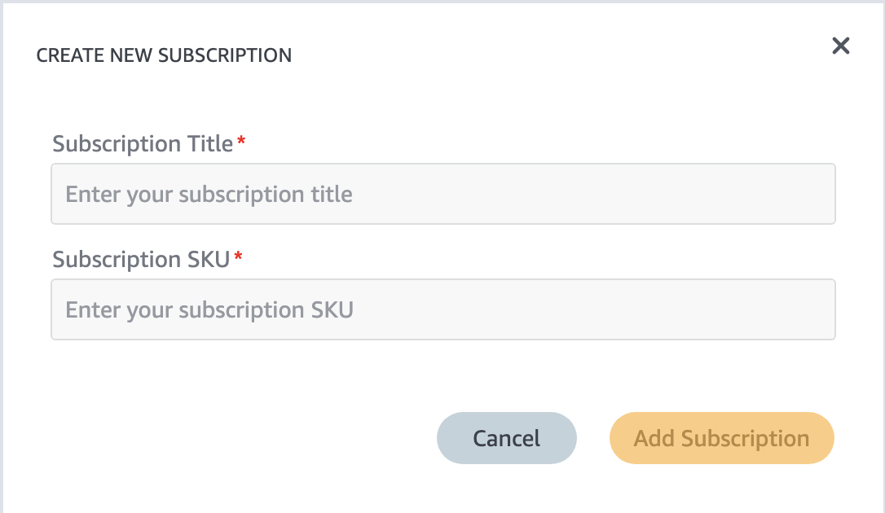
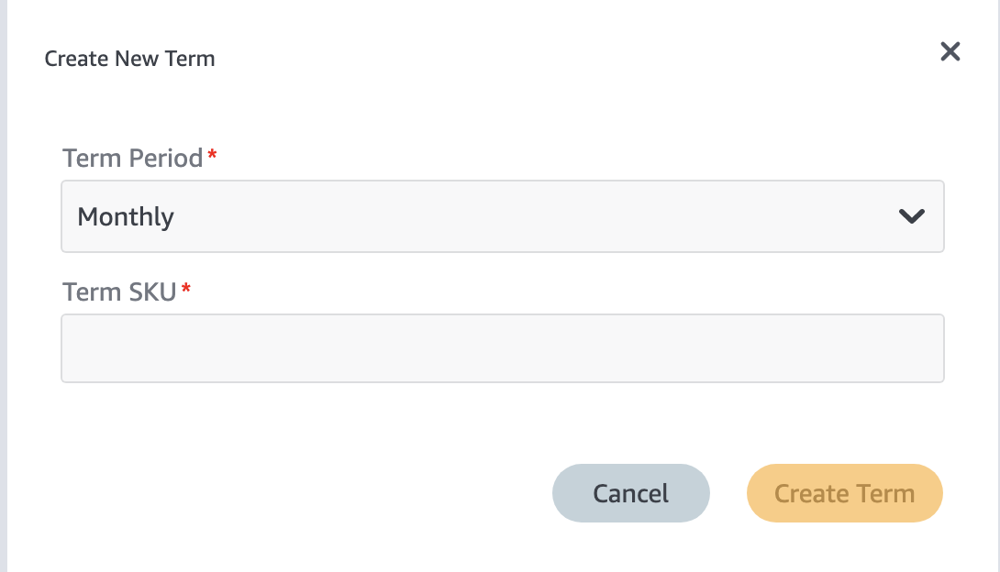

# Setting up SKU’s

If you’re reading this you’re probably being asked to add SKU’s to the Amazon and Google Play store. This guide will walk you through the steps including additional steps required for making the SKU's available for testing.

## Before you begin

!!! info "Requirements"
    _Make sure to have access to the following things, if you have no access ask your team lead to get access:_

      - Access to the Amazon Developer Console
      - Access to Firebase (Project: Disney Plus Internal)
      - Access to the Google Play Developer Console

### Important information

Check if the JIRA ticket contains following information:

- Friendly (SKU) Name
- Product Key
- Pricing’s table

## Amazon

### Create IAP Item

- Go to the Amazon Developer console at <https://developer.amazon.com/>
- Hover your mouse over **Apps & Services** and click on **My Apps**
- Click on the app that you want to add the SKU for
- On the left pane go to **In-App Items**
- Now click on the button **Add Single IAP**

There are a couple of IAP’s you can add. Here’s a brief explanation what they mean:

| Type | Description |
|:-:|:-|
| Consumable | Currently we do not use this one. A consumable is a product that you can buy multiple times. Such as a life or coins in-game items.  |
| Entitlement | An entitlement is access to a certain thing. For example, we use it for Premier Access. |
| Subscription | A recurring purchase. We use it for monthly and yearly subscriptions. |

#### Entitlement SKU

Now click on the IAP type that you want to add and it will ask you for two things:

- **Title**: For Amazon you can choose your own naming here since it’s only used in this dashboard. An example, when we’ve added Jungle Book for the QA environment we named in: **Jungle Book QA**. It’s the name listed in the title row of the table on the page with In-App Items.
- **SKU**: This one is important. Add the product key that should be supplied in the JIRA ticket

You’ll now see the IAP item page and we’ll have to finish submitting all the other information.

- **Display Title**: Add friendly name here. This one will be shown on the receipt
- **Description**: Copy and paste the friendly name here

#### Subscription SKU

There's two SKU's to input in for Subscriptions:

**Subscription SKU** - What we call `Parent SKU's`. This is the first SKU that is asked of you when creating the subscription (see image below). For this, we append a .parent to the end of it.
For example, if the SKU being asked to add to the Amazon store is `com.disney.yearly.disneyplus.amazon`, then we will input `com.disney.yearly.disneyplus.amazon.parent` here.

{ width="500" }

**Term SKU** - This is the SKU that is subscribed to. When making a subscription, we have to click "Add New Term". That brings up the screenshot below. This allows us to associate separate SKU's to a single parent SKU. The way we have it set up is on a 1-1 basis (meaning 1 term and 1 parent).

{ width="500" }

### Set IAP pricing

**Note:** If you're adding a subscription, before you can add any pricing make sure to setup the term sku first as described in the section above.

Now scroll down to the pricing part and you’ll have to set the [no/yes] toggle to yes so that we can charge for this IAP item. For this you’ll need to use the pricing table that is supplied in the JIRA ticket.

Click on the button to add/edit the pricing.

- First set the US price from the table and calculate all other prices based on that. Before closing the dialog, let’s now manually set the other prices that you can find in the table of your JIRA ticket.
- Go over the prices one by one and make sure most of them are matching. I.e. European prices for European countries, UK and Austrialian price will be separate and so will also most of the other countries. It may be that when you’re adding this for QA testing purposes some countries are missing in the table, this is ok for now and something you can ignore.
- Save the prices
- Set the **product tax code**: to `A_EGOOD_VIDEOONDEMAND`

Now double check all the information and submit the IAP item when you’re done

### Update test JSON

We have a firebase project that contains a json with all the available SKU’s that is used for the IAP Tester app. Now that we’ve added a new SKU we need to update this JSON in order to test the new SKU with our local builds.

- Go to the **In-App Items** page in the Amazon developers console
- Click on **Export Multiple IAPs** and choose JSON
- Rename the file that you’ve just downloaded from the Amazon console to: `amazon.sdktester.disney.json` or `amazon.sdktester.star.json` depending on the project that you’re updating the SKU’s for.
- Now go to the storage section of our Disney internal firebase project [here](https://console.firebase.google.com/project/disney-plus-internal/storage)
- Click on **Upload file** and select the json file that you downloaded and renamed earlier
- Refresh the page and `amazon.sdktester.json` should be updated (see Last modified date).
- Click on that file and in order to complete this part, you’ll have to click on **File location** in the right pane and then click on **Create new access token**.
- The name of the file in the right pane should’ve changed to a blue clickable link. Click on the Name and it’ll open the json. **Validate if the newly added SKU is in there.**

You should now be able to update the json of the IAP tester app and test out the new SKU.

Find the helper app and more information here:

- Android project for the helper app: <https://github.bamtech.co/arietschlin/Dmgz-Amazon-IAP-Helper/blob/main/README.md>
- Node project that does the merging: <https://github.bamtech.co/arietschlin/Dmgz-Amazon-Iap-Helper-Node/blob/main/README.md>

## Google

### Create In-app product

- Go to the Google Play Console
- Now go to `Products > In-app products` in the left menu pane
- Then click on **Create product**
- You’ll now navigate to a page to create an In-app product item.
- **Product ID**: This is the `product key` in your JIRA ticket. (Note, this is different than Amazon. Do not use the friendly name here but the product key often ending with `_{brand}{google}`
- **Name**: Use the Friendly name here
- **Description**: Also use the friendly name here

#### Set In-app product pricing

Now below on the In-app product page you will set the pricing of the different countries and currencies based on the table that you can find in your JIRA ticket.

**Note:** on QA there’s often countries missing in the table of the ticket or some countries mentioned in the ticket aren’t in the pricing table of the Google ticket. Don’t worry about this, you can ignore that for now. Important is that you use the countries that match between the ticket and the google store pricing table.

- Click on **Set price**
- Use the US dollar here as Default price
- Now go over each country in the JIRA ticket and make sure the correct price is set with countries that match between the ticket and the dialog on the play store page.
- If you’re done press **Apply prices**
- Double check all the information on the page
- Click on **Save** and after that confirm again to submit the new IAP product.

## Add SKU to the README

We have two lists that have all the SKU's listed across Disney+ and Star+

- If you've added a subscription, add it to the list [here](sku_list.md)
- If you've added a product such as an premier access title, add it to the list [here](product_sku_list.md)
