# Promo Labels

**Promo Labels** are presented on Details pages for users to be informed of information on premier access or coming soon contents.

***Example***

| Coming soon to Disney+ | New season airs tonight at 8pm |
| --------------------------------- | :-----------------------------------------------------------------------------------: |
| 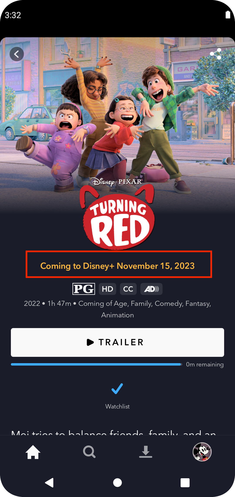{ width="200" } |                           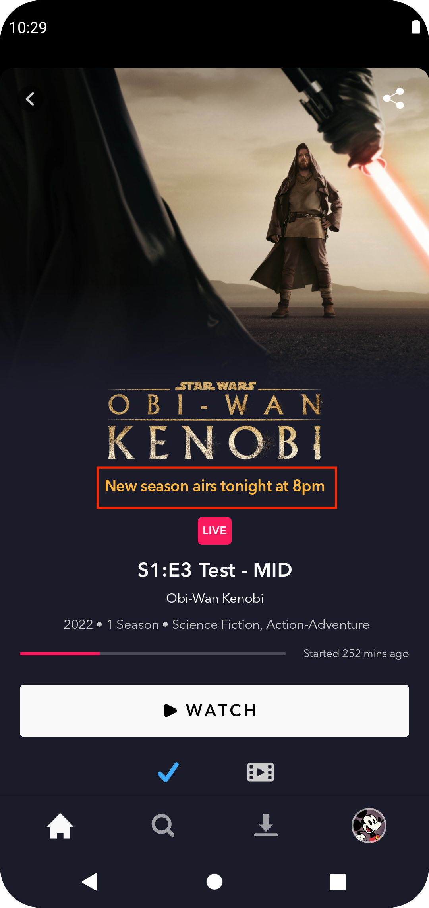{ width="200" }                           |

## Coming Soon Promo Label

- When a movie/series is in coming soon state, most of the times, a Trailer button will be displayed to promote the title
- When rendering details page buttons, we look for a valid promolabel: if there is no playable and there is a promolabel and extra video (trailer or clip), we will display play trailer/extra clip button
- see methods: `getPromoPlayable`, `hasPromoPlayable` and `isMainButtonWatchlist`

## Premier Access Promolabels: *ComingSoonEarlyAccess* and *AvailableEarlyAccess*

### How Purchase Data is Loaded on Details Screen

In the `DetailsPurchaseDelegate` we can find all the code related to EarlyAccess `PurchaseResult` parsing. There are two types of Early Access (Premier Access): **ComingSoonEarlyAccess** and **AvailableEarlyAccess**. For a certain content detail, purchase result is evaluated and returned as below:

<figure markdown>
  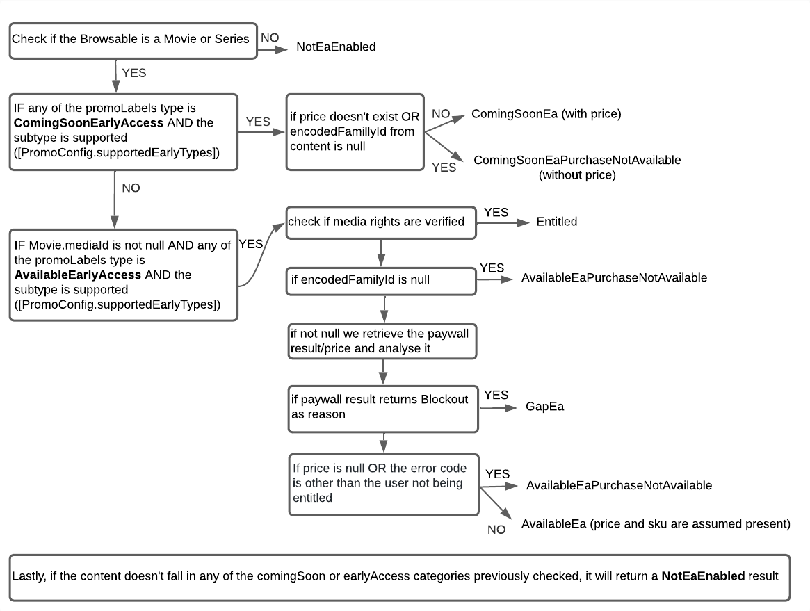
</figure>

With this information we use the `PurchaseResult` in our getHeaderList method from `DetailHeaderPresenter` to get the correct headers in the details page. We currently have two types of headers, PROMO_LABEL and PREMIER_ACCESS. The first one reflects coming soon content and the last one premier access content. There's quite some logic in that method to obtain the headers according to the priority of them, please check `DetailHeaderPresenter` to get more information.

## Promo Label Prioritization

Promo Label should have below priority List:

1. **Coming Soon** - Any title that has a promoLabels.type == ComingSoon should take priority.
2. **IMAX** - if a content is IMAX eligible
3. **shopDisney** - If both Coming Soon and IMAX data do not exist and promoLabels.type == shop and shop tab is available then display shopDisney promo label.

Resulting in: **Coming Soon Promo labels** > **IMAX promo labels** > **shopDisney promo labels**

## Feature Info

### Availability

|       | Availability |
| ----------- | :-----------: |
| :icons-disney-logo: Disney+ | :white_check_mark: |
| :icons-star-logo: Star+ | :white_check_mark: |
| :fontawesome-solid-mobile: Mobile | :white_check_mark: |
| :fontawesome-solid-tv: TV | :white_check_mark: |
| :material-earth: Regions | :white_check_mark: All regions |

### How to test

- Premier Access: Open Disney+ on mobile or TV using the QA environment

??? example "Testing Entitled Premier Access"
    | **Entitled:** Use jarvis visionware premier_access configuration and Toy Story movie. | **Entitled with bookmark:** Use jarvis visionware premier_access configuration and Toy Story movie. Play the movie and after a minute go back. |
    | --------------------------------- | :-----------------------------------------------------------------------------------: |
    | 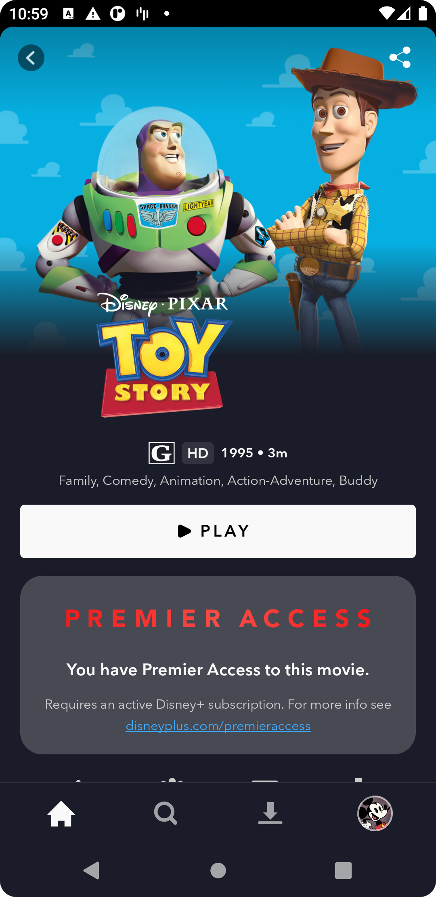{ width="200" } |                           { width="200" }                           |

??? example "Testing Early Access with Price"
    | **Available early access with price:** Use jarvis visionware premier_access_not_purchased configuration and enable the jarvis override toggle "Ignore SKU and Market Products" within the In App Purchases and Paywall section. Make sure you use a device with play services and that you're logged in with your google account in the play store Open the Mulan movie. You should see an early access with price and purchase button. | **Coming soon early access with price:** Use jarvis visionware premier_access_coming_soon_purchasable configuration and enable the jarvis override toggle "Ignore SKU and Market Products" within the In App Purchases and Paywall section. Make sure you use a device with play services and that you're logged in with your google account in the play store. Open the Mulan movie. You should see an early access with price and no purchase button.|
    | --------------------------------- | :-----------------------------------------------------------------------------------: |
    | 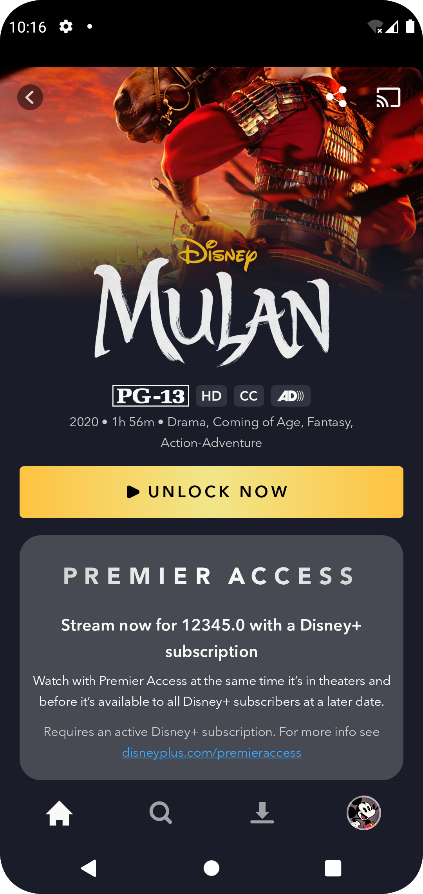{ width="200" } |                           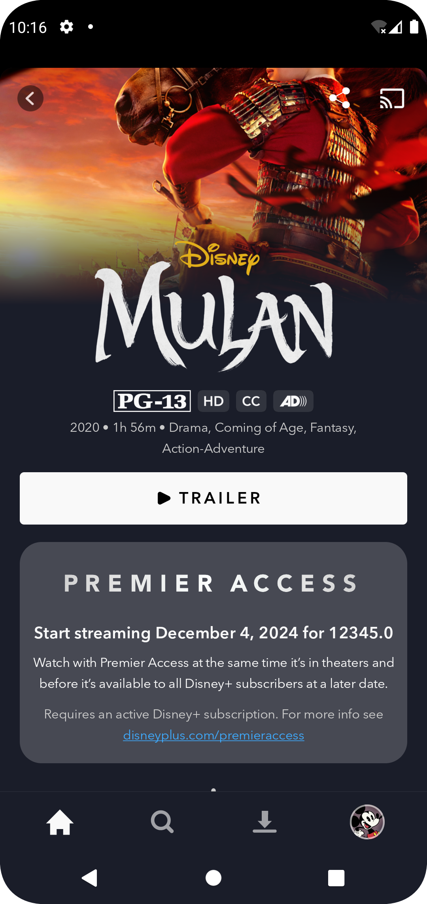{ width="200" }                           |

??? example "Testing Early Access Purchase not Available"
    | **Coming soon early access purchase not available (without price):** Use jarvis visionware premier_access configuration and Raya movie. You should see the early access banner without any price and no purchase button. | **Available early access purchase not available (without price):** Use jarvis visionware premier_access_available_not_purchasable configuration. Open the Mulan movie. You should see the early access banner without any price and no purchase button.|
    | --------------------------------- | :-----------------------------------------------------------------------------------: |
    | 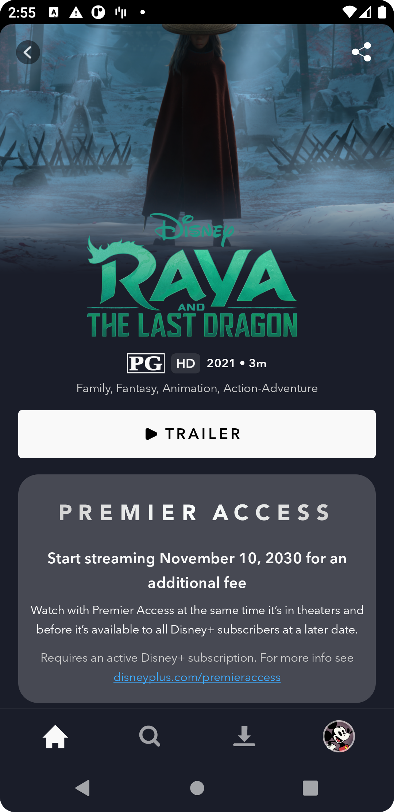{ width="200" } |                           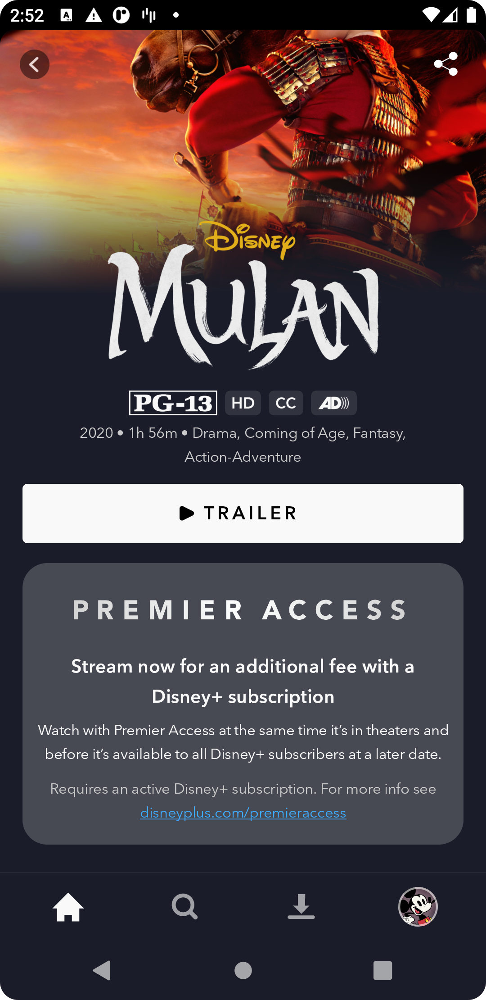{ width="200" }                           |

??? example "GAP Premier Access not Purchasable"
    Use jarvis visionware premier_access_not_purchasable configuration. Open the Mulan movie. You should see a message as if the movie was a coming soon and not premier access.
    <figure markdown>
    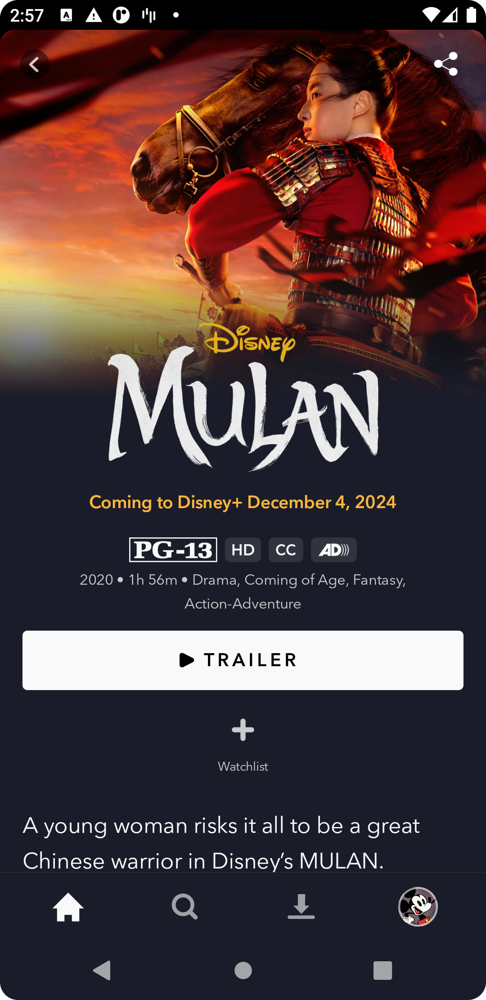{ width="200" }
    </figure>

- Coming Soon V2: Open Disney+ on Production environment.
??? example "Testing Coming Soon"
    | **Coming Soon with Title:** Use jarvis visionware coming_soon_v2 configuration and Turning Red movie. | **Coming soon with title and description:** Use jarvis visionware coming_soon_v2 configuration and Agents of SHIELD movie. |
    | --------------------------------- | :-----------------------------------------------------------------------------------: |
    | 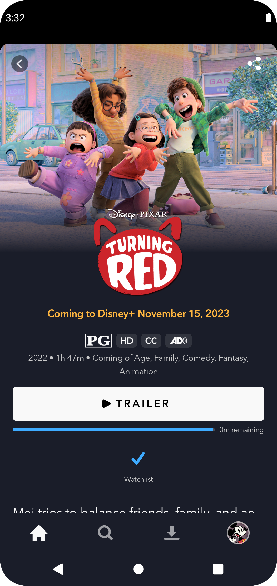{ width="200" } |                           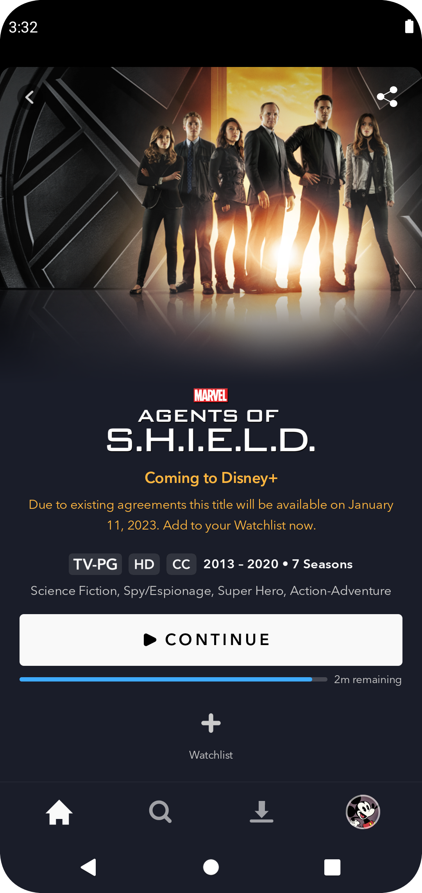{ width="200" }                           |

### Relevant classes

- `DetailsPurchaseDelegate.kt`
- `PurchaseResult.kt`
- `DetailPromoLabelPresenter.kt`
- `DetailHeaderPresenter.kt`

### Additional Details and Tickets

- [Coming Soon Content](https://jira.disneystreaming.com/browse/DMGZ-913)
- [FED Solution Architecture](https://github.bamtech.co/pages/fed-solutions/documentation/content/promo-labels.html#coming-soon-v2)
- [FED Early Access](https://github.bamtech.co/pages/fed-solutions/documentation/content/early-access.html#rules-and-assumptions)
- [Lucid chart source file](https://lucid.app/lucidspark/4c4ce1ab-531c-47e2-9e45-9249b697a63c/edit?viewport_loc=-213%2C194%2C1694%2C925%2C0_0&invitationId=inv_b2e93ea2-aec0-464b-b53e-114aa6d51553)

### Designs

- [Coming Soon](https://app.zeplin.io/project/5aecb868bfc8d1a3521b7a12/dashboard?seid=5bdcee107dac5468ff03e844)
- [Premier Access](https://app.zeplin.io/project/5aecb868bfc8d1a3521b7a12/screen/604aaefd4564bd959c270bf0)
