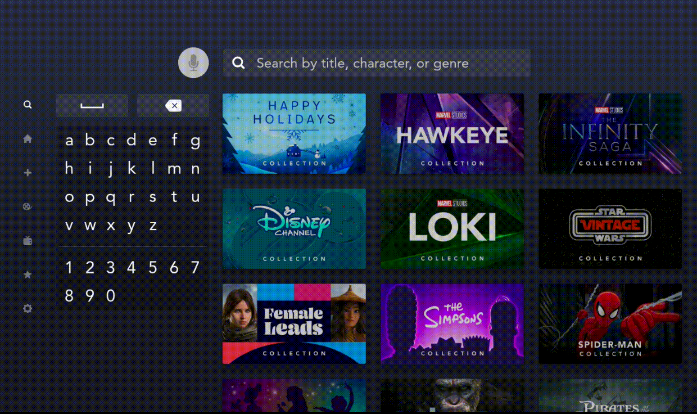
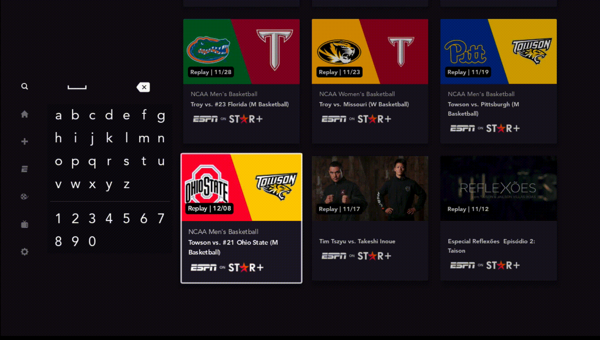

# Search

**Search** is where a user can search for content. When first landing on **Search**, there are some default tiles that can be seen. Product sometimes refers to this as **Explore**

## Suggestions

- Only exists on TV for Disney+
- After a user types enters a letter on Search, we display any suggestions returns from our suggestions API
- **Relevant classes**
    - `KeyboardSearchSuggestionClickListener.kt`
    - `KeyboardSuggestionAvailabilityListener.kt`
    - `SearchSuggestionsViewModel.kt`
    - `KeyboardResultsPresenter.kt`

## Recent Search

- Only exists on mobile
- After clicking into the search field to search, we display a dropdown of your most recent searches
- **Relevant classes**
    - `RecentSearchesLogoutAction.kt`
    - `RecentSearchItem.kt`
    - `RecentSearchModels.kt`
    - `RecentSearchRepository.kt`
    - `RecentSearchViewModel.kt`
    - `PersistentRecentSearches.kt`

## Categories

- Only exists on Star+
- Categories let a user filter the search results
    - **Examples** - All Results, Movies & Series, Sports, etc.
- **Relevant classes**
    - `SearchCategoriesItem.kt`
    - `SearchCategoryRepository.kt`
    - `SearchCategoryViewModel.kt`

## Grid Keyboard

- Only exists on TV devices
- Grid Keyboard is our custom keyboard implementation that supports many different languages and enables users to search on TV without a hardware keyboard
- It is in its own module and exposes a `gridKeyboardApi` module
- **Relevant classes**
    - `GridKeyboardView.kt`
    - `GridKeyboardViewPresenter.kt`
    - `keyboard_config.json`

## Focus

- Handling focus on TV can be a bit tricky. For **Search**, this logic is handled inside of `SearchTvKeyDownHandler`
- See `OnKeyDownHandler` to understand how we go about choosing the Fragment that handles custom focusing logic
- There are a few tricky animations that need to be coordinated with certain focusing rules. For example:
    - User searches. Scrolls down a bit. Types in another letter to search :material-arrow-right-bold: scroll animation to top
    - User searches. Scrolls down a bit. Deletes a letter :material-arrow-right-bold: scroll animation to top
    - User searches. We show suggestions :material-arrow-right-bold: animate down a bit to show the suggestions
- In accessibility mode the focusing is handled a bit different. See `SearchAccessibilityHelper` and [our accessibility docs](../../docs/ACCESSIBILITY.MD)
- **Relevant classes**
    - `SearchTvKeyDownHandler.kt`
    - `SearchAccessibilityHelper.kt`
    - `OnKeyDownHandler.kt`

### Examples

- **Example 1**
    - This shows opening the global nav menu when focusing `LEFT`
    - This should happen when you focus `LEFT` from:
        - Voice button
        - Any grid keyboard character in the first column
        - The space button in the grid keyboard

<figure markdown>
  { width="700" }
  <figcaption>Example 1</figcaption>
</figure>

- **Example 2**

    - This example shows scrolling down, then focusing `UP` from the grid keyboard
    - Since this is Star+, notice the Categories, as well as a lack of suggestions
    - When focusing `UP`, we do the scroll to top animation, and focus the voice recognition button

<figure markdown>
  { width="700" }
  <figcaption>Example 2</figcaption>
</figure>

- **Example 3**

    - This shows changing focus from collections to the grid keyboard focusing `LEFT`
    - The delete key on the grid keyboard is always focused
    - Additionally this shows a user attempting to focus `DOWN` on the grid keyboard (which does nothing)

<figure markdown>
  { width="700" }
  <figcaption>Example 3</figcaption>
</figure>

## Animations

- There is an entrance animation on TV that is handled inside of `TvNavItemAnimationHelper`
- After landing on Search on TV, the animations are handled inside of `SearchTvTransitionHelperImpl`
        - There are four states we transition between. Here is a quick overview; see `SearchTvTransitionHelperImpl` for more details
            - `Default` - Represents the initial state, where no suggestions are showing and we are scrolled to the top. The first row can be focused in this state
                - `Step0` - This is the same state as Default except search suggestions are showing.
                - `Step1` - Represents the transition state where the second row of the search results has focus.
                - `Step2` - Represents the transition state where the focus is on any row besides the first or second rows.
- There is also a state holder class that assists in maintaining the animation state - `FragmentAnimationState`
- **Relevant classes**
    - `TvNavItemAnimationHelper.kt`
    - `SearchTvTransitionHelperImpl.kt`
    - `FragmentAnimationState.kt`

### Examples

- **Example 1** - This shows us scrolling to the top when the user enters a new letter on the grid keyboard

<figure markdown>
  { width="700" }
  <figcaption>Example 1</figcaption>
</figure>

- **Example 2**
    - This shows a few scroll to top animations
    - If a user scrolls down, then focuses `UP` from the grid keyboard, it will focus the suggestions that are above
    - If a user deletes a character from the grid keyboard, it will scroll the user up

<figure markdown>
  { width="700" }
  <figcaption>Example 2</figcaption>
</figure>

## Speech Recognition

- Only exists on non-Amazon TV devices
- Implements Speech to text API (which is not available on Amazon devices)
- Handles permissions, displaying the recognized voice input from the user, animation while searching, and canceling
- **Relevant classes**
    - `SpeechRecognizerHelper.kt`

## Feature Info

### Availability

|       | Availability |
| ----------- | :-----------: |
| :icons-disney-logo: Disney+ | :white_check_mark: |
| :icons-star-logo: Star+ | :white_check_mark: |
| :fontawesome-solid-mobile: Mobile | :white_check_mark: |
| :fontawesome-solid-tv: TV | :white_check_mark: |
| :material-earth: Regions | :white_check_mark: All regions |

### How to test

- Click the :material-magnify: icon in the global nav menu to land on **Search**
- Global nav is on the bottom for mobile, and on the left for TV

### Relevant classes

- `SearchFragment.kt`
- `SearchViewModel.kt`
- `RxSearchViewWrapper.kt`
- `SearchResultsRepository.kt`
- `SearchRepository.kt`
- `SearchResultsViewModel.kt`
- `SearchTermViewModel.kt`

### Product Tickets

- [Search Epic that should have all original requirements](https://jira.disneystreaming.com/browse/DMGZ-22)
- [Recent Searches](https://jira.disneystreaming.com/browse/DMGZAND-318)
- [Search Functionality / scroll / selection](https://jira.disneystreaming.com/browse/DMGZAND-619)
- [Mobile Recent Search Animation](https://jira.disneystreaming.com/browse/DMGZAND-595)
- [Speech Recognition](https://jira.disneystreaming.com/browse/DMGZAND-530)
- [Grid Keyboard](https://jira.disneystreaming.com/browse/DMGZANDSTB-4915)
- Categories
    - [Mobile](https://jira.disneystreaming.com/browse/ALCMYAND-32)
    - [TV](https://jira.disneystreaming.com/browse/ALCMYANDST-30)

### Designs

- [Mobile Search](https://app.zeplin.io/project/5aecb868bfc8d1a3521b7a12/dashboard?tag=Search)
- [Tablet Explore](https://app.zeplin.io/project/5aecb868bfc8d1a3521b7a12/dashboard?tag=Explore)
- [TV Search](https://app.zeplin.io/project/5c801991c22b9abcbb12be15/dashboard?q=search)
- [TV Keyboard](https://app.zeplin.io/project/5c801991c22b9abcbb12be15/screen/5c805dbbaf86007b434b7f8d)
- [TV Search Input](https://app.zeplin.io/project/5c8019017e270e628038f6b6/screen/606b5c887e246c946e73d106)

### Help

- `#search-support` - reach out in this channel for questions about our search algorithm. Note: the team is Beijing based
