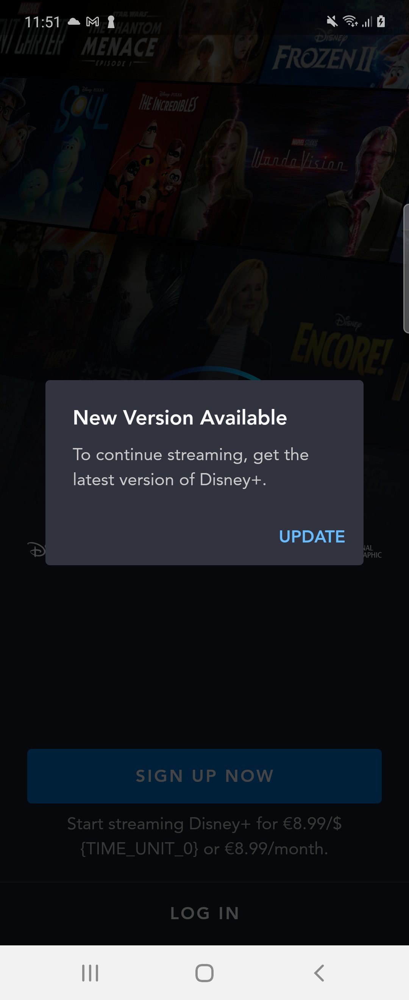

# Soft and Forced App Updates

## Soft Updates

Soft app updates are dismissible messages to the user recommending them to update their app. We don't support native soft updates, these are instead done through [Braze In-App messages](https://www.braze.com/docs/user_guide/message_building_by_channel/in-app_messages).

## Forced Updates

Forced app updates are non dismissable messages to the user forcing them to update their app.

### Availability

|Version|Forced Update Available|Additional info|
|-|-|-|
|- 2.8.x|✅||
|2.9.x - 2.13.x|❌| Forced Update dialog appears but does not have text. See [ANDROID-5152](https://jira.disneystreaming.com/browse/ANDROID-5152), [ANDROIDTV-2494](https://jira.disneystreaming.com/browse/ANDROIDTV-2494), [this Google Doc](https://docs.google.com/document/d/1kdtGdk-6-yp2EyBi8syJg5OSVA2VqEwFnJCaPcxlzUs/edit#) and [this PR](https://github.bamtech.co/Android/Dmgz/pull/13030) for context.|
|2.14.0+|✅||

### Description

|Dialog|In-App update|
|-|-|
|||

Force updates can be enabled by setting the `minAppVersion` config flag to a version higher than the installed version of the app. *Be aware that the versions for TV and mobile are different and thus should use a different `minAppVersion`*.

Example:

```json
"targetedOverrides": [
    {
      "targets": [
        ["PLATFORM_MOBILE"]
      ],
      "minAppVersion": 2111010
    },
    {
      "targets": [
        ["PLATFORM_TV"]
      ],
      "minAppVersion": 21110100
    }
]
```

Forced updates can be targeted to specific devices, countries or user states by using [Targeted Config Overrides](https://github.bamtech.co/Android/Dmgz/blob/development/docs/CONFIG_OVERRIDES.md).

### Active Forced Updates

#### Disney+

For the exact devices, check the config files in [Dmgz Android Appconfig](https://github.bamtech.co/Mobile/dmgz-android-appconfig) and the [Partner Devices wiki] to lookup model # to device/operator names.

| Version | Exclusions |
|-|-|
| 1.0.0 - 1.12.0 | None |
| 1.13.0 | 2 Bouygous Telecom Partner devices |
| 1.13.1 - 1.16.0 | None |
| 1.17.0 | All Partner Devices |
| 2.1 | Amazon TV, partner devices, entitled users, users located in HK/JP/KR/TW |
| 2.2 - 2.15 | US and territories (AS, GU,MH, MP, UM, PR, VI) |

#### Star+

There has been no Forced Update for S+ yet.

### In App Updates

From version 1.8.0+ we support [Google In-app updates](https://developer.android.com/guide/playcore/in-app-updates). This is only available on Google Mobile, Tablet and Chromebooks, so *not on Google TV or Amazon*.

In-app updates can be disabled by setting the `disableInAppUpdate` to false or toggling the `Force App Updates -> Disable Google In-App-Update` Jarvis toggle.

See also the [Wiki page on Android In App Updates](https://wiki.disneystreaming.com/display/DMGZ/Android+In-App+Updates).

#### Testing

- **In App Updates** will only work when you have installed a *signed* version of the app. Unsigned versions cannot be updated through Google Play. You can get the signed APKs from the [Google Play Console](https://play.google.com/console/u/0/developers/7700171517953165945/app/4974830683713314200/releases/overview).
- When using the Jarvis `Forced App Updates -> Force App Update screen`, a force update dialog will popup again after the update since the new version will still be lower than the min version set by the toggle. To do a proper test, set the `minAppVersion` through a config transform to a version *higher* than your currently installed version but *lower* than the version in the Play Store.
- **Forced update dialog** isn't shown on debug builds. Use the Jarvis toggle/config `Force App Updates -> Allow Force Update Dialog on Debug Builds` to allow the dialog to show up on debug builds.
- If you want to bypass the forced update dialog you can use the Jarvis toggle/config flag `Force App Updates -> Disable Force Update Dialog` to suppress the dialog.
