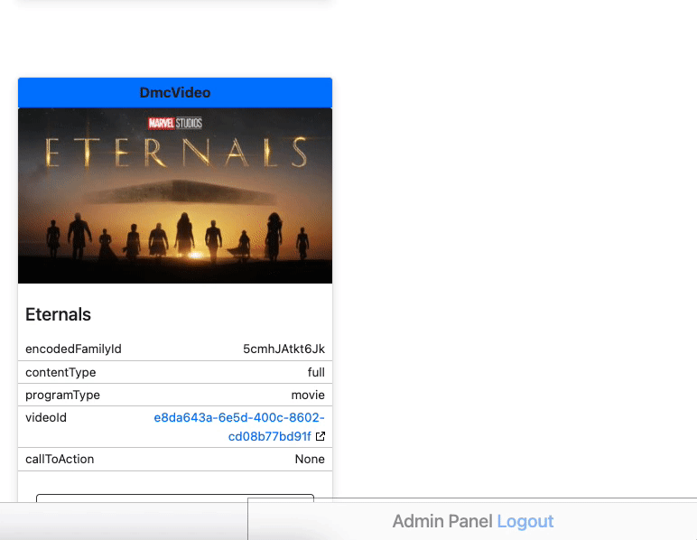

# Vision Inspection Log

Several developers are using the [Project Vision content inspection tool](https://project-vision.us-east-1.bamgrid.net/content) to quickly confirm what content is available in a Collection or Set. To check content on this tool requires a few steps to navigate to the correct collection/set/details page. To make this easy, we have added a logger that prints the URL to the tool in the logcat.

!!! note ""
    The Vision log prefix is "Project Vision URL"

Currently, it is enabled for the below paths and `LogInterceptorConfig.enabledPaths` config can be used to add more via remote config.

```kotlin
 private val defaultEnabledPaths = setOf(
        "/svc/content/BecauseYouSet",
        "/svc/content/Collection",
        "/svc/content/CompleteStandardCollection",
        "/svc/content/ContinueWatching",
        "/svc/content/CuratedSet",
        "/svc/content/DmcProgramBundle",
        "/svc/content/DmcSeriesBundle",
        "/svc/content/DmcVideoBundle",
        "/svc/content/PersonalizedCollection",
        "/svc/content/PersonalizedCuratedSet",
        "/svc/content/RecommendationSet",
        "/svc/content/TrendingSet",
        "/svc/content/WatchlistSet"
    )
```

??? example "Project Vision URL example for each enabled path"
    BecauseYouSet

    ```logcat
    D/Vision: Project Vision URL: https://project-vision.us-east-1.bamgrid.net/content-inspection?url=https://disney.content.edge.bamgrid.com/svc/content/BecauseYouSet/version/6.0/region/US/audience/k-false,l-true/maturity/1499/language/en-GB/setId/bd1bfb9a-bbf7-43a0-ac5e-3e3889d7224d/pageSize/15/page/1
    ```

    Collection

    ```logcat
    D/Vision: Project Vision URL: https://project-vision.us-east-1.bamgrid.net/content-inspection?url=https://disney.content.edge.bamgrid.com/svc/content/Collection/PersonalizedCollection/version/5.1/region/US/audience/k-false,l-true/maturity/1499/language/en-GB/contentClass/home/slug/home
    ```

    ContinueWatching

    ```logcat
    D/Vision: Project Vision URL: https://project-vision.us-east-1.bamgrid.net/content-inspection?url=https://disney.content.edge.bamgrid.com/svc/content/ContinueWatching/Set/version/5.0/region/US/audience/k-false,l-true/maturity/1499/language/en-GB/setId/76aed686-1837-49bd-b4f5-5d2a27c0c8d4
    ```

    CuratedSet

    ```logcat
    D/Vision: Project Vision URL: https://project-vision.us-east-1.bamgrid.net/content-inspection?url=https://disney.content.edge.bamgrid.com/svc/content/CuratedSet/version/6.0/region/US/audience/k-false,l-true/maturity/1499/language/en-GB/setId/085cc2a9-7a18-4746-9243-ae3708d502f4/pageSize/15/page/1
    ```

    DmcProgramBundle

    ```logcat
    D/Vision: Project Vision URL: https://project-vision.us-east-1.bamgrid.net/content-inspection?url=https://star.content.edge.bamgrid.com/svc/content/DmcProgramBundle/version/5.1/region/AR/audience/k-false,l-true/maturity/1850/language/en/encodedFamilyId/67haAq2Y9QUF
    ```
    DmcSeriesBundle

    ```logcat
    D/Vision: Project Vision URL: https://project-vision.us-east-1.bamgrid.net/content-inspection?url=https://disney.content.edge.bamgrid.com/svc/content/DmcSeriesBundle/version/5.1/region/US/audience/k-false,l-true/maturity/1499/language/en-GB/encodedSeriesId/3xsQKWG00GL5
    ```

    DmcVideoBundle

    ```logcat
    D/Vision: Project Vision URL: https://project-vision.us-east-1.bamgrid.net/content-inspection?url=https://disney.content.edge.bamgrid.com/svc/content/DmcVideoBundle/version/5.0/region/US/audience/k-false,l-true/maturity/1499/language/en-GB/encodedFamilyId/5rnVhiRFkaqL
    ```

    PersonalizedCuratedSet

    ```logcat
    D/Vision: Project Vision URL: https://project-vision.us-east-1.bamgrid.net/content-inspection?url=https://disney.content.edge.bamgrid.com/svc/content/PersonalizedCuratedSet/version/6.0/region/US/audience/k-false,l-true/maturity/1499/language/en-GB/setId/50d388c6-ce72-49ab-808f-e84ad9dad3f5/pageSize/15/page/1
    ```

    RecommendationSet

    ```logcat
    D/Vision: Project Vision URL: https://project-vision.us-east-1.bamgrid.net/content-inspection?url=https://disney.content.edge.bamgrid.com/svc/content/RecommendationSet/version/6.0/region/US/audience/k-false,l-true/maturity/1499/language/en-GB/setId/6e365205-5805-c877-9e04-6443a40523f2/pageSize/15/page/1
    ```

    TrendingSet

    ```logcat
    D/Vision: Project Vision URL: https://project-vision.us-east-1.bamgrid.net/content-inspection?url=https://disney.content.edge.bamgrid.com/svc/content/TrendingSet/version/6.0/region/US/audience/k-false,l-true/maturity/1499/language/en-GB/setId/25b87551-fd19-421a-be0f-b7f2eea978b3/pageSize/15/page/1
    ```

    WatchlistSet

    ```logcat
    D/Vision: Project Vision URL: https://project-vision.us-east-1.bamgrid.net/content-inspection?url=https://disney.content.edge.bamgrid.com/svc/content/WatchlistSet/version/6.0/region/US/audience/k-false,l-true/maturity/1499/language/en-GB/setId/463a4cb9-aa4a-4500-0e26-8f4dee160c12/pageSize/15/page/1
    ```

??? tip "How to see response data"
    You can check this in two ways -

    1) From the Project Vision URL select text after `url=` → Paste that in the browser.
    For eg.

       Project Vision URL:

       ```logcat
       https://project-vision.us-east-1.bamgrid.net/content-inspection?url=https://disney.content.edge.bamgrid.com/svc/content/BecauseYouSet/version/6.0/region/US/audience/k-false,l-true/maturity/1499/language/en-GB/setId/bd1bfb9a-bbf7-43a0-ac5e-3e3889d7224d/pageSize/15/page/1
       ```

       Request URL:

       ```logcat
       https://disney.content.edge.bamgrid.com/svc/content/BecauseYouSet/version/6.0/region/US/audience/k-false,l-true/maturity/1499/language/en-GB/setId/bd1bfb9a-bbf7-43a0-ac5e-3e3889d7224d/pageSize/15/page/1
       ```

    2) Go to Project Vision URL in the browser → Hover over/Select "Admin Panel" at the bottom right → Select "Request URL"
    <figure markdown>{ width="550" height="450" }</figure>

## Feature Info

### Availability

|       | Availability |
| ----------- | :-----------: |
| :icons-disney-logo: Disney+ | :white_check_mark: |
| :icons-star-logo: Star+ | :white_check_mark: |
| :fontawesome-solid-mobile: Mobile | :white_check_mark: |
| :fontawesome-solid-tv: TV | :white_check_mark: |
| :material-earth: Regions | :white_check_mark: All regions |

### How to test

When logging a personalized set request like `BecauseYouSet`, `WatchlistSet` or `PersonalizedCuratedSet`, the user needs to navigate to [Vision Login page](https://project-vision.us-east-1.bamgrid.net/login) and select the same profile to see the correct output.

- Enable Vision log with

```shell
adb shell setprop log.tag.DmgzVision DEBUG
```

- Navigate to any collection or details page(home, watchlist, movies, series, event, and details) and filter logs for "Project Vision URL", you should see vision links to the tool.

### Relevant classes

- `CollectionRequestLogInterceptor.kt` An implementation of the `SortableInterceptor` interface to intercept the actual URL and then combine to URL with the vision content inspection prefix. This is to print the URL to the Vision tool with the active collection or set
