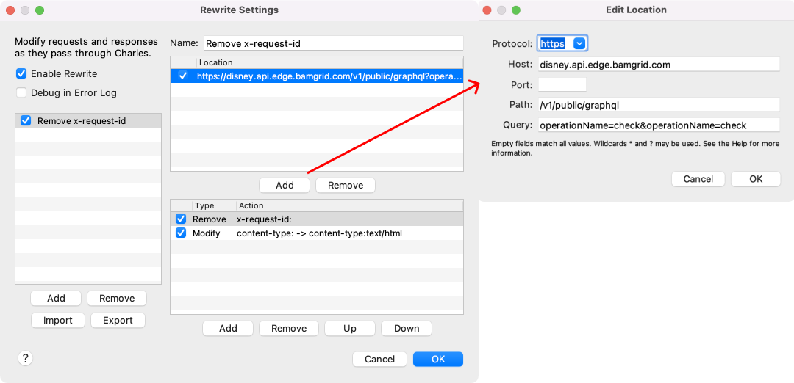
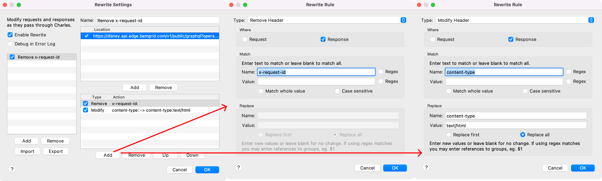

# SDK errors

Some UI errors are thrown by the SDK. Testing these can be a bit hard, this documentation will go through the different
error types and which tools to use to test these errors.

| Error type | Description |
|-           |-            |
| requestTemporarilyBlocked | error case is surfaced based on a `code: forbidden` 403 HTTP edge response |
| temporarilyThrottled | error case is surfaced based on a `code: throttled` 429 HTTP edge response |
| requestBlocked | error case is surfaced based on the HTTP response having HTTP error 403, does NOT have an `X-Request-Id` header, and has a Content-Type value of `text/html` (this is a WAF error response) |

## Fraud tool

For extensive documentation on where to find and how to use the Fraud tool see the following wiki page: [Fraud Tool Wiki Instructions](https://wiki.disneystreaming.com/display/APISVCS/Fraud+Tool)

You'll later need this tool to configure a ban type to force above errors. For that you'll need your external IP address, the `Device ID` and know your `Region`.
Below is briefly explained on how to obtain these properties.

### Device ID

There are two ways to know what you deviceID is

#### Logcat

When you open the app in a logged-out state search for `LoggedOutSession`. This will show the contents of the `anonymous` call.
Take the id that's in the device object, for example: `device=Device(id=d1960b99-a9b1-4f97-95c9-bb67fbbb7ae7)`

#### Using Charles

- Connect charles with your test device
- Open the Disney+ (or other) app
- Find the network call with `operationName=anonymous` in the `/v1/public` respones
- In the json response under `data > anonymous > activeSession > device > id`. Use that UUID as your Device ID.

**Note:** This ID will change every time you clear application data

### Region

You can find the region in the `x-bamtech-region` response header of requests from `*.bamgrid.com` domains.  Use Charles (or search your logcat) to check what region you need to target in the Fraud tool.

- Connect charles with your test device
- Open the Disney+ (or other) app
- Open the response of a network call and select `headers` of the response in Charles
- The region can be found by looking at the following header: `x-bamtech-region`

**Note:** Even though you're in the Netherlands you'll still be targeting: `us-east-1` so you can't necessarily base it on your own location

## Testing SDK errors

Let's go through above errors to show different cases on how to force these errors on the client using the Fraud tool and Charles.

### requestTemporarilyBlocked & temporarilyThrottled

Testing these errors is fairly easy and straightforward. Select either `TEMPORARILY THROTTLED` or `TEMPORARILY BLOCKED`
in the fraud tool and follow the instructions from the fraud tool wiki [here](https://wiki.disneystreaming.com/display/APISVCS/Fraud+Tool)

Now open the app, go the the login email screen. Use a valid email and then press continue. You should now see one of both errors.
Information on what message for what error is supposed to be shown can be found in this JIRA ticket: [ANDROIDTV-194](https://jira.disneystreaming.com/browse/ANDROIDTV-194)

### requestBlocked

For this one you can use `BLOCKED EXCEPTION` or `TEMPORARILY BLOCKED`. They both have the same outcome in the app.
However, to correctly imitate the response as it comes from the server as describe at the top of this page we have to
go with `TEMPORARILY BLOCKED` and use the rewrite tool in Charles to make it work.

Setup this ban type in the Fraud tool using the fraud tool wiki here [here](https://wiki.disneystreaming.com/display/APISVCS/Fraud+Tool)

Now let's add some rewrite rules in Charles to make a temporarily blocked error a requestBlocked error.

Connect charles with your test device and go to `Tools > Rewrite...`
Here's some great documentation on how to setup these rewrite rules: [https://charlesdocsy.com/2020/05/11/rewrite-modify-the-request/](https://charlesdocsy.com/2020/05/11/rewrite-modify-the-request/)

What's important is that we remove the `x-request-id` header of the incoming response and modify the `content-type` header to `text/html`

I'll show an example of how the rewrite rules look in Charles after setting up. First you need to configure the call of which
we want the response to be rewritten. See image below on the configuration, we do this for the `operationName=check` call

{ width="500" }

After that's being setup we also need to tell what we need to rewrite in the response. That will look for both rules like this:

{ width="500" }

Now open the app, go the the login email screen. Use a valid email and then press continue. You should see an error.
Information on what message for what error is supposed to be shown can be found in this JIRA ticket: [ANDROIDTV-194](https://jira.disneystreaming.com/browse/ANDROIDTV-194)
