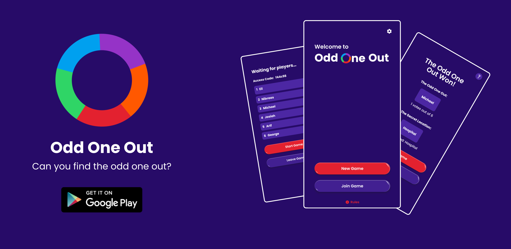
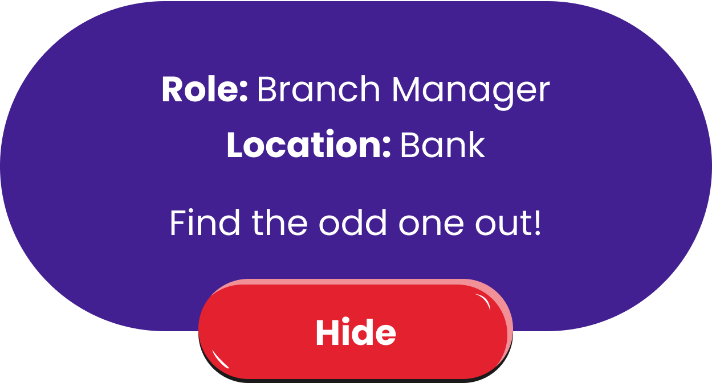

# Welcome to Odd One Out!

*A game of deception, misdirection, and deduction.*

[Click here to download](https://play.google.com/store/apps/details?id=com.dangerfield.spyfall.free)

## Description
Dive into a world where secrets and strategies collide in "Odd One Out". All players are assigned a role at a secret location, except for the 'odd one out' who is left guessing. Your mission: uncover the odd one out through strategic questioning, while keeping the location hidden.

## Rules

- As the game starts, every player gets the secret word.

- One player doesn’t get to see the secret location. They are the Odd One Out.

- Everyone takes turns picking someone to ask a question to about the secret location and their role there.

- The odd one out is trying to figure out the location without revealing that they are the odd one out.
- The players are trying to figure out who the odd one out is without revealing the secret location.

