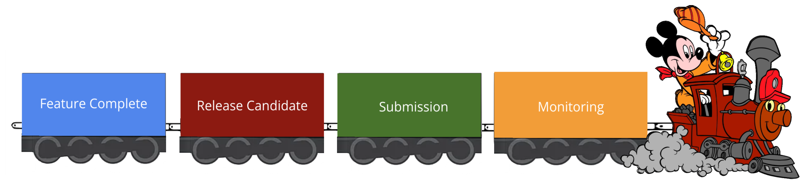

# Release Train

Usually, we have one release per month, according to the [Release Calendar](https://wiki.disneystreaming.com/display/DMGZ/Android+Release+Train). Those dates can be adjusted depending on the need to have a certain feature released on a specific date. The image below illustrates the four major steps of the release process:

* [Feature Complete Tasks](feature_complete.md):
    * Create a release branch and update PRs that have the release milestone
    * Bump the development version and deploy a new app config version
    * Kick the FC build
    * Send an email to QA with the build and tickets included

* [Release Candidate Tasks](release_candidate.md):
    * Deploy app config default values
    * Kick the RC build
    * Send an email to QA with the build and tickets included
    * Upload RC build to Google Alpha & Amazon LAT (for both Star+ & Disney+)

* [Submission](release_submission.md)
    * Confirm QA sign-off for the release
    * Google submission with % rollout
    * Amazon submission for approval with 5% rollout and Future Release Date
    * Confirm Conviva sign-off after 20% rollout
    * Update Google rollout % if metrics look good
    * Remove Future Release Date (FRD) from Amazon and submit the release for 100%

* [Monitoring](release_monitoring.md)
    * Create Sentry and Conviva dashboards
    * Verify Sentry, Play Store and Conviva metrics every day before updating the rollout %
    * Update the [Android Release Process]((https://docs.google.com/spreadsheets/d/1qdULvQnSn1J0CZERrUeTYy5Eg2mGMURvJUoRTedBsf0/edit#gid=1559420519)) spreadsheet with release issues
    * Create tickets for issues and assign to teams

## Release Team

For every release, we have a rotating release team; before the Feature Complete date, we choose a few people that will be part of the "Release Team" and will be responsible for doing the steps above. Besides that, the release team also needs to do the following:

* Dictionary Pinning (Usually happens every Monday, see documentation with [steps here](https://github.bamtech.co/Mobile/dmgz-android-appconfig#dictionary-pinning-process))

* Monitoring [#disneyplus-support-general](https://bamtechmedia.slack.com/archives/CL4L5FPKR) and [#starplus-support-general](https://bamtechmedia.slack.com/archives/C028P7QQ075). Suppose an issue related to the release is reported. In that case, someone should acknowledge and contact the teams responsible for it to investigate or create a ticket and report the status back in the support thread.

* Ensure the [Android Release Process](https://docs.google.com/spreadsheets/d/1qdULvQnSn1J0CZERrUeTYy5Eg2mGMURvJUoRTedBsf0/edit#gid=1559420519) is filled properly and organized. (Any ideas for improvements are welcome)

??? tip "Release Team members"
    The release team members's name should be added to a Release X tab in our [Android Release Process spreadsheet](https://docs.google.com/spreadsheets/d/1qdULvQnSn1J0CZERrUeTYy5Eg2mGMURvJUoRTedBsf0/edit#gid=1559420519)

??? example "Bundling a new language"
    If the release includes support for new languages, add the new languages to the `dictionary_bundle_config.json` from the Dmgz codebase. Note that we usually create the RC build quite a bit before the language launch happens. This means that not all texts might have been translated at that point in time. We need to get approval from International Product to start bundling a new language.

## Other Resources

* [Prepare release parent ticket](https://jira.disneystreaming.com/browse/ANDROID-389)
* [Our Release Calendar](https://wiki.disneystreaming.com/display/DMGZ/Release+Calendar+for+Android+and+Fire)
* [Android Release Show](https://docs.google.com/document/d/1UONIeF9aOKLmESz4ODNEmPFiFAcEwWnJQ41UBFylWso/edit#heading=h.5q2cv8unfqbr)
* [Release Strategy Approaches](https://docs.google.com/document/d/1dBlV3L5aO6LIZdp-lofBu4WUqGazUYAwIxpJlrZ_7tM/edit#)
