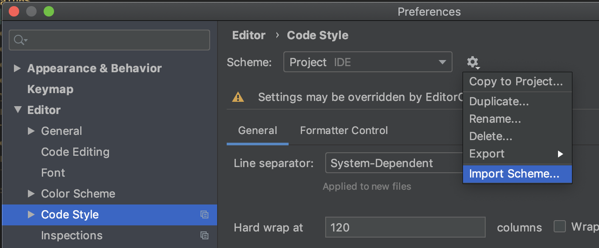
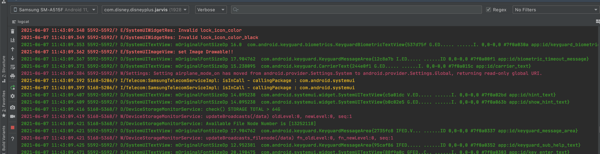

# Android Studio

This doc goes over setting up Android Studio (AS) and other AS relevant items

## Setting Up Android Studio

- Install [AS here](https://developer.android.com/studio)
- Import our `Project.xml` file into AS
	- Open up the project in AS
	- Click `Android Studio` → `Preferences` → `Code Style` → Select the Gear Icon → `Import Scheme...`
	- Select our `Project.xml` file. It can be found at `Dmgz/config/codeStyles/Project.xml`:



- Run the following command in the terminal of AS:

```text
make setup_env
```

- This will install our `git hooks`
- You can look at our [`makefile` located at `Dmgz/makefile`](https://github.bamtech.co/Android/Dmgz/blob/development/makefile) to discover other useful commands you can use. For example, running `make all_tests` runs all of our unit tests locally

## Plugins

- Here is a list of plugins that some developers find useful on the project
	- **PlantUML** - enables the rendering of `*.puml` files
	- **JS GraphQL** - to show autocomplete on graph queries. Note that you need to run a Gradle command to set up the configuration per module where graph implementation is enabled
	- **ADB IDEA** - Shortcuts for some common ADB functions like clearing app data, restarting, uninstalling, etc.
	- **Markdown** - Edit and view markdown in the IDE
	- **Rainbow Brackets** - Colorizes brackets in the code

## Tips

### Change Android Studio terminal

- You can change the default terminal inside of AS to one with a lot more functionality, such as [Oh-My-Zsh](https://ohmyz.sh/) or [Warp](https://www.warp.dev/)
- After installing a new terminal, change it in AS by going to: `Preferences` → `Tools` → `Terminal` and then choosing the appropriate shell path
	- In the case of Oh-My-Zsh the path is `/bin/zsh`

### Filter the logcat to only show Disney+ or Star+ log messages

- Open the logcat, and in the dropdown in the top right choose **Edit Filter Configurations**, and then in the package name section, enter the package name `com.disney.disneyplus` or `com.disney.starplus`

#### Change the colors of the log messages

- The messages in the logcat can be color coded to make it easier to differentiate between the types of log messages (debug, info, warn, error, etc.)
- To set custom colors for the log messages, go to `Preferences` → `Editor` → `Color Scheme` → `Android Logcat`, and for each value you want to change, uncheck the **Inherit Colors** option, and add in hex values for your custom color
- An example color scheme which sets the errors to a bright red, the warnings to a reddish-purple, the info to a yellow, and the debug to the green is:
	- Debug: `3D9D2A`
	- Error: `EA222F`
	- Info: `EAB822`
	- Warning: `BB4767`



### Have `app-configs` and `dmgz-docs` repo checked out in Android Studio

Git allows excluding files locally by adding to `.git/info/exclude` in the root of a git repository. This makes it easy to clone them inside of the project so that you can search and edit them without leaving your IDE. Android Studio will also recognize them as separate Git repositories so you can commit/push/pull just like you would for the main repository.

An example that you could do is this.

```shell
echo "/app-configs" >> .git/info/exclude
git clone git@github.bamtech.co:Mobile/dmgz-android-appconfig.git app-configs
echo "/dmgz-docs" >> .git/info/exclude
git clone git@github.bamtech.co:Android/dmgz-docs.git dmgz-docs
```

The same can also be useful for just generic local files. For example, if you add `/local` to `.git/info/exclude` you can drop all kinds of files in there that are editable within your IDE without worrying about them getting checked into source control.
