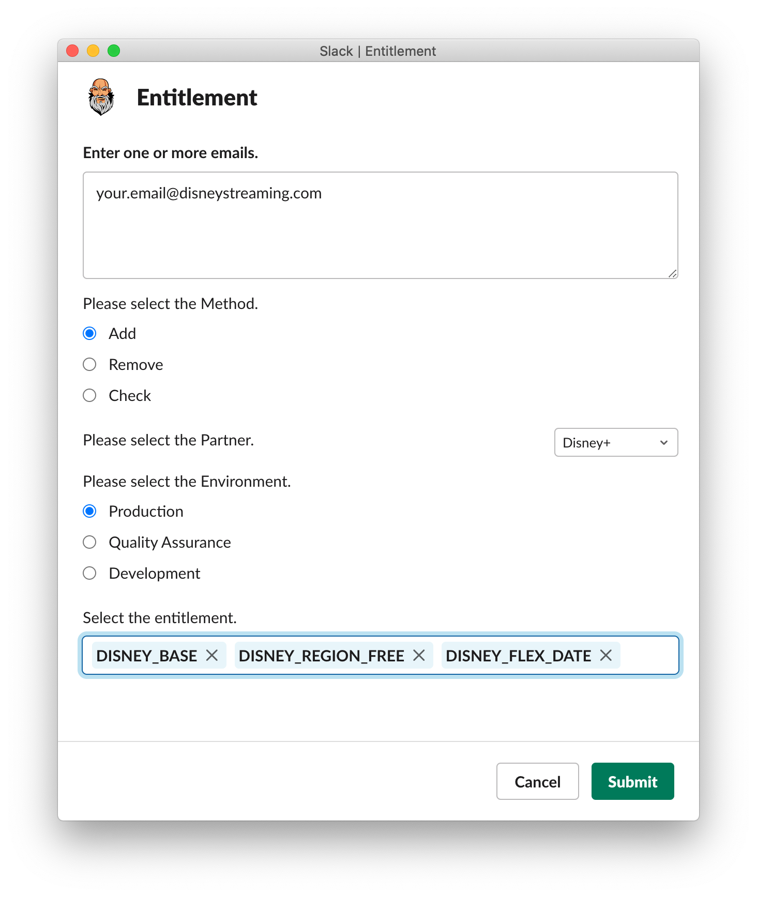
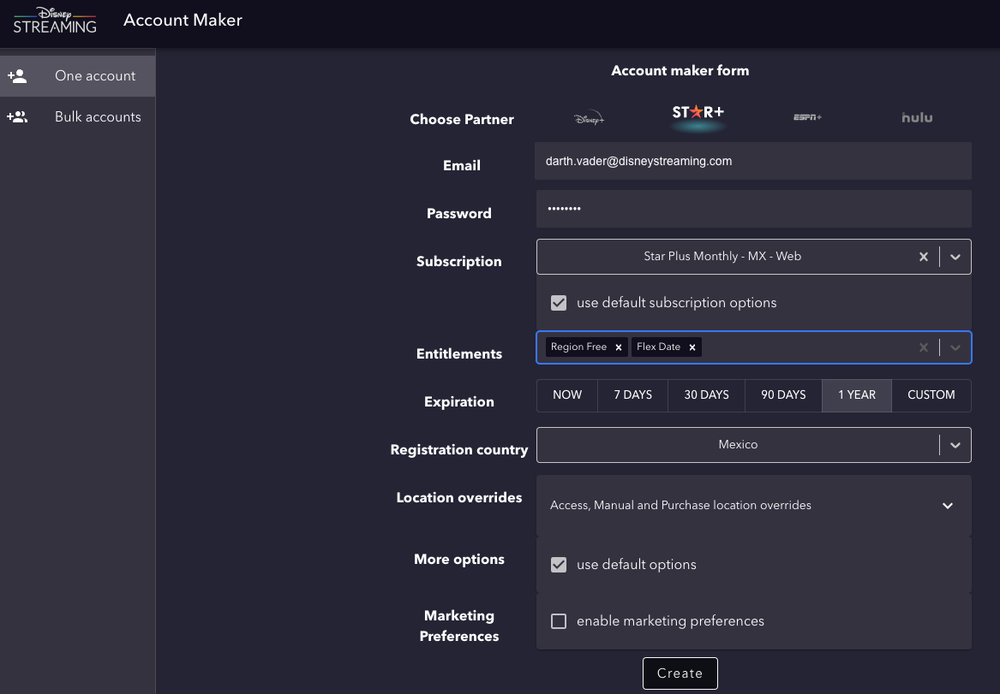

# Creating Disney+, Star+ and Hulu Test Accounts

This doc will walk you through creating your test accounts for both Disney+ and Star+

## Creating Disney+ Accounts

1. Install the Disney+ app - `make installDisney`
2. Select the signup option to create an account with your `@disneystreaming.com` email account
3. When you get to the Paywall to purchase a subscription, swipe the app away
4. In any slack chat (you can slack chat yourself if you want), type `/kentitlement` which will open a window. This opens up a window to use our Slack Bot called Kronos. Kronos helps us manage, view and update account state. [Read more about later here Kronos](https://github.bamtech.co/pages/Android/dmgz-docs/tools/kronos)
5. Fill in the window as follows, making sure that you have the `_BASE`, `_REGION_FREE` and `_FLEX_DATE` entitlements selected. Select the `DISNEY` variants of those entitlements
6. Now open the app again and you should be able to browse and play content
7. When you have [Jarvis](../../tools/jarvis/jarvis.md) installed, you can switch to the QA environment there and follow the same steps to create an account in the QA environment

## Creating Star+ Accounts

1. You may not be in a region that Star+ supports, so use the [Account Maker Tool](#account-maker-tool)
2. We need to create an account for our PROD environment and also for our QA environment. Use the [PROD environment Account Maker tool here](https://account-maker-prod.us-east-1.bamgrid.net/accounts/one) and the [QA environment Account Maker tool here](https://account-maker-qa.us-east-1.bamgrid.net/accounts/one). If you do not have access to the Account Maker Tool, [request access here](https://hoth.disneystreaming.com/sp?id=sc_cat_item&sys_id=f234d0931b898950729d2068b04bcb35)
3. Choose the Partner at the top
4. For **Email** ➜ put in your `@disneystreaming.com` email address
5. For **Password** ➜ enter a password
6. Before selecting a subscription, choose the **Expiration** as **1 YEAR**
7. For **Subscription** ➜ select **Star Plus Monthly - MX - Web**
8. For **Entitlements** ➜ select **Region Free** and **Flex Date**
9. For **Registration country** ➜ select your desired country (the country you're in might not be supported, that's ok just pick one)
10. Click **Create** at the bottom
11. Install the Star+ app - `make installStar`
12. Try logging into the account you just made. To swap between PROD / QA environments use [Jarvis](../../tools/jarvis/jarvis.md)
13. The **Expiration** value for these accounts should automatically be updated every year in August. [Source here](https://bamtechmedia.slack.com/archives/C02CVSKUSEL/p1660148840213489?thread_ts=1660148403.285419&cid=C02CVSKUSEL)

## Creating Hulu Accounts

!!! warning

    You cannot use an email for your Hulu account that is already associated with a Disney+ account (so you will not be able to use your `@disneystreaming.com` email address for your Hulu account). This is because of the way these codes are generated on the backend alongside the backend's Account unification efforts

1. [Click on this Hoth link](https://hoth.disneystreaming.com/sp?id=sc_cat_item&sys_id=82e815a2db06ecd4bf43c28d1396194d)
2. Request a VIP account
3. [Open this link here](https://secure.hulu.com/start/vip) and enter the code
4. Reason for requesting access ➜ need account for Prod testing to build Kyber (new Hulu)

## Account Maker Tool

- At some point you may need to utilize the **Account Maker Tool**
    - If you do not have access to it, [request access here](https://hoth.disneystreaming.com/sp?id=sc_cat_item&sys_id=f234d0931b898950729d2068b04bcb35)
- It can be useful to create or update accounts
    - [PROD environment Account Maker tool](https://account-maker-prod.us-east-1.bamgrid.net/accounts/one)
    - [QA environment Account Maker tool](https://account-maker-qa.us-east-1.bamgrid.net/accounts/one)
- [Official Account Maker Tool documentation](https://wiki.disneystreaming.com/pages/viewpage.action?pageId=241876234)
- Have issues or questions? Reach out to a teammate or ask a question in the slack channel `#tech-ops-solutions-eng`
